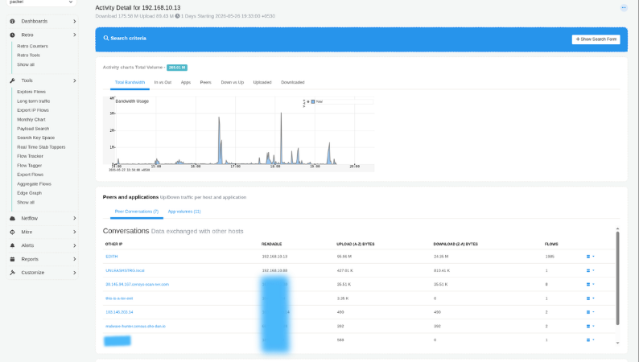
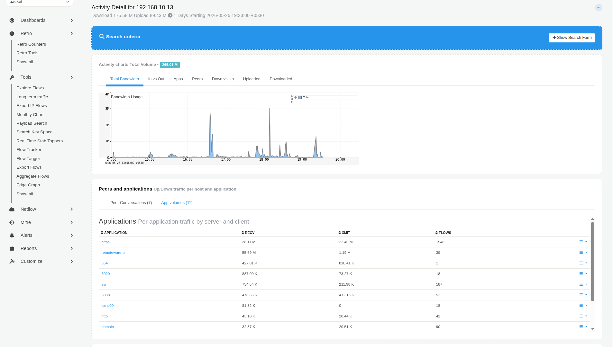

# Investigate the Network Activity of an IP Address

## Investigation Overview

Investigating the network activity of an IP address is one of the most common tasks performed by network and security teams. Whether responding to a user-reported issue, validating the behaviour of a newly deployed server, investigating suspicious activity, or troubleshooting excessive bandwidth usage, understanding how a host communicates across the network provides the foundation for every investigation.

Rather than immediately examining individual flows or packet captures, experienced engineers begin by building context. They first review the host's overall activity, identify its communication patterns, understand the applications generating traffic, and progressively narrow the investigation until the underlying behaviour becomes clear.

Using Trisul, this entire workflow can be completed from a single investigative interface, allowing engineers to move seamlessly from high-level host activity to detailed flow and packet analysis.

---

## When to Use This Investigation

Use this investigation when you need to:

- Investigate a user-reported network issue.
- Analyse traffic generated by a workstation or server.
- Validate communication from a newly deployed device.
- Investigate excessive bandwidth usage by a host.
- Examine suspicious or unexpected network activity.
- Establish a communication profile for an endpoint.

---

## Investigation Objectives

By completing this investigation, you should be able to determine:

- Whether the host communicates with the expected systems.
- Whether application usage matches the intended role of the device.
- Whether traffic characteristics are consistent with normal operational behaviour.
- Whether current activity represents normal behaviour or a recent operational change.
- Whether additional operational or security investigation is required.

---

# Investigation Workflow

## Step 1: Review Host Activity

Every investigation begins by understanding the overall activity of the host. Before analysing conversations or individual flows, determine whether the host exhibits behaviour that appears consistent with its operational role.

Open the [**Hosts Dashboard**](/docs/ug/cg/retrotools#investigate-ip-activity) and locate the IP address being investigated.

The dashboard provides an immediate overview of the host's activity, allowing you to understand its relative importance within the network before beginning deeper analysis.

This view helps answer questions such as:

- Is the host currently active?
- Is it generating unusually high bandwidth?
- Does its activity appear consistent with its role?
- Does the host immediately stand out compared to other systems?

*Figure: Hosts Dashboard*

### Evidence to Collect

- Overall bandwidth utilisation.
- Relative activity compared to other hosts.
- Total conversations.
- Traffic trends.
- Any unusually high activity.

### Next Step

Once you understand the host's overall activity, investigate how it communicates with other systems across the network.

---

## Step 2: Explore Communication Patterns

Understanding who the host communicates with often explains far more than bandwidth alone. Most devices have predictable communication patterns based on their operational role. Unexpected communication partners frequently provide the first indication that additional investigation is required.

Open [**Explore Flows**](/docs/ug/tools/explore_flows) for the selected IP address.

The Conversations view provides a high-level communication profile without requiring you to inspect every individual flow.

This view helps answer questions such as:

- Which systems communicate with the host most frequently?
- Is communication primarily internal or external?
- Which destinations exchange the most traffic?
- Are unfamiliar communication partners present?
- Do communication patterns align with the expected role of the device?

*Figure: Explore Flows - Conversations View*

### Evidence to Collect

- Frequent communication partners.
- Internal and external destinations.
- High-volume conversations.
- Unexpected communication peers.
- Newly observed relationships.

### Next Step

Once communication relationships have been established, determine which applications are responsible for the observed traffic.

---

## Step 3: Analyze Application Usage

Communication between hosts only tells part of the story. Understanding the applications generating the traffic provides the operational context needed to determine whether the observed behaviour is expected.

Open the [**Applications**](/docs/ug/cg/retrotools#investigate-ip-activity) view for the selected host.

Application visibility allows you to identify the services and protocols responsible for network activity, making it easier to distinguish legitimate business traffic from unexpected or unauthorised applications.

This view helps answer questions such as:

- Which applications generate most of the traffic?
- Do the observed applications match the role of the device?
- Are backup or replication services responsible for the traffic?
- Are unexpected protocols consuming bandwidth?
- Does application usage explain the reported issue?

*Figure: Application Usage*

### Evidence to Collect

- Top applications.
- Protocol distribution.
- Expected business applications.
- Backup or replication traffic.
- Unexpected services or protocols.

### Next Step

After identifying the applications responsible for the traffic, evaluate the host's overall traffic characteristics to determine whether its behaviour is operationally consistent.

## Step 4: Review Aggregate Traffic

After understanding who the host communicates with and which applications generate its traffic, the next objective is evaluating the host's overall traffic characteristics.

While individual conversations explain specific communications, aggregate traffic statistics provide a broader operational view of the host's behaviour. Reviewing these metrics helps determine whether the host's activity is consistent with its expected role or whether further investigation is required.

Open [**Aggregate Flow Statistics**](/docs/ug/tools/aggregate_flows) for the selected host.

This view consolidates network activity into meaningful operational metrics, allowing you to assess the overall impact of the host without examining thousands of individual flow records.

This view helps answer questions such as:

- How much traffic has the host generated?
- Has bandwidth utilisation changed significantly?
- Is traffic evenly distributed or concentrated within a few conversations?
- Are traffic patterns consistent throughout the investigation period?
- Does the overall activity appear normal for this type of device?

*Figure: Aggregate Flow Statistics*

### Evidence to Collect

- Total traffic volume.
- Number of flows.
- Packet and byte counts.
- Bandwidth trends.
- Significant changes in traffic behaviour.

### Next Step

If the aggregate statistics indicate unusual behaviour, examine the individual connections responsible for generating the observed traffic.

---

## Step 5: Examine Individual Connections

Aggregate statistics identify unusual behaviour, but individual flow records reveal exactly which network sessions are responsible.

When an investigation needs to move beyond high-level observations, reviewing individual connections allows you to isolate specific communications, identify the systems involved, and determine whether those sessions are expected.

Open the [**Individual Flow Records**](/docs/ug/cg/retrotools#investigate-ip-activity) for the selected host.

This view provides detailed information about every network conversation, allowing you to validate communication patterns and identify sessions requiring closer examination.

This view helps answer questions such as:

- Which individual sessions generated the observed traffic?
- Which destination hosts exchanged the most data?
- Which ports and protocols were used?
- Are unusually long-lived or high-volume sessions present?
- Do the individual flows support the conclusions reached so far?

*Figure: Individual Flow Records*

### Evidence to Collect

- High-volume flow records.
- Long-duration connections.
- Frequently repeated sessions.
- Unexpected ports or protocols.
- Conversations requiring deeper validation.

### Next Step

If the flow records alone do not fully explain the observed behaviour, validate the investigation using packet analysis.

---

## Step 6: Validate with Packet Analysis

Flow records provide an excellent summary of network activity, but some investigations require packet-level visibility to confirm protocol behaviour or troubleshoot application-specific issues.

Where packet capture is available, Trisul allows you to pivot directly from a flow record to packet analysis, eliminating the need to manually correlate data between separate tools.

Use [**Packet Analysis**](/docs/ug/cg/retrotools#pull-packets) to validate the findings of the investigation.

This view helps answer questions such as:

- Does packet-level analysis support the investigation findings?
- Are applications behaving as expected?
- Are protocol anomalies present?
- Are retransmissions or communication failures occurring?
- Is additional evidence required before reaching a conclusion?

*Figure: Packet Analysis*

### Evidence to Collect

- Successful protocol exchanges.
- Retransmissions or packet loss.
- Protocol anomalies.
- Application-level behaviour.
- Packet-level evidence supporting the investigation.

### Investigation Outcome

At this stage, you should have sufficient evidence to understand the host's communication behaviour, determine whether the observed activity is expected, and decide whether operational action or further investigation is required.

---

# Investigation Completion

This investigation can generally be considered complete when:

- The host's overall activity has been reviewed.
- Communication partners have been identified and validated.
- The applications responsible for the traffic have been determined.
- Aggregate traffic characteristics have been evaluated.
- Individual flow records have been examined where necessary.
- Packet-level analysis has been performed where required.
- The underlying cause of the observed behaviour has been established.
- Appropriate operational or engineering actions have been determined.

---

# Best Practices

- Begin every investigation by reviewing the host's overall activity before analysing individual conversations.
- Progressively narrow the investigation from host activity to communication patterns, applications, aggregate statistics, individual flows, and packet analysis.
- Always correlate communication patterns with application usage before drawing conclusions.
- Compare current behaviour with historical activity whenever possible.
- Use packet analysis only when flow-level information is insufficient.
- Document the evidence collected at each stage of the investigation.

---

# Related Investigations

- [**Investigate High Traffic on a Network Interface**](/playbook/Network%20Investigation%20Playbook/inv2-routersintfs) – Continue investigating if excessive bandwidth is isolated to a specific router or switch interface.
- [**Investigate Historical Network Activity**](/playbook/Network%20Investigation%20Playbook/inv3-retro) – Compare the host's current behaviour with historical traffic patterns.
- [**Investigate Threshold Crossing Alerts**](/playbook/Network%20Investigation%20Playbook/inv4-tca) – Determine whether the host triggered bandwidth or activity thresholds that require further analysis.