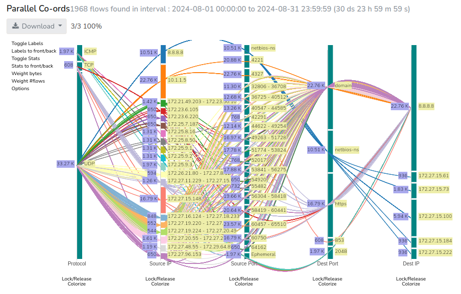

# Investigate the Network Activity of an IP Address

## Investigation Overview

Whether responding to a user-reported issue, investigating suspicious network activity, or validating expected communication patterns, examining the network activity of an IP address is often the first step in a network investigation.

An IP address may represent a workstation, server, virtual machine, network appliance, or any other connected device. Understanding how that host communicates with the rest of the network helps establish whether its behavior is expected or requires further investigation.

This investigation provides a structured approach to analyzing an IP address by examining its communication patterns, application usage, traffic characteristics, and historical behavior.

---

## When to Use This Investigation

Use this investigation when you need to:

- Investigate a user-reported network issue.
- Analyze traffic generated by a specific workstation or server.
- Validate communication from a newly deployed device or application.
- Investigate excessive bandwidth consumption by a host.
- Examine suspicious or unexpected network activity.
- Establish a communication profile for a network endpoint.

---

## Investigation Objectives

By completing this investigation, you should be able to:

- Identify the systems communicating with the IP address.
- Understand which applications and protocols are in use.
- Evaluate the host's traffic characteristics.
- Determine whether communication patterns are expected.
- Decide whether additional investigation is required.

---

## Investigation Steps

### Step 1: Define the Scope of the Investigation

Begin by identifying the IP address that requires investigation and understanding why it has become the focus of attention.

The IP address may have been identified through a user complaint, operational monitoring, security alert, firewall log, or routine network review. Understanding the context helps define the objective of the investigation before examining network activity.

---

### Step 2: Identify Communication Peers

Determine which systems communicate with the IP address.

Review the communication profile to understand:

- Which systems communicate with the host most frequently.
- Whether communication is primarily internal or external.
- Which destinations exchange the largest amount of traffic.
- Whether unfamiliar or unexpected communication partners are present.

At this stage, the objective is to understand the host's communication relationships rather than individual network sessions.

---

### Step 3: Understand Application Usage

Identify the applications and protocols responsible for the observed traffic.

Application visibility provides context that IP addresses alone cannot.

Consider the following questions:

- Which applications generate the majority of the traffic?
- Do the observed applications match the expected role of the device?
- Are unexpected services or protocols present?
- Does application usage explain the reported issue?

Understanding application behavior often provides the explanation behind otherwise unusual traffic patterns.

---

### Step 4: Evaluate Traffic Characteristics

Review the overall characteristics of the host's network activity.

Evaluate factors such as:

- Total traffic volume.
- Number of conversations.
- Traffic direction.
- Duration of network sessions.
- Relative contribution of different applications.

These characteristics help determine whether the observed activity aligns with the expected behavior of the device.

---

### Step 5: Compare Historical Activity

Current observations should always be evaluated alongside historical network activity.

Determine whether the observed behavior:

- Has been consistently present over time.
- Represents a recent change.
- Occurs on a recurring schedule.
- Coincides with infrastructure or application changes.

Historical comparison helps distinguish normal operational behavior from genuine anomalies.

---

### Step 6: Document the Investigation

Summarize the observations collected during the investigation.

Document:

- Significant communication patterns.
- Notable applications or protocols.
- Unexpected traffic characteristics.
- Historical observations.
- Whether further investigation is recommended.

Documenting the findings establishes a baseline for future investigations and supports operational or security reviews.

---

## Applying this Investigation Using a Network Analytics Platform

The investigation methodology described above can be performed using a combination of network monitoring platforms, flow analyzers, packet captures, firewall logs, and other operational tools. While each data source provides valuable insight, manually correlating information across multiple systems can be time-consuming, particularly in large or distributed enterprise networks.

Network analytics platforms such as **Trisul** simplify this process by consolidating network telemetry into a unified investigative workflow. Instead of switching between multiple tools, engineers can examine host activity, communication patterns, application usage, packet-level details, and historical traffic from a single platform, reducing the time required to move from observation to root cause.

For this investigation, Trisul provides multiple analytical perspectives that complement one another throughout the investigation.

### Review Host Activity

The [**Hosts Dashboard**](/docs/ug/hosts_dashboard) provides an overview of network activity for individual hosts, allowing engineers to quickly identify top bandwidth consumers, active hosts, connection statistics, and other key traffic indicators. This serves as an effective starting point for determining whether a host warrants further investigation.

> **Screenshot Placeholder:** Hosts Dashboard showing Top Hosts, IP Usage by Connections, and Top Talkers

---

### Investigate Communication Patterns

Using [**Explore Flows**](/docs/ug/tools/explore_flows), engineers can pivot directly to the selected IP address and examine:

- Communication peers
- Active conversations
- Client and server relationships
- Traffic direction
- Flow statistics

This helps establish how the host communicates with the rest of the network.

*Figure: Explore Flows - Conversations View*

---

### Analyze Application Usage

The Applications view provides visibility into the protocols and services responsible for the observed traffic.

This helps determine whether the network activity aligns with the expected role of the device or whether unexpected applications require further investigation.

> **Screenshot Placeholder:** Explore Flows - Applications View

---

### Review Aggregate Flow Statistics

[Aggregate flow statistics](/docs/ug/tools/aggregate_flows) summarize the host's network behavior by consolidating traffic into meaningful metrics such as:

- Total flows
- Packet counts
- Bytes transferred
- Bandwidth utilization
- Traffic trends

These summaries help engineers quickly identify unusual traffic patterns before drilling down into individual connections.

> **Screenshot Placeholder:** Aggregate Flows View

---

### Examine Individual Connections

When additional detail is required, engineers can review individual flow records associated with the selected host.

Each connection provides information such as:

- Source and destination IP addresses
- Source and destination ports
- Protocol
- Session duration
- Packet counts
- Byte counts
- Traffic direction

This enables engineers to validate communication patterns and identify the specific conversations contributing to the observed activity.

> **Screenshot Placeholder:** Individual Flow Records

---

### Validate with Packet Analysis

Where packet capture is available, engineers can pivot from flow records to packet-level analysis for deeper inspection.

Packet analysis enables validation of protocol behavior, troubleshooting of application issues, and investigation of suspicious communications that require payload-level visibility.

> **Screenshot Placeholder:** Packet Analysis

---

By combining the Hosts Dashboard, Explore Flows, aggregate flow statistics, connection-level analysis, and packet inspection within a single investigative workflow, Trisul enables engineers to progress from high-level observations to detailed root cause analysis without manually correlating information from multiple monitoring systems.

## Investigation Findings

The following observations may help guide the next stage of the investigation.

| Observation          | Possible Interpretation     |
| --------------------------------- | ---------------------------- |
| Communication is primarily internal                          | Typical enterprise workload.                                  |
| Large HTTPS traffic                                          | Cloud services, software updates, or web applications.        |
| Continuous SMB traffic                                       | File sharing, backup, or synchronization activity.            |
| Communication with unfamiliar external hosts                 | Validate the destination and business purpose.                |
| Significant increase in traffic compared to previous periods | Continue investigating the source of the change.              |
| Unexpected applications or protocols                         | Verify whether they are approved and expected for the device. |

---

## Best Practices

- Establish the purpose of the investigation before analyzing traffic.
- Begin with communication patterns before drilling down into individual flows.
- Use application visibility to understand the intent behind network activity.
- Compare current observations with historical behavior whenever possible.
- Avoid drawing conclusions based solely on traffic volume; always consider the role of the device and the applications involved.

---

## Related Investigations

- If the investigation identifies excessive utilization on a network interface, continue with [**Investigate High Traffic on a Network Interface**](./inv2-routersintfs.md).
- If the investigation requires analysis of an earlier incident or comparison with historical network behavior, continue with [**Investigate Historical Network Activity**](./inv3-retro.md).