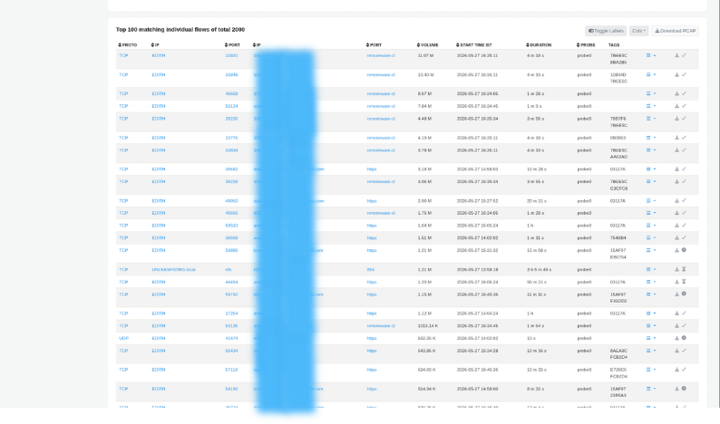
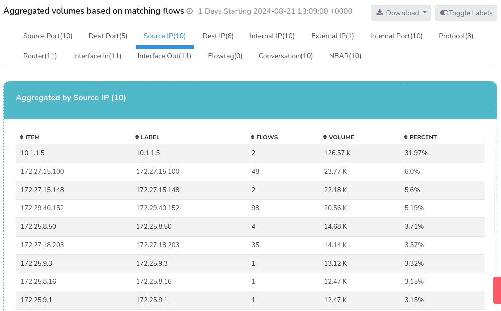
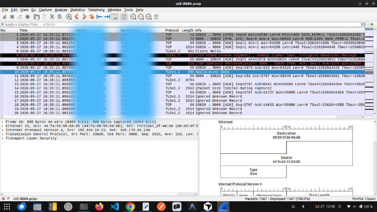

# Investigate the Network Activity of an IP Address

## Investigation Overview

Investigating the network activity of an IP address is one of the most common tasks performed by network and security teams. Whether responding to a user-reported issue, validating the behaviour of a newly deployed server, investigating suspicious activity, or troubleshooting excessive bandwidth usage, understanding how a host communicates across the network provides the foundation for every investigation.

Rather than immediately examining individual flows or packet captures, experienced engineers begin by building context. They first review the host's overall activity, identify its communication patterns, understand the applications generating traffic, and progressively narrow the investigation until the underlying behaviour becomes clear.

Using Trisul, this entire workflow can be completed from a single investigative interface, allowing engineers to move seamlessly from high-level host activity to detailed flow and packet analysis.

---

## When to Use This Investigation

Use this investigation when you need to:

- Investigate a user-reported network issue.
- Analyse traffic generated by a workstation or server.
- Validate communication from a newly deployed device.
- Investigate excessive bandwidth usage by a host.
- Examine suspicious or unexpected network activity.
- Establish a communication profile for an endpoint.

---

## Investigation Objectives

By completing this investigation, you should be able to determine:

- Whether the host communicates with the expected systems.
- Whether application usage matches the intended role of the device.
- Whether traffic characteristics are consistent with normal operational behaviour.
- Whether current activity represents normal behaviour or a recent operational change.
- Whether additional operational or security investigation is required.

---

## Investigation Workflow

### Step 1: Review Host Activity

Every investigation begins by understanding the overall activity of the host. Rather than switching between multiple dashboards, begin the investigation directly within **Explore Flows** by entering the IP address to be investigated. This provides an immediate operational profile of the host and serves as the starting point for progressively investigating its communication behavior.

Open [**Explore Flows**](/docs/ug/tools/explore_flows) and enter the IP address being investigated.

*Figure: Explore Flows*

The initial view provides an overview of the host's activity, allowing you to understand its relative importance within the network before beginning deeper analysis.

This view helps answer questions such as:

- Is the host currently active?
- Is it generating unusually high bandwidth?
- Does its activity appear consistent with its role?
- Does the host immediately stand out compared to other systems?

#### Evidence to Collect

- Overall bandwidth utilisation.
- Relative activity compared to other hosts.
- Total conversations.
- Traffic trends.
- Any unusually high activity.

#### Next Step

Once you understand the host's overall activity, investigate how it communicates with other systems across the network.

---

### Step 2: Explore Communication Patterns

Understanding who the host communicates with often explains far more than bandwidth alone. Most devices have predictable communication patterns based on their operational role. Unexpected communication partners frequently provide the first indication that additional investigation is required.

Remain within [**Explore Flows**](/docs/ug/tools/explore_flows) and review the [**Top Conversations**](/docs/ug/tools/explore_flows#top-conversations) view for the selected IP address.

This view provides a high-level communication profile without requiring you to inspect every individual flow.

This view helps answer questions such as:

- Which systems communicate with the host most frequently?
- Is communication primarily internal or external?
- Which destinations exchange the most traffic?
- Are unfamiliar communication partners present?
- Do communication patterns align with the expected role of the device?

#### Evidence to Collect

- Frequent communication partners.
- Internal and external destinations.
- High-volume conversations.
- Unexpected communication peers.
- Newly observed relationships.

#### Next Step

Once communication relationships have been established, investigate the individual connections responsible for the observed behavior.

---

### Step 3: Examine Individual Connections

After identifying the host's communication patterns, remain within [**Explore Flows**](/docs/ug/tools/explore_flows) and drill down from the [**Top Conversations**](/docs/ug/tools/explore_flows#top-conversations) view into the [**Top Matching Flows**](/docs/ug/tools/explore_flows#top-matching-flows) view. This is a natural continuation of the communication investigation and allows you to determine which specific sessions explain the observed behavior.

This view helps answer questions such as:

- Which individual sessions generated the observed traffic?
- Which destination hosts exchanged the most data?
- Which ports and protocols were used?
- Are unusually long-lived or high-volume sessions present?
- Are repeated sessions or unusual connections visible?

*Figure: Top Matching Flows*

#### Evidence to Collect

- High-volume flow records.
- Long-duration connections.
- Frequently repeated sessions.
- Unexpected ports or protocols.
- Conversations requiring deeper validation.

#### Next Step

Once the communication investigation has been completed, determine which applications generated the observed traffic.

---

### Step 4: Analyze Application Usage

Communication patterns identify who the host is communicating with, while application analysis explains why that communication exists.

Remain within [**Explore Flows**](/docs/ug/tools/explore_flows) and select the [**Top Applications**](/docs/ug/tools/explore_flows#activity-details) topper under the activity details to open the Application Usage view for the selected host.

    

*Figure: Application Usage*

Application visibility allows you to identify the services and protocols responsible for network activity, making it easier to distinguish legitimate business traffic from unexpected or unauthorised applications.

This view helps answer questions such as:

- Which applications generate most of the traffic?
- Do the observed applications match the role of the device?
- Are backup or replication services responsible for the traffic?
- Are unexpected protocols consuming bandwidth?
- Does application usage explain the reported issue?

#### Evidence to Collect

- Top applications.
- Protocol distribution.
- Expected business applications.
- Backup or replication traffic.
- Unexpected services or protocols.

#### Next Step

After identifying the applications responsible for the traffic, review the same investigation using alternative aggregate views to validate the host's overall traffic characteristics.

---

### Optional Validation: Review Aggregate Traffic

Most investigations can be completed without reviewing Aggregate Flows. This view serves as an optional validation and summary activity when you want additional confirmation of the conclusions reached during the investigation or need supporting evidence for reporting.

Rather than introducing new data, [**Aggregate Flows**](/docs/ug/tools/aggregate_flows) presents the same flow information from different perspectives, allowing you to view traffic by IP address, port, router, application, and other network dimensions.

This view helps answer questions such as:

- Is the host's traffic concentrated around a few applications or distributed across many services?
- Which IP addresses, ports, routers, or applications account for most of the traffic?
- Does the aggregate traffic profile support the conclusions reached during the investigation?
- Are there dominant traffic patterns that were not immediately apparent from individual flow records?
- Does the host's overall traffic profile appear consistent with its operational role?

*Figure: Aggregate Flows*

#### Evidence to Collect

- Aggregate traffic distribution.
- Dominant IP addresses, ports, routers, or applications.
- Overall traffic profile.
- Significant traffic concentrations.
- Aggregate evidence supporting the investigation findings.

#### Next Step

Once the aggregate traffic characteristics have been reviewed, continue with packet-level analysis if protocol-level validation is required.

---

### Step 5: Validate with Packet Analysis

Flow records usually provide an excellent summary of network activity, but some investigations require packet-level visibility to confirm protocol behavior or troubleshoot application-specific issues.

From [**Explore Flows**](/docs/ug/tools/explore_flows), select the required host or flow record, click the [**Options button**](/docs/ug/tools/explore_flows#flow-options) against that flow, and choose **Download PCAP** to validate the findings using packet-level analysis.

This view helps answer questions such as:

- Does packet-level analysis support the investigation findings?
- Are applications behaving as expected?
- Are protocol anomalies present?
- Are retransmissions or communication failures occurring?
- Is additional evidence required before reaching a conclusion?

*Figure: Packet Analysis*

#### Evidence to Collect

- Successful protocol exchanges.
- Retransmissions or packet loss.
- Protocol anomalies.
- Application-level behaviour.
- Packet-level evidence supporting the investigation.

---

### Summarize the Investigation with Trisul AI

By this stage, the investigation should have established the host's communication behavior and collected the evidence required to answer the original investigation question.

Open **Trisul AI** and review the investigation findings.

Use Trisul AI to generate a concise summary of the investigation, highlight the key observations, and assist with documenting the findings for operational review, incident reporting, or future reference.

## Investigation Completion

This investigation can generally be considered complete when:

- The host's overall activity has been reviewed.
- Communication partners have been identified and validated.
- The applications responsible for the traffic have been determined.
- Aggregate traffic characteristics have been evaluated.
- Individual flow records have been examined where necessary.
- Packet-level analysis has been performed where required.
- The underlying cause of the observed behaviour has been established.
- Appropriate operational or engineering actions have been determined.

---

## Best Practices

- Begin every investigation by reviewing the host's overall activity before analysing individual conversations.
- Progressively narrow the investigation from host activity to communication patterns, applications, aggregate statistics, individual flows, and packet analysis.
- Always correlate communication patterns with application usage before drawing conclusions.
- Compare current behaviour with historical activity whenever possible.
- Use packet analysis only when flow-level information is insufficient.
- Document the evidence collected at each stage of the investigation.

---

## Related Investigations

- [**Investigate High Traffic on a Network Interface**](./inv2-routersintfs.md) – Continue investigating if excessive bandwidth is isolated to a specific router or switch interface.
- [**Investigate Historical Network Activity**](./inv3-retro.md) – Compare the host's current behaviour with historical traffic patterns.
- [**Investigate Threshold Crossing Alerts**](./inv4-tca.md) – Determine whether the host triggered bandwidth or activity thresholds that require further analysis.
- [**Correlate Network Activity Across Multiple Dimensions**](./inv7-crosskey.md) – Analyse this host's traffic alongside application, interface, or site dimensions if a single-host view doesn't fully answer the question.