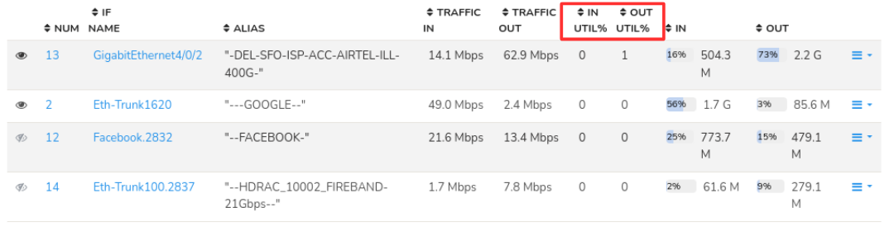
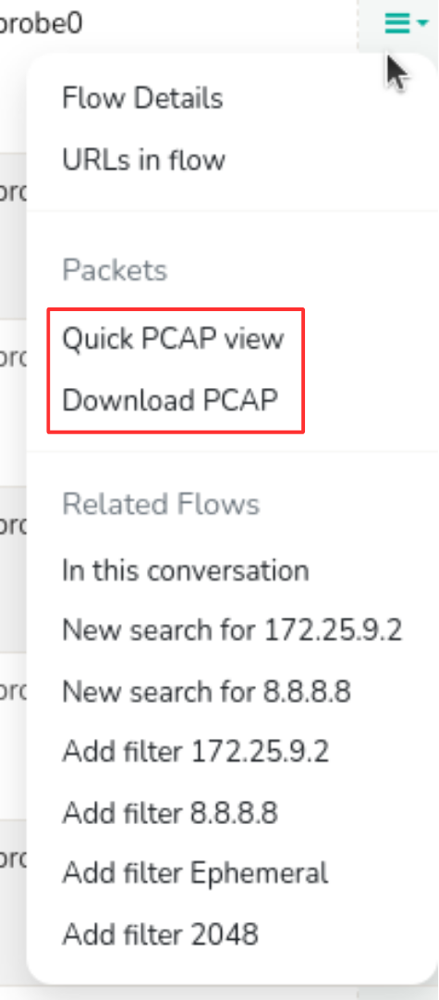

# Investigate High Traffic on a Network Interface

## Investigation Overview

High interface utilization is often the first indication of network congestion, but high bandwidth alone rarely explains the root cause. A busy interface may simply reflect expected operational activity such as backups, software deployments, cloud synchronization, or database replication. In other cases, it may indicate application issues, bandwidth abuse, configuration changes, or emerging network problems.

This investigation follows the same workflow experienced network engineers use when troubleshooting interface congestion. Starting from the affected interface, the investigation pivots into [**Explore Flows**](/docs/ug/tools/explore_flows), where engineers progressively identify the hosts consuming bandwidth, investigate the conversations responsible for the observed utilization, determine the applications generating the traffic, and validate their findings when packet-level analysis is required.

Using Trisul, this entire workflow can be completed without switching between multiple monitoring tools.

---

## When to Use This Investigation

Use this investigation when you need to:

- Investigate unusually high utilization on a router or switch interface.
- Identify the hosts consuming interface bandwidth.
- Determine which applications are responsible for increased utilization.
- Validate whether the observed traffic is expected.
- Determine whether operational action or capacity planning is required.

---

## Investigation Objectives

By completing this investigation, you should be able to determine:

- Which interface is experiencing increased utilization.
- Which hosts contribute most of the traffic.
- Which applications generate the observed bandwidth.
- Whether the utilization represents expected operational activity.
- Whether further investigation or corrective action is required.

---

## Investigation Workflow

### Step 1: Review Interface Utilization

Every investigation begins by identifying the interface experiencing increased utilization and understanding the scope of the issue. Before investigating hosts or applications, determine whether the congestion is isolated to a single interface or affects a wider portion of the network.

Open [**Routers & Interfaces**](/docs/ug/netflow/routers_and_interfaces) to [**review interface utilization**](/docs/ug/netflow/routers_and_interfaces#interfaces-table) across monitored devices.

*Figure: Interface Utilization*

Use this dashboard to answer questions such as:

- Which interface is experiencing high utilization?
- Is the increase inbound, outbound, or both?
- Is the utilization sustained or only a temporary spike?
- Are multiple interfaces showing similar behaviour?

#### Evidence to Collect

- Interfaces consistently operating near capacity.
- Sustained utilization rather than short-lived spikes.
- Interfaces showing unusual traffic compared to historical behaviour.
- Multiple interfaces becoming congested simultaneously.

#### Continue the Investigation

Once the affected interface has been identified, determine which systems are responsible for generating the observed traffic.

---

### Step 2: Investigate Interface Activity

> **Prerequisite:** This step assumes accurate, long-term host and application visibility for the interface, which depends on [**Interface Tracking**](/docs/ug/netflow/interface_tracker) being enabled for the router in question. If Interface Tracking isn't enabled, the per-interface breakdown may be incomplete or unavailable — confirm this with your admin before concluding a host isn't a contributor.

After identifying the affected interface, continue the investigation in [**Explore Flows**](/docs/ug/tools/explore_flows) using the **Interface ID** from the [**Interface Drilldown**](/docs/ug/netflow/drilldown). This provides an operational view of the traffic traversing the selected interface and identifies the hosts contributing to the observed utilization.

This step helps answer questions such as:

- Which hosts consume most of the interface bandwidth?
- Is the utilization caused by a single dominant host or multiple systems?
- Is the traffic concentrated around a few conversations?
- Does the traffic distribution appear consistent with the purpose of the interface?

#### Evidence to Collect

- Hosts responsible for the majority of interface traffic.
- Relative bandwidth contribution of each host.
- Concentrated or evenly distributed traffic patterns.
- Hosts requiring further investigation.

#### Continue the Investigation

After identifying the primary bandwidth consumers, determine who those hosts are communicating with and which conversations explain the interface utilization.

---

### Step 3: Investigate Communication Patterns

After identifying the hosts responsible for the interface utilization, determine who those systems are communicating with. Before determining why the traffic is occurring, establish which conversations and network sessions are responsible for the observed bandwidth.

Continue the investigation using [**Explore Flows**](/docs/ug/tools/explore_flows).

Use the **Interface ID** (available in the [**Interface Drilldown**](/docs/ug/netflow/drilldown)) in the Explore Flows search field to pivot directly from the affected interface into the corresponding communication records.

Remain within Explore Flows while analysing:

- Communication peers.
- Active conversations.
- Client and server relationships.
- Individual flow records.
- Traffic direction.

This step helps answer questions such as:

- Which conversations account for most of the interface traffic?
- Are the highest-bandwidth conversations expected?
- Are external destinations contributing significantly to the utilization?
- Are multiple hosts communicating with the same destination?
- Do the communication patterns explain the observed congestion?

#### Evidence to Collect

- High-bandwidth conversations.
- Dominant communication paths.
- Unexpected traffic destinations.
- Traffic concentration between specific hosts.
- Conversations requiring deeper analysis.

#### Continue the Investigation

Once the communication patterns have been established, determine which applications generated the observed traffic.

### Step 4: Analyze Application Usage

After identifying the conversations responsible for the interface utilization, determine which applications generated the observed traffic.

Open the [**Applications**](/docs/ug/tools/explore_flows#activity-details) view for the selected interface or host.

    

*Figure: Application Usage*

Application visibility provides the operational context needed to determine whether the communication is explained by expected business applications, backup operations, software deployments, replication traffic, cloud synchronization, or unexpected services.

This view helps answer questions such as:

- Which applications generate most of the traffic?
- Do the observed applications match the operational role of the host?
- Are scheduled activities such as backups or software deployments responsible?
- Are replication or cloud synchronization workloads present?
- Are unexpected protocols consuming bandwidth?

#### Evidence to Collect

- Expected business applications.
- Backup or replication traffic.
- Software deployment activity.
- Unexpected or unauthorized applications.
- Protocols consuming unusually high bandwidth.

#### Continue the Investigation

Application analysis is usually sufficient to determine the cause of interface utilization. Where additional confirmation is useful — for example, when preparing a capacity planning report — review the aggregate traffic profile below before continuing to packet analysis.

---

### Optional Validation: Review Aggregate Traffic

Most interface investigations can be completed without reviewing Aggregate Flows, since the interface-level traffic distribution is already visible from Steps 2–4. Use this view as an optional validation step when you want additional confirmation of the conclusions reached during the investigation, or need supporting evidence for a capacity planning report.

[**Aggregate Flows**](/docs/ug/tools/aggregate_flows) presents the same flow information from different perspectives — grouped by IP address, application, port, or router — for the affected interface.

This view helps answer questions such as:

- Is the interface's traffic concentrated around a few hosts or applications, or distributed across many?
- Which IP addresses, applications, or protocols account for most of the interface traffic?
- Does the aggregate traffic profile support the conclusions reached during the investigation?
- Are there dominant traffic patterns that were not immediately apparent from individual flow records?

#### Evidence to Collect

- Aggregate traffic distribution for the interface.
- Dominant IP addresses, applications, or protocols.
- Aggregate evidence supporting the investigation findings.

#### Continue the Investigation

Once the aggregate traffic characteristics have been reviewed (or skipped, if not needed), continue with packet-level analysis if protocol-level validation is required.

---

### Step 5: Validate with Packet Analysis

Packet-level analysis provides the final layer of validation for investigations that require deeper protocol visibility. This step is particularly useful when troubleshooting application behaviour or confirming findings identified during flow analysis.

Where packet capture is available, pivot directly from the selected flow to [**Packet Analysis**](/docs/ug/tools/explore_flows#flow-options) by downloading the PCAP from the flows drilldown.

  

*Figure: View/Download PCAP*

Use packet analysis to answer questions such as:

- Does packet-level analysis support the investigation findings?
- Are applications behaving as expected?
- Are protocol anomalies present?
- Is there evidence of retransmissions or communication failures?

#### Evidence to Collect

- Successful protocol exchanges.
- Retransmissions or packet loss.
- Protocol anomalies.
- Packet-level evidence supporting the identified root cause.

---

### Summarize the Investigation with Trisul AI

By this stage, the investigation should have established the cause of the increased interface utilization and collected the evidence required to explain the observed behavior.

Open **Trisul AI** and review the investigation findings.

Use Trisul AI to generate a concise summary of the investigation, highlight the key observations, and assist with documenting the findings for operational review, incident reporting, or future reference.

---

## Investigation Completion

- The affected interface has been identified.
- The primary bandwidth consumers have been identified.
- The communication patterns responsible for the utilization have been established.
- The applications responsible for the observed traffic have been determined.
- Packet-level evidence has been reviewed where necessary.
- The underlying cause of the increased interface utilization has been established.
- Appropriate operational or engineering actions have been determined.

---

## Best Practices

- Begin by identifying the affected interface, then continue the investigation in Explore Flows, progressively analysing hosts, communication patterns, application usage, and packet-level evidence as required.
- Complete the communication investigation before drawing conclusions about the applications responsible for the traffic.
- Always correlate communication patterns with application usage before drawing conclusions.
- Compare current utilization with historical trends whenever possible.
- Use packet analysis only when flow-level information is insufficient.
- Document the evidence collected at each stage of the investigation.

---

## Related Investigations

- [**Investigate the Network Activity of an IP Address**](/playbook/Network%20Investigation%20Playbook/inv1-exploreflows) – Continue investigating a specific host identified as a primary bandwidth consumer.
- [**Investigate Historical Network Activity**](/playbook/Network%20Investigation%20Playbook/inv3-retro) – Compare the interface's current utilization with historical traffic patterns.
- [**Investigate Threshold Crossing Alerts**](/playbook/Network%20Investigation%20Playbook/inv4-tca) – Determine whether the interface triggered a utilization threshold that requires further analysis.
- [**Correlate Network Activity Across Multiple Dimensions**](/playbook/Network%20Investigation%20Playbook/inv7-crosskey) – Analyse this interface's traffic alongside application, customer, or site dimensions if a single-interface view doesn't fully answer the question.