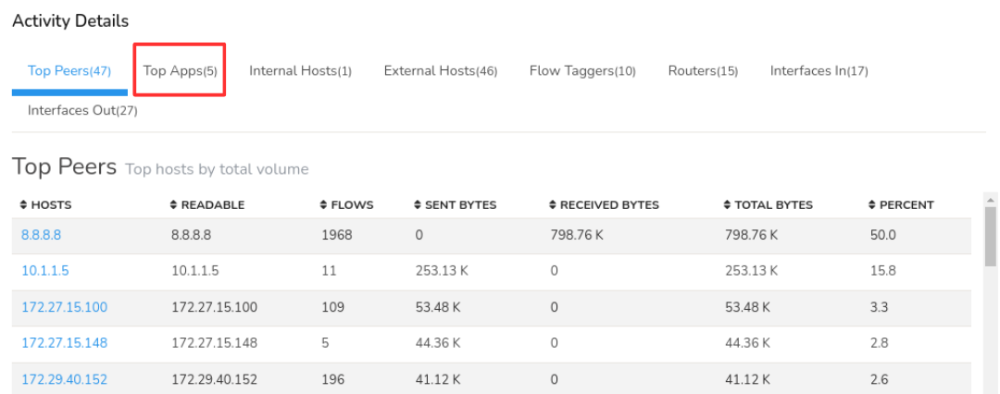

# Investigate Network Behavior Anomalies

## Investigation Overview

Network behavior rarely remains identical from one day to the next, but significant deviations from established traffic patterns often indicate that something within the network has changed. An unexpected increase in application traffic, a sudden shift in communication patterns, unusual activity during normally quiet periods, or a sustained decrease in expected traffic may all point to application changes, infrastructure issues, misconfigurations, or emerging security events.

Unlike threshold-based investigations, behavioral investigations focus on activity that appears unusual when compared to the network's learned baseline, even when predefined utilization limits have not been exceeded. Rather than immediately investigating individual hosts or interfaces, the objective is to understand how current behavior differs from normal operation, identify the entities responsible for the deviation, explain why the observed behavior is unusual, and determine whether the anomaly represents expected operational activity or requires further investigation.

Using Trisul, engineers can investigate behavioral anomalies from the detected deviation and progressively explain the observed behavior before determining the most appropriate follow-up investigation.

---

## When to Use This Investigation

Use this investigation when you need to:

- Investigate an anomaly detected through behavioral monitoring.
- Determine whether traffic deviates from normal network patterns.
- Validate unexpected changes in bandwidth utilization or traffic behavior.
- Investigate unexplained increases or decreases in network activity.
- Distinguish genuine anomalies from normal operational fluctuations.

---

## Investigation Objectives

By completing this investigation, you should be able to:

- Identify the behavioral deviation detected by the learned baseline.
- Understand how current behavior differs from normal network operation.
- Identify the entities responsible for generating the deviation.
- Determine why the observed behavior is unusual.
- Determine whether the deviation represents expected operational activity.
- Decide whether additional investigation is required.

---

## Investigation Workflow

### Step 1: Review the Behavioral Anomaly

Every behavioral investigation begins by understanding what has deviated from normal network activity. Before investigating hosts, interfaces, or applications, establish which metric exhibited unusual behavior, when the deviation began, which monitored object is affected, and whether the anomaly is still occurring.

Open [**Threshold Band Alerts**](/docs/ug/alerts/tband) to review the detected anomaly.

Use this dashboard to answer questions such as:

- Which metric deviated from its learned baseline?
- Which interface, host, or monitored object is affected?
- When did the deviation begin?
- Is the anomaly still active or has activity returned to normal?

#### Evidence to Collect

- Metric exhibiting anomalous behavior.
- Affected monitored object.
- Time the deviation was detected.
- Current status of the anomaly.
- Severity of the deviation.

#### Next Step

Once the anomaly has been identified, compare the observed activity against the learned baseline to understand how current behavior differs from normal operation.

---

### Step 2: Compare Against the Learned Baseline

An anomaly only has meaning when compared to what is considered normal. The next objective is to understand how the observed activity differs from the learned baseline before attempting to investigate the systems responsible for the deviation.

Review the learned baseline and historical trends for the affected metric.

Use this view to answer questions such as:

- How does current activity differ from normal behavior?
- Is the deviation an increase, decrease, or change in traffic distribution?
- Does the anomaly occur during an unusual time of day?
- Has similar behavior occurred previously?

#### Evidence to Collect

- Historical baseline for the affected metric.
- Magnitude of the deviation.
- Duration of the anomalous behavior.
- Previous occurrences of similar deviations.
- Changes from expected daily or weekly patterns.

#### Next Step

Once the deviation has been compared against the learned baseline, identify the entities responsible for generating the observed behavior.

---

### Step 3: Investigate the Observed Behavior

After comparing the anomaly against the learned baseline, continue the investigation in **Explore Flows** using the monitored entity and investigation period associated with the behavioral deviation.

This allows you to investigate the detailed network activity responsible for the observed anomaly while remaining focused on the affected time period. Rather than assuming why the anomaly occurred, investigate the communication activity to identify the network entities contributing to the behavioral deviation.

This step helps answer questions such as:

- Which network entities contributed to the observed behavioral deviation?
- Which hosts, interfaces, conversations, or other monitored objects exhibited unusual activity?
- Which communication patterns changed during the anomaly?
- Which observations appear most significant?
- Which entities require deeper investigation?

#### Evidence to Collect

- Network entities contributing to the behavioral deviation.
- Significant communication patterns.
- High-volume conversations.
- Network objects requiring further investigation.
- Initial evidence explaining the anomaly.

#### Continue the Investigation

Once the contributing network entities have been identified, determine which applications explain the observed behavior.

---

### Step 4: Analyze Application Activity

Remain within [**Explore Flows**](/docs/ug/tools/explore_flows) and review the [**Top Applications**](/docs/ug/tools/explore_flows#top-applications) for the investigation period.

Application visibility helps determine whether the observed deviation resulted from expected operational activity, scheduled maintenance, backups, software deployments, changing business demand, or unexpected application behavior.

*Figure: Application Analysis*

This step helps answer questions such as:

- Which applications contributed to the behavioral deviation?
- Did application behavior differ from the learned baseline?
- Were the observed applications expected?
- Do the applications explain why the anomaly was detected?
- Are unexpected services or protocols present?

#### Evidence to Collect

- Applications contributing to the behavioral deviation.
- Significant application activity.
- Expected operational traffic.
- Unexpected applications or protocols.
- Applications requiring further investigation.

#### Continue the Investigation

After identifying the applications involved, review the aggregate traffic profile to validate the investigation findings.

---

### Optional Validation: Review Aggregate Traffic

Most behavioral investigations can be completed using Explore Flows. Where additional validation is required, [**Aggregate Flows**](/docs/ug/tools/aggregate_flows) provides a summarized view of the investigated traffic.

Rather than introducing new evidence, Aggregate Flows groups the flow records by dimensions such as IP address, interface, application, port, router, and other network attributes. This helps confirm whether the observed behavioral deviation is concentrated within a particular network entity or distributed across multiple contributors.

This step helps answer questions such as:

- Do the aggregate statistics support the investigation findings?
- Which network entities dominate the observed traffic?
- Is the behavioral deviation concentrated within specific hosts, interfaces, or applications?
- Does the aggregate traffic profile explain the detected anomaly?

#### Evidence to Collect

- Aggregate traffic distribution.
- Dominant network entities.
- Traffic concentrations.
- Aggregate evidence supporting the investigation.

#### Continue the Investigation

If packet capture is available, continue with Packet Analysis to validate the observed network behavior.

### Step 5: Validate with Packet Analysis

Where packet capture is available, continue directly from [**Explore Flows**](/docs/ug/tools/explore_flows) by downloading the PCAP for the selected flow records.

Packet-level analysis helps validate the conclusions drawn from the flow investigation and provides protocol-level evidence explaining the observed behavioral deviation.

This step helps answer questions such as:

- Does packet-level analysis support the investigation findings?
- Are protocol anomalies visible?
- Does the packet data explain the behavioral deviation?
- Is additional evidence required before completing the investigation?

#### Evidence to Collect

- Packet-level evidence supporting the investigation.
- Protocol anomalies.
- Communication failures or retransmissions.
- Evidence validating the observed behavior.

#### Continue the Investigation

Once the network activity has been validated, determine whether the observed behavior represents expected operational activity.

---

### Step 6: Determine Whether the Behavior Was Expected

Not every behavioral anomaly indicates a network problem. Many deviations from the learned baseline are the result of legitimate operational activities such as scheduled maintenance, software deployments, infrastructure upgrades, backup or replication jobs, seasonal business demand, or planned configuration changes.

Review the investigation findings alongside known operational activities to determine whether the observed behavior represents an expected variation in network activity or a genuinely unexpected anomaly requiring additional investigation.

This step helps answer questions such as:

- Can the observed behavior be explained by planned operational activity?
- Were maintenance activities or software deployments in progress?
- Were backup or replication jobs running?
- Have infrastructure or configuration changes recently occurred?
- Does the observed behavior align with known business operations?
- Does the anomaly remain unexplained?

#### Evidence to Collect

- Scheduled maintenance activities.
- Software deployment events.
- Infrastructure or configuration changes.
- Backup or replication activity.
- Business events explaining the deviation.
- Evidence supporting expected or unexpected behavior.

#### Continue the Investigation

Once it has been determined whether the behavior is expected, identify the most appropriate follow-up investigation or operational action.

---

### Step 7: Determine the Appropriate Follow-up Investigation

Review the investigation findings as a whole to determine whether the behavioral anomaly has been fully explained or whether additional investigation is required.

The objective of this step is to decide whether continued monitoring, operational action, or a specialized investigation is necessary.

This step helps answer questions such as:

- Can the behavioral anomaly be fully explained?
- Does the anomaly require continued monitoring?
- Is no further action required?
- Should the investigation continue with a Host Investigation?
- Is an Interface Investigation required?
- Would Historical Investigation provide additional context?
- Is Packet Analysis required?
- Does the anomaly require escalation to a security investigation?

#### Evidence to Collect

- Confirmed explanation for the behavioral deviation.
- Responsible network entities.
- Evidence supporting expected or unexpected behavior.
- Recommended follow-up investigation.
- Monitoring or escalation recommendations.

--

### Summarize the Investigation with Trisul AI

By this stage, the investigation should have determined why the observed behavior differed from the learned baseline and collected the evidence required to explain the anomaly.

Open **Trisul AI** and review the investigation findings.

Use Trisul AI to generate a concise summary of the investigation, highlight the key observations, and assist with documenting the findings for operational review, incident reporting, or future reference.

---

## Investigation Completion

This investigation can generally be considered complete when:

- The anomalous behavior has been identified.
- The deviation has been compared against the learned baseline.
- The entities responsible for the deviation have been identified.
- The reason the observed behavior is unusual has been established.
- The observed behavior has been determined to be expected or unexpected.
- The appropriate follow-up investigation has been identified.

---

## Best Practices

- Treat behavioral anomalies as the beginning of an investigation rather than evidence of a problem.
- Always compare observed behavior against the learned baseline before drawing conclusions.
- Investigate why behavior differs from normal operation before investigating individual systems in detail.
- Use application and communication analysis to explain the anomaly rather than simply describing current network activity.
- Determine whether the observed behavior is expected before escalating the investigation.
- Review learned baselines periodically as network behavior evolves.
- Continue with specialised investigations when deeper analysis of a specific host, interface, application, or other monitored entity is required.

---

## Related Investigations

- [**Investigate the Network Activity of an IP Address**](/playbook/Network%20Investigation%20Playbook/inv1-exploreflows)
- [**Investigate High Traffic on a Network Interface**](/playbook/Network%20Investigation%20Playbook/inv2-routersintfs)
- [**Investigate Historical Network Activity**](/playbook/Network%20Investigation%20Playbook/inv3-retro)
- [**Investigate Threshold Crossing Alerts**](/playbook/Network%20Investigation%20Playbook/inv4-tca)
- [**Monitor Critical Network Assets**](/playbook/Network%20Investigation%20Playbook/inv6-customkeymonitor) – Check whether the anomalous entity is also a monitored critical asset.
- [**Correlate Network Activity Across Multiple Dimensions**](/playbook/Network%20Investigation%20Playbook/inv7-crosskey) – Determine whether the anomaly forms part of a broader multi-entity pattern.