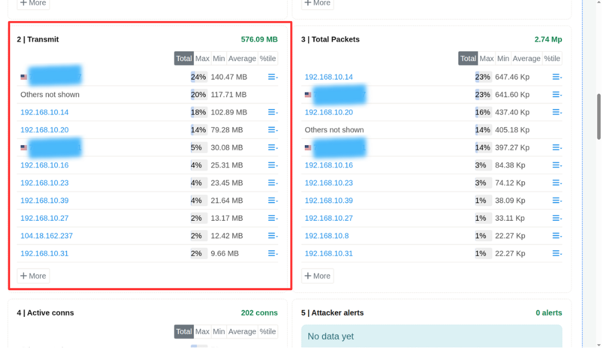
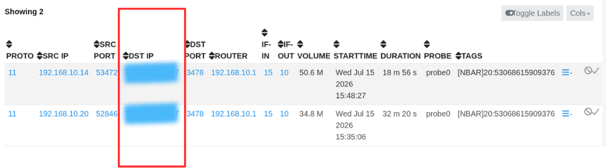
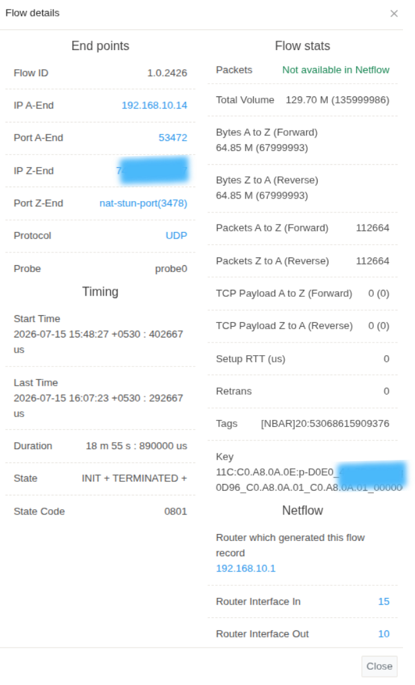

# Investigate Potential Data Exfiltration

## Investigation Overview

Sensitive information rarely leaves an organization's network without generating observable network activity. Large outbound transfers, repeated communication with unfamiliar external systems, unexpected uploads outside normal business hours, or unusual application behavior may all indicate an attempt to move data beyond organizational control.

Not every outbound transfer represents malicious activity. Backups, cloud synchronization, software updates, and legitimate business processes frequently generate similar traffic patterns. The objective of this investigation is to determine whether the observed communication represents normal business activity or potential data exfiltration, identify the systems involved, and establish the scope of the incident.

Using Trisul Network Security Monitoring, analysts can progressively narrow the investigation from the initial indicator to the underlying communication without switching between multiple security tools.

---

## When to Use This Investigation

Use this investigation when you need to:

- Investigate unusually large outbound data transfers.
- Validate communication with unfamiliar external destinations.
- Determine whether outbound traffic represents legitimate business activity.
- Investigate alerts indicating potential data exfiltration.
- Assess the scope of a suspected data theft incident.

---

## Investigation Objectives

By completing this investigation, you should be able to:

- Identify the host responsible for the outbound communication.
- Determine the destination of the transferred data.
- Understand the applications and protocols involved.
- Assess the volume and duration of the transfer.
- Determine whether the activity is legitimate or suspicious.
- Determine whether the observed outbound communication represents legitimate business activity or potential data exfiltration.

---

## Investigation Workflow

### Step 1: Review Outbound Traffic

Every data exfiltration investigation begins by identifying the systems generating unusual outbound network activity. Before analysing individual communications, determine which hosts are transmitting significant volumes of data outside the organization.

In [**Trisul Retro**](/docs/ug/cg/retro#selecting-a-time-window), navigate to:

**Retro Counters → Retro Usage → Hosts → Transmit**

    

*Figure: Outbound Toppers*

The [**Transmit**](/docs/ug/cg/retrotools#investigate-ip-activity) view lists hosts ranked by the volume of outbound traffic during the selected investigation period, making it easy to identify systems responsible for significant data transfers.

Review the top transmitting hosts and note:

- Systems generating unusually high outbound traffic.
- Sudden increases in transmitted data.
- Servers or workstations transmitting more data than expected.
- Hosts requiring further investigation.

The identified hosts can then be investigated in greater detail using flow analysis, packet inspection, and historical communication records.

#### Evidence to Preserve

- Source host.
- Outbound traffic volume.
- Time of the communication.
- Duration of the activity.
- Additional hosts exhibiting similar behavior.

#### Continue the Investigation

Once the source host has been identified, determine where the data was transferred.

---

### Step 2: Investigate External Destinations

Once a host with significant outbound traffic has been identified, the next step is to determine where the data is being sent and whether those destinations are expected within the organization's environment.

From the [**Transmit**](/docs/ug/cg/retrotools#investigate-ip-activity) view, click the **Actions** menu for the selected host and choose **Host Conversations**.

The **Host Conversations** view displays all inbound and outbound communications for the selected host during the investigation period, allowing analysts to identify the external systems involved in the transfer.

    

*Figure: Host Conversations- Destination IP*

Review the conversations to determine:

- The external IP addresses communicating with the host.
- The volume of data exchanged with each destination.
- Whether the destinations are known or expected.
- Whether any communications involve unfamiliar or suspicious external systems.

This analysis helps establish whether the outbound traffic represents normal business communication or requires deeper investigation.

#### Evidence to Preserve

- Destination IP addresses.
- Domains.
- ASN information.
- Geographic locations.
- Threat intelligence context.

#### Continue the Investigation

Once the destination has been validated, determine what communication occurred between the source and destination.

---

### Step 3: Analyze Network Flows

After identifying the communicating systems, examine the network flows to understand how the data transfer occurred. Flow analysis provides detailed information about the communication and helps determine whether the observed traffic is consistent with the expected role of the host.

From the [**Host Conversations**](/docs/ug/tools/explore_flows#top-conversations) view, click the [**Actions**](/docs/ug/tools/explore_flows#flow-options) menu for the selected conversation and choose **Flow Details**.

The [**Flow Details**](/docs/ug/tools/explore_flows#top-matching-flows) view provides detailed information about the communication, including the source and destination addresses, ports, protocols, applications, timestamps, and the volume of data transferred.

    

*Figure: Flow Details*

Review the flow details to determine:

- Which applications or services were used for the communication.
- The ports and protocols involved.
- The duration and timing of the connection.
- The amount of data transferred.
- Whether the communication characteristics are consistent with normal host behaviour.

Flow analysis helps determine whether the observed outbound communication represents legitimate business activity or warrants further investigation through packet analysis or additional historical review.

#### Evidence to Preserve

- Flow records.
- Applications involved.
- Protocols used.
- Total bytes transferred.
- Session duration and frequency.

#### Continue the Investigation

If the communication requires further validation, inspect the packet evidence supporting the network flows.

---

### Step 4: Validate with Packet Evidence

Flow records describe the communication, but packet analysis provides the detailed evidence required to validate what occurred during the transfer. Where packet capture is available, examining the packets allows analysts to inspect the actual network traffic associated with the communication.

From the [**Flow Details**](/docs/ug/tools/explore_flows#top-matching-flows) view, click the [**Actions**](/docs/ug/tools/explore_flows#flow-options) menu for the selected flow and choose **Download PCAP**.

The downloaded packet capture can be opened in a packet analysis tool such as **Wireshark** for detailed inspection of the communication.

Review the packet capture to determine:

- Whether the observed traffic matches the expected application or protocol.
- The sequence of requests and responses exchanged.
- Whether files or large amounts of data were transferred.
- Any protocol anomalies or suspicious payloads that may indicate unauthorized activity.

Packet analysis provides the highest level of evidence for validating whether the communication represents legitimate business activity or a potential data exfiltration attempt.

#### Evidence to Preserve

- Packet captures.
- Protocol exchanges.
- File transfer evidence.
- Packet timestamps.
- Indicators supporting or disproving exfiltration.

#### Continue the Investigation

After validating the communication, determine whether similar activity has occurred previously.

---

### Step 5: Determine Whether the Activity Is New or Recurring

Determining whether the observed communication is new or part of an established pattern provides valuable context for the investigation.

Open [**Historical Investigation (Retro)**](/docs/ug/cg/retro/) for the affected host and destination.

Use this investigation to answer questions such as:

- Has this host communicated with the destination previously?
- Is the observed transfer consistent with historical behavior?
- When did the communication first appear?
- Has the volume increased over time?
- Are additional hosts communicating with the same destination?

#### Evidence to Preserve

- Historical communication patterns.
- Previous occurrences.
- Changes in transfer volume.
- Additional affected hosts.
- Timeline of the activity.

#### Continue the Investigation

Once the historical context has been established, review the investigation findings to determine the scope of the incident.

---

### Step 6: Summarize the Investigation with Trisul AI

Once the investigation is complete, open **Trisul AI** to review the investigation findings.

Trisul AI can generate a concise summary of the investigation, highlight the key observations, and assist with documenting the findings for operational review, incident reporting, or future reference.

---

## Investigation Completion

This investigation can generally be considered complete when:

- The source host has been identified.
- The external destination has been validated.
- The communication has been analyzed using flow records.
- Packet evidence has been reviewed where available.
- Historical activity has been compared.
- Whether the observed communication has been determined to be legitimate or suspicious.

---

## Best Practices

- Investigate unusual outbound communications before assuming malicious activity.
- Validate destination reputation together with business context.
- Correlate flow records with packet evidence whenever available.
- Compare current observations with historical communication patterns.
- Preserve investigation evidence before containment or remediation activities begin.
- Document all findings to support incident response and post-incident analysis.

---

## Related Investigations

- [**Investigate Command and Control (C2) Communications**](/docs/playbook/securityplaybook/inv2-commandcontrol)
- [**Investigate Encrypted Traffic**](/playbook/securityplaybook/inv3-encryptedtraffic)
- [**Investigate Threat Intelligence Alerts**](/docs/playbook/securityplaybook/inv6-secalerts)
- [**Hunt Threats Across Historical Network Activity**](/docs/playbook/securityplaybook/inv7-historical)