# UI

:::info Navigation
:point_right: Go to **Customize &rarr; UI**
:::

The **Customize → UI** page provides access to the tools used to customize different parts of the Trisul web interface.

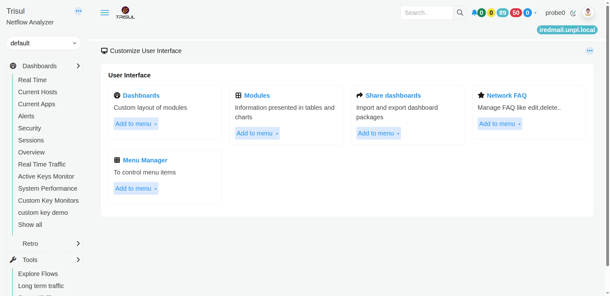
*Figure: Customization Menu*

It contains the following options:

| Option | What can you customize? |
| --- | --- |
| **Dashboards** | Create and manage dashboards and their layouts. |
| **Modules** | Manage the modules used to display information in dashboards. |
| **Share dashboards** | Import and export dashboard packages. |
| **Network FAQ** | Manage the questions available in Network FAQ. |
| **Menu Manager** | Manage the items and links displayed in the navigation menu. |

Select the option you want to work with to open its management page.

### Customize UI options

- **[Dashboards](#dashboards)** — Manage dashboards.
- **[Modules](#modules)** — Manage dashboard modules.
- **[Share dashboards](#share-dashboards)** — Import or export dashboard packages.
- **[Network FAQ](#network-faq)** — Manage Network FAQ questions.
- **[Menu Manager](#menu-manager)** — Manage navigation menu items.

## Dashboards

| Click &rarr; Dashboard              | Dashboards Customization                             |
| ---------------------- | ---------------------------------------------- |
| 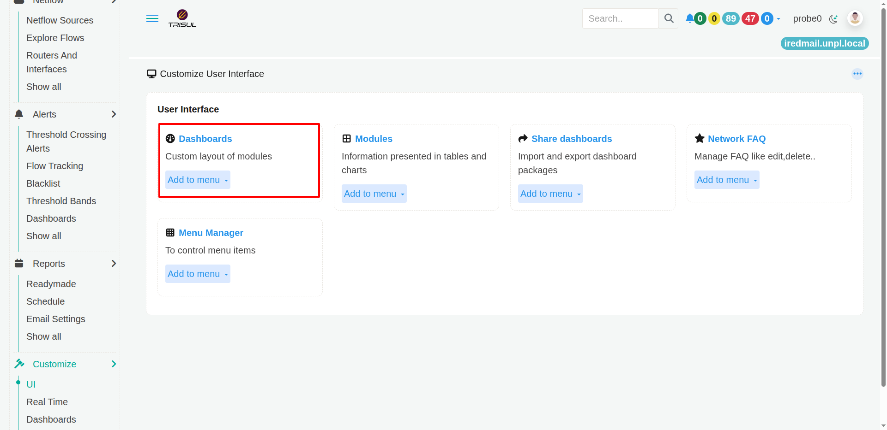             | 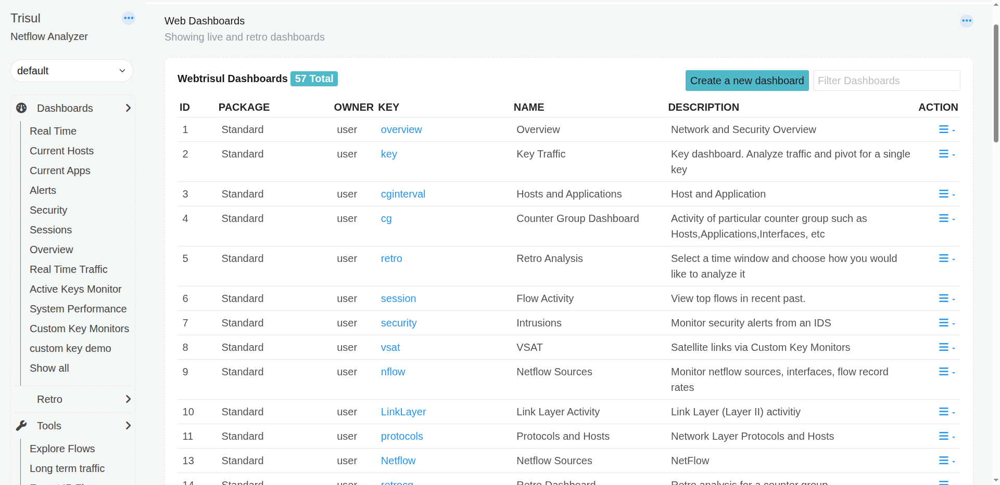      |

The **Dashboards** page lets you manage the dashboards available in Trisul. A dashboard is a collection of modules arranged to present the network information you want to monitor or investigate.

Use this page when you want to **create a dashboard, modify an existing dashboard, make a copy of one, set a dashboard as your homepage, or remove a dashboard**.

### What you can do

The Web Dashboards list shows the dashboards currently available.

Each dashboard is displayed with:

| Column          | What does it show?                                             |
| --------------- | -------------------------------------------------------------- |
| **ID**          | The identifier assigned to the dashboard.                      |
| **Package**     | The dashboard package from which the dashboard comes.          |
| **Owner Key**   | The key associated with the dashboard.                         |
| **Name**        | The name displayed for the dashboard.                          |
| **Description** | A short description of what the dashboard is intended to show. |
| **Action**      | Available actions for managing the dashboard.                  |

For example, the standard dashboards include **Overview, Key Traffic, Hosts and Applications, Counter Group Dashboard, Retro Analysis, Flow Activity, Intrusions, and NetFlow Sources**.

### Create a new dashboard

Click **Create a new dashboard** to create a dashboard for your own monitoring or investigation needs.

A custom dashboard can be built from the modules available in Trisul.

### Filter dashboards

Use **Filter Dashboards** to quickly find a dashboard in the list.

This is useful when many dashboards are available.

### Dashboard actions

The action menu for a dashboard provides options such as:

- **Clone** — Create a copy of an existing dashboard.
- **Edit** — Modify the dashboard.
- **Set as my Homepage** — Make the dashboard your default starting page.
- **Delete** — Remove the dashboard.

> Tip: Cloning an existing dashboard is useful when you want a dashboard similar to an existing one but with a different arrangement or set of modules.

## Modules

| Click &rarr; Modules             | Modules Customization                             |
| ---------------------- | ---------------------------------------------- |
| 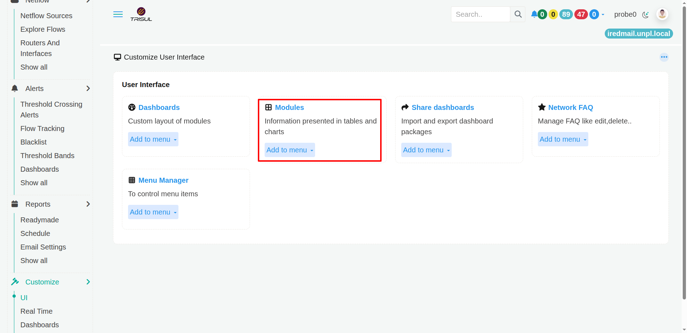             | 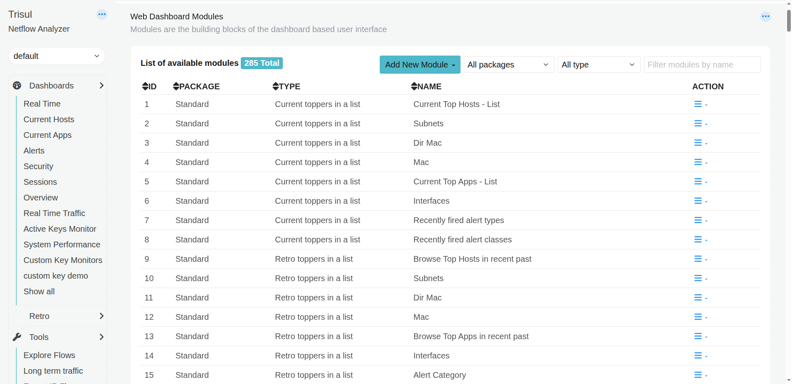      |

The **Modules** page lets you manage the individual building blocks used to create Trisul dashboards.

A module presents a particular type of network information, such as a list, chart, or other visualization. Dashboards are built by arranging these modules.

### What you can see

The Web Dashboard Modules page displays the available modules.

Each module is listed with:

| Column      | What does it show?                                          |
| ----------- | ----------------------------------------------------------- |
| **ID**      | The unique identifier of the module.                        |
| **Package** | The package that provides the module.                       |
| **Type**    | The type of module, such as a current or retro topper list. |
| **Name**    | The module's name.                                          |
| **Action**  | Actions available for managing the module.                  |

The screenshot, for example, shows modules such as **Current Top Hosts - List, Current Top Apps - List, Interfaces, Recently fired alert types, Recently fired alert classes**, and retro topper modules.

### Find a module

The page provides filters to help you locate a module:

- **All packages** — Filter modules by package.
- **All type** — Filter modules by module type.
- **Filter modules by name** — Search for a module by name.

This is useful when the system has a large number of available modules.

### Add a new module

Click **Add New Module** to add a module.

Modules can then be used as building blocks when creating or customizing dashboards.

> **Tip**: A module and a dashboard are different things. A module displays a particular piece of information, while a dashboard combines multiple modules into a single view.

## Share Dashboards

| Click &rarr; Share Dashboards              | Share Dashboards Customization                             |
| ---------------------- | ---------------------------------------------- |
| 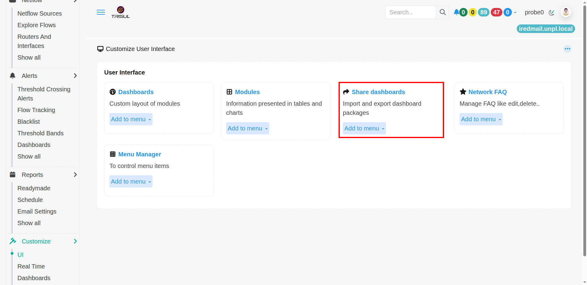             | 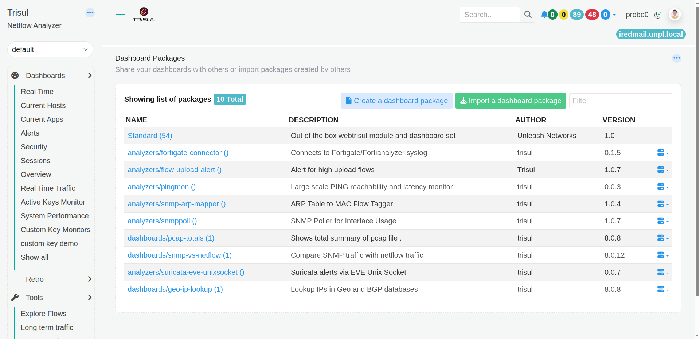      |

The **Share Dashboards** feature lets you package dashboards so that they can be shared with other Trisul users or imported into another Trisul installation.

A dashboard package can contain the dashboard configuration and the components required to reproduce the dashboard.

### Dashboard Packages

The **Dashboard Packages** page displays the packages currently available.

Each package is shown with:

| Column          | What does it show?                                   |
| --------------- | ---------------------------------------------------- |
| **Name**        | The name of the dashboard package.                   |
| **Description** | What the package contains or is intended for.        |
| **Author**      | The person or organization that created the package. |
| **Version**     | The package version.                                 |

The page also shows the total number of packages available.

### Create a dashboard package

Click **Create a dashboard package** to package a dashboard for sharing.

This is useful when you have created a dashboard that you want to:

- Share with another user.
- Move to another Trisul installation.
- Keep as a reusable dashboard package.

### Import a dashboard package

Click **Import a dashboard package** to bring a dashboard package created elsewhere into Trisul.

This is useful when someone provides you with a dashboard package that you want to use in your own Trisul environment.

### Find a package

Use the **Filter** field to find a particular dashboard package by name or other matching text.

**In simple terms**

**Create** a package when you want to share a dashboard.

**Import** a package when you want to use a dashboard shared with you.

## Network FAQ

| Click &rarr; Network FAQ              | Network FAQ Customization                             |
| ---------------------- | ---------------------------------------------- |
| 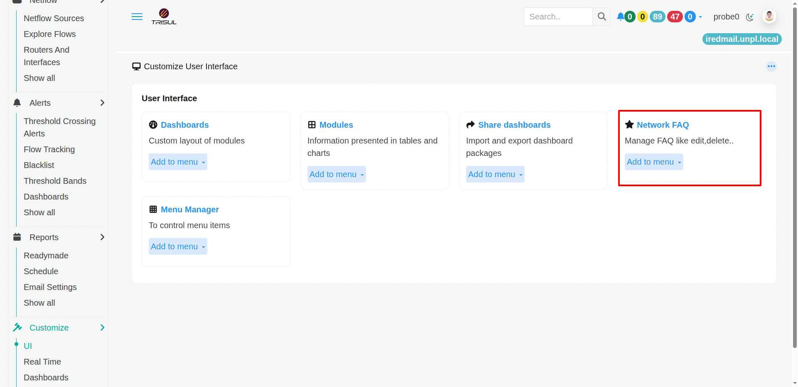             | 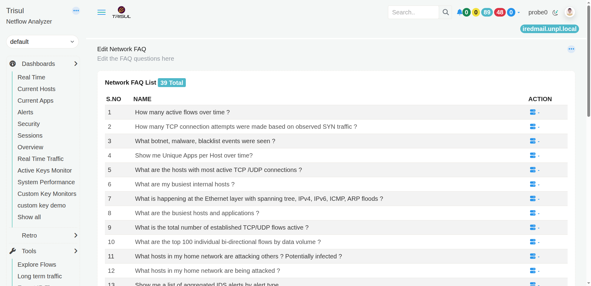      |

The **Network FAQ** page lets you manage the questions available in Trisul's Network FAQ feature.

Network FAQ provides predefined questions that can be used to perform commonly needed network investigations without having to manually configure every analysis.

### Network FAQ List

The page displays the available FAQ questions in a list.

Each entry contains:

| Column     | What does it show?                                      |
| ---------- | ------------------------------------------------------- |
| **S.No**   | The sequence number of the FAQ question.                |
| **Name**   | The question that can be used for the network analysis. |
| **Action** | Actions available for managing the question.            |

The screenshot shows examples such as:

- How many active flows over time?
- How many TCP connection attempts were made based on observed SYN traffic?
- What botnet, malware, blacklist events were seen?
- Show me Unique Apps per Host over time?
- What are the hosts with most active TCP/UDP connections?
- What are my busiest internal hosts?
- What are the busiest hosts and applications?
- What is the total number of established TCP/UDP flows active?
- What are the top 100 individual bi-directional flows by data volume?
- What hosts in my home network are attacking others?
- What hosts in my home network are being attacked?

The page displays the total number of FAQ questions currently configured.

### Managing Network FAQ questions

Use the Action menu associated with a question to manage that FAQ entry.

The Network FAQ list is useful when you want to maintain the set of commonly used questions available to users.

> **Tip**: Network FAQ questions are intended to make common investigations easier to repeat. Instead of remembering which analysis to run for a particular question, users can use the corresponding FAQ entry.

## Menu Manager

| Click &rarr; Menu Manager              | Menu Manager Customization                             |
| ---------------------- | ---------------------------------------------- |
| 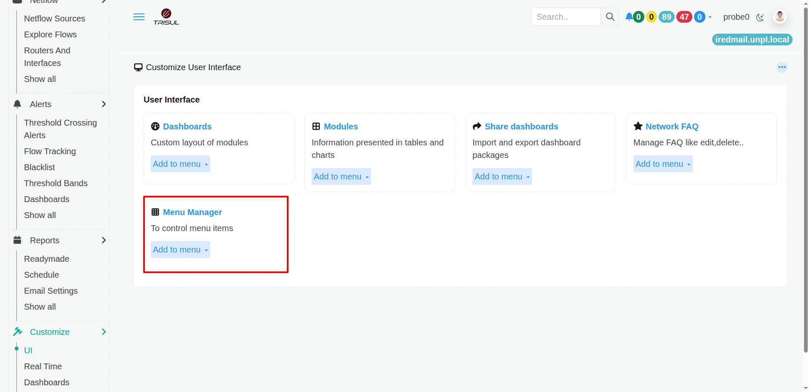             | 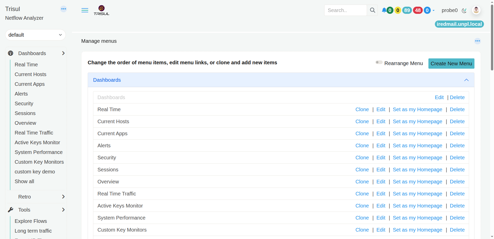      |

The **Menu Manager** lets you control the items that appear in the Trisul navigation menu.

Use it when you want to **change the order of menu items, modify menu links, create copies of existing items, add new items, or remove items**.

### Manage menus

The page displays the current menu structure.

The heading explains the main purpose of the page:

> **Change the order of menu items, edit menu links, or clone and add new items**

### Rearrange Menu

Enable Rearrange Menu when you want to change the order of menu items.

This is useful when you want frequently used pages to appear earlier in the navigation.

### Create New Menu

Click Create New Menu to add a new menu item.

This allows you to extend the navigation with an additional item.

### Menu actions

The menu manager displays actions alongside individual menu entries.

Depending on the menu item, available actions include:

| Action                 | What does it do?                               |
| ---------------------- | ---------------------------------------------- |
| **Clone**              | Creates a copy of an existing menu item.       |
| **Edit**               | Changes the menu item's configuration or link. |
| **Set as my Homepage** | Makes the selected item the user's homepage.   |
| **Delete**             | Removes the menu item.                         |

The screenshot also shows that the top-level Dashboards menu has its own **Edit** and **Delete** actions, while individual dashboard entries have additional actions.

> **Tip**: Use **Edit** when you want to change an existing menu entry. Use **Clone** when you want to create a similar entry without starting from scratch.

## Customize UI

The Customize → UI page is the starting point for customizing how Trisul presents information to users.

It provides access to five areas:

| Option               | Purpose                                                                  |
| -------------------- | ------------------------------------------------------------------------ |
| **Dashboards**       | Create and manage dashboards and their layouts.                          |
| **Modules**          | Manage the individual modules used to present information in dashboards. |
| **Share dashboards** | Import and export dashboard packages for sharing dashboards.             |
| **Network FAQ**      | Manage questions used for commonly performed network investigations.     |
| **Menu Manager**     | Control the items and links displayed in the navigation menu.            |

Each option addresses a different part of the Trisul user interface:

- Dashboards → what information is presented together

- Modules → what individual information blocks are available

- Share dashboards → how dashboard configurations are shared

- Network FAQ → which common network questions are available

- Menu Manager → how users navigate to those pages

This gives administrators a central place to customize the Trisul interface rather than having to treat every dashboard, module, and menu item as an isolated thing.

