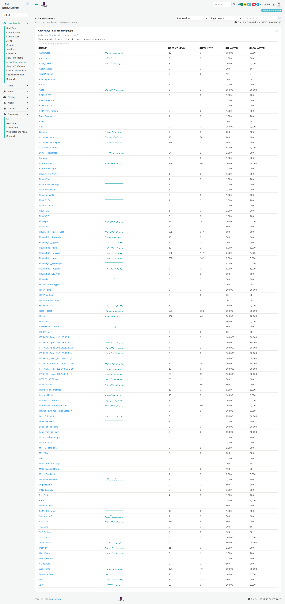

# Active Keys Monitor

The **Active Keys Monitor** shows how many keys Trisul is currently tracking for each [**Counter Group**](/docs/learntrisul/terminology#counter-group).

This helps you monitor changes in the **number and variety of items Trisul is seeing**. An unusual increase in active or new keys can indicate that Trisul is seeing a much larger variety of network activity than usual.

For example, if the **Hosts** counter group shows **193 Active Keys**, Trisul is currently tracking 193 active host keys in that counter group.

Checking this number over time helps you recognize whether the number of tracked values is within its usual range. An unusually high count can indicate a significant increase in the variety of network activity being observed.

Use this dashboard to check the current number of tracked values, spot new values appearing, and identify unusual changes over time.

*Figure: Active Keys Monitor*

> **Note:** The information displayed in the dashboard depends on the selected **Time window** and **Topper count**.

## Active Keys

**Active Keys** shows the number of keys currently active in the counter group. This tells you how many values Trisul is currently tracking for that type of information.

Checking this number over time helps you recognize whether the number of tracked values is within its usual range. An unusually high count can indicate a significant increase in the variety of network activity being observed.

## New Keys

**New Keys** shows how many new keys were detected during the latest time interval.

This helps you see whether new values are appearing at an unusual rate. A sudden increase can indicate that many new hosts, applications, or other values are being observed.

## Sparkline

The **Sparkline** shows how the number of active keys has changed over time.

Use it to quickly spot increases, decreases, or other unusual changes without opening a detailed chart. Click the **counter group name** to open its long-term chart.

**To learn how to interact with the charts, see [Chart UI Elements](/docs/ug/ui/charts#chart-ui-elements).**

## Hi Water and Low Water

**Hi Water** and **Low Water** show the high and low threshold values configured for the counter group.

These values are useful when you need to understand whether a change in the active-key count is approaching or exceeding a configured threshold.

For the general meaning of these thresholds, see [**Hi Water**](/docs/learntrisul/terminology#hi-water) and [**Low Water**](/docs/learntrisul/terminology#low-water).

## Investigate Further

Use the **Active Keys Monitor** to identify unusual changes in the number of values Trisul is tracking.

When you find a significant change, click the relevant **counter group name** to examine its long-term trend.

For information about investigating the network activity behind these changes, see the [Network Investigation Playbook](/playbook/Network%20Investigation%20Playbook/).