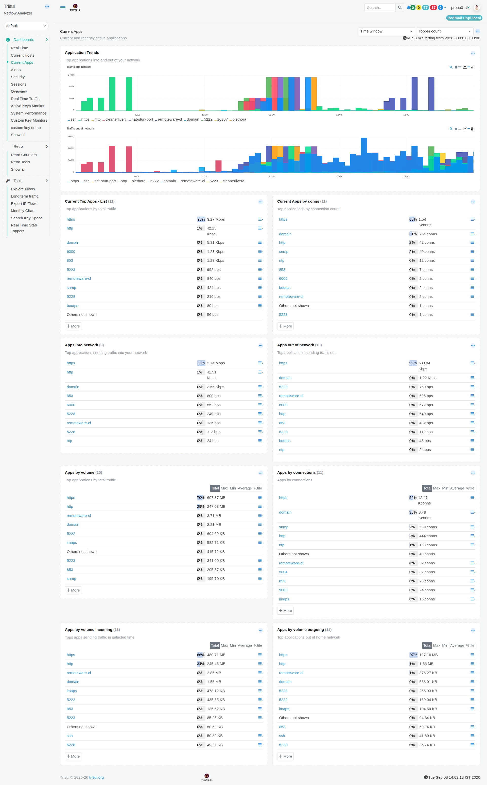

# Current Apps

The **Current Apps** dashboard shows which applications are active on your network and how much traffic and activity they generate.

It helps you answer questions such as:

- Which applications are using the most traffic?
- Which applications have the most connections?
- Which applications are receiving the most traffic?
- Which applications are sending the most traffic?
- How does application traffic change over time?

*Figure: Current Apps*

## Understanding the terms used in this dashboard

:::info Terminologies used

Before looking at the modules, it is useful to understand the terms used throughout this dashboard:

- **[Application](/docs/learntrisul/terminology#application)**

- **[Home Network](/docs/learntrisul/terminology#home-network)**

- **[Internal Hosts](/docs/learntrisul/terminology#internal-hosts)**

- **[External Hosts](/docs/learntrisul/terminology#external-hosts)**

- **[Inbound, Outbound, and Transit Traffic](/docs/learntrisul/terminology#inbound--outbound--transit-traffic)**

:::

> **Note:** The information displayed in the modules depends on the selected **Time window** and **Topper count**.

---

## 1. Application Trends

### What question does it answer?

**"How is application traffic changing over time?"**

This module shows how traffic from different applications changes during the selected time period.

It contains two charts:

- **Traffic into network** shows application traffic coming into your network.
- **Traffic out of network** shows application traffic leaving your network.

The charts let you compare applications and see when their traffic increases or decreases.

**To learn how to interact with the charts, see [Chart UI Elements](/docs/ug/ui/charts#chart-ui-elements).**

### When would I use it?

Use this module when you want to **see how application traffic changes over time**.

For example, if traffic from a particular application suddenly increases, you can use the other modules on this dashboard to see how much traffic that application is generating and how many connections it has.

---

## 2. Current Top Apps - List

### What question does it answer?

**"Which applications are generating the most traffic?"**

This module lists the top applications based on the amount of traffic they are generating during the selected time interval.

The applications are ranked from highest to lowest traffic, making it easy to see which applications currently account for the most traffic in the selected interval.

### When would I use it?

Use this module when you want to **quickly identify the applications responsible for the most traffic**.

For example, if HTTPS is at the top of the list, you can see that it accounts for the largest amount of traffic among the applications shown during the selected interval.

---

## 3. Current Apps by conns

### What question does it answer?

**"Which applications are communicating most frequently?"**

This module lists applications based on the number of network connections associated with each application during the selected time interval.

An application can have many connections even when the amount of data it transfers is relatively small.

### When would I use it?

Use this module when you want to identify **which applications are creating the most connections**.

For example, an application may have a large number of connections even though it does not appear among the applications generating the most traffic.

---

## 4. Apps into network

### What question does it answer?

**"Which applications are bringing the most traffic into my network?"**

This module lists the applications that are responsible for the most incoming traffic during the selected time interval.

### When would I use it?

Use this module when you want to find **which applications are receiving the most traffic from outside your network**.

For example, if HTTPS appears at the top, you can investigate the incoming traffic associated with HTTPS.

---

## 5. Apps out of network

### What question does it answer?

**"Which applications are sending the most traffic out of my network?"**

This module lists the applications that are responsible for the most outgoing traffic during the selected time interval.

### When would I use it?

Use this module when you want to find **which applications are sending the most traffic outside your network**.

For example, if one application suddenly appears at the top of the list, you can investigate the traffic it is sending and where that traffic is going.

---

## 6. Apps by volume

### What question does it answer?

**"Which applications have transferred the most data overall?"**

This module ranks applications according to the **total amount of traffic** associated with them during the selected time period, regardless of traffic direction.

The table also provides additional statistics such as **maximum, minimum, average, and percentage** values.

### When would I use it?

Use this module when you want to **compare applications based on how much data they have transferred overall**.

For example, you can use it to identify applications responsible for a large amount of network traffic during the selected period.

---

## 7. Apps by connections

### What question does it answer?

**"Which applications have the most connections overall?"**

This module ranks applications according to the **number of connections** associated with them during the selected time period.

The table also provides additional information about the connections, including maximum, minimum, average, and percentage values where available.

### When would I use it?

Use this module when you want to **compare applications based on how frequently they communicate**.

This can be useful when an application has many connections but does not necessarily transfer a large amount of data.

---

## 8. Apps by volume incoming

### What question does it answer?

**"Which applications have received the most data?"**

This module ranks applications according to the **total amount of incoming traffic** they received during the selected time period.

The table provides additional statistics such as the total, maximum, minimum, average, and percentage of incoming traffic.

### When would I use it?

Use this module when you want to **identify which applications are receiving the most data from outside your network**.

For example, if one application has received significantly more data than others, you can use this information as a starting point for further investigation.

---

## 9. Apps by volume outgoing

### What question does it answer?

**"Which applications have sent the most data?"**

This module ranks applications according to the **total amount of outgoing traffic** they generated during the selected time period.

The table provides additional statistics such as the total, maximum, minimum, average, and percentage of outgoing traffic.

### When would I use it?

Use this module when you want to **identify which applications are sending the most data outside your network**.

For example, if an application is responsible for an unusually large amount of outgoing traffic, you can investigate the application and the destinations receiving that traffic.

---

## Current Apps at a Glance

If you already know what you want to find, use this table to choose the relevant module.

| If you want to know... | Use this module |
| --- | --- |
| How is application traffic changing over time? | **Application Trends** |
| Which applications are generating the most traffic? | **Current Top Apps - List** |
| Which applications are communicating most frequently? | **Current Apps by conns** |
| Which applications are bringing the most traffic into my network? | **Apps into network** |
| Which applications are sending the most traffic out of my network? | **Apps out of network** |
| Which applications have transferred the most data overall? | **Apps by volume** |
| Which applications have the most connections overall? | **Apps by connections** |
| Which applications have received the most data? | **Apps by volume incoming** |
| Which applications have sent the most data? | **Apps by volume outgoing** |

---

## Investigate Further

The **Current Apps** dashboard can be used as a starting point when you notice an application generating unusual traffic or connections.

For example, you may notice that an application is responsible for a large amount of traffic, has an unusually high number of connections, or is sending more data than expected.

You can continue the investigation using the relevant workflow in the [Network Investigation Playbook](/playbook/Network%20Investigation%20Playbook/).

The playbook provides step-by-step investigation workflows that help you move from an initial observation to a deeper investigation of network activity.