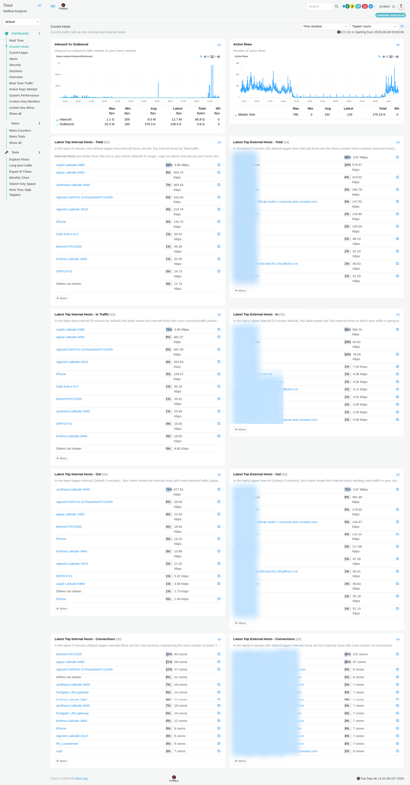

# Current Hosts

The **Current Hosts** dashboard shows the hosts that are currently communicating on your network and gives you a quick view of the traffic between them.

It helps you understand:

- How much traffic is coming into and leaving your network
- Which devices on your network are using the most traffic
- Which outside systems are communicating with your network
- Which devices are receiving or sending the most data
- Which systems have the most network connections

You can use this dashboard to get a quick understanding of network activity and identify hosts that may need further investigation.

  
*Figure: Current Hosts*

## Understanding the terms used in this dashboard

:::info terminologies used

Before looking at the modules, it is useful to understand the terms used throughout this dashboard:

- **[Home Network](/docs/learntrisul/terminology#home-network)** refers to the network that Trisul is monitoring as your own network.
- **[Internal Hosts](/docs/learntrisul/terminology#internal-hosts)** are hosts that belong to your home network.
- **[External Hosts](/docs/learntrisul/terminology#external-hosts)** are hosts outside your home network that communicate with it.
- **[Inbound, Outbound, and Transit Traffic](/docs/learntrisul/terminology#inbound--outbound--transit-traffic)** describes the direction in which traffic moves in relation to your home network.

:::

The modules on this dashboard use these two groups to show where traffic is coming from, where it is going, and which hosts are most active.

> **Note:** The information displayed in the modules depends on the selected **Time window** and **Topper count**.

---

## 1. Inbound vs Outbound

### What question does it answer?

**"Is more traffic coming into my network or going out?"**

This module compares **inbound and outbound traffic** and shows how the traffic changes over the selected time period.

The graph helps you see traffic patterns and identify periods when traffic increases or decreases.

The figures below the graph show the **maximum, minimum, average, latest, and total** traffic recorded during the selected period.

### When would I use it?

Use this module when you want to **quickly understand the overall direction and volume of network traffic**.

For example, if you notice a sudden increase in outbound traffic, you can use the **Top Internal Hosts - Out** module to find which device is sending the traffic and the **Top External Hosts - Out** module to see where the traffic is going.

**To learn how to interact with the chart, see [Chart UI Elements](/docs/ug/ui/charts#chart-ui-elements).**

---

## 2. Active Flows

### What question does it answer?

**"How active is my network right now?"**

This module shows the number of **active flows**, giving you an idea of how much communication is taking place between devices and other systems.

A flow represents a period of communication between two endpoints. For example, when a device accesses a website, Trisul records that communication as a flow.

The graph shows whether the number of active flows is increasing, decreasing, or staying relatively steady over the selected time period.

### When would I use it?

Use this module when you want to **quickly see whether network activity is normal or unusually high**.

If the number of active flows suddenly increases, it means there is more communication happening across the network than before. You can then use the other modules in **Current Hosts** to identify which devices or external systems are contributing to that activity.

**To learn how to interact with the chart, see [Chart UI Elements](/docs/ug/ui/charts#chart-ui-elements).**

---

## 3. Latest Top Internal Hosts - Total

### What question does it answer?

**"Which devices on my network are using the most traffic overall?"**

This module lists the internal hosts that have generated or received the most **total traffic** during the selected time interval.

For example, if one computer transfers much more data than the other devices on your network, it will appear higher in the list.

### When would I use it?

Use this module when you want to find **which devices are responsible for the most overall traffic**.

For example, if one computer appears at the top of the list, you can investigate that device to understand what is causing its high traffic.

**To learn how to interact with the chart, see [Chart UI Elements](/docs/ug/ui/charts#chart-ui-elements).**

---

## 4. Latest Top External Hosts - Total

### What question does it answer?

**"Which outside systems are exchanging the most traffic with my network?"**

This module lists the external hosts that have exchanged the most **total traffic** with your network during the selected time interval.

These external hosts may be websites, Internet servers, cloud services, or other systems outside your network.

### When would I use it?

Use this module when you want to understand **which outside systems account for most of your network traffic**.

For example, if a particular external server is responsible for a large amount of traffic, you can investigate that destination further.

**To learn how to interact with the chart, see [Chart UI Elements](/docs/ug/ui/charts#chart-ui-elements).**

---

## 5. Latest Top Internal Hosts - In Traffic

### What question does it answer?

**"Which devices on my network are receiving the most traffic?"**

This module ranks internal hosts according to the amount of **incoming traffic** they receive.

In simple terms, it helps you find **which devices are receiving or downloading the most data**.

### When would I use it?

Use this module when you want to identify devices that are receiving unusually large amounts of data.

For example, if one computer is receiving much more traffic than the others, this module helps you identify it quickly.

**To learn how to interact with the chart, see [Chart UI Elements](/docs/ug/ui/charts#chart-ui-elements).**

---

## 6. Latest Top External Hosts - In

### What question does it answer?

**"Which outside systems are sending the most traffic to my network?"**

This module shows the external hosts that are sending the most **incoming traffic** to your network.

### When would I use it?

Use this module when you want to find out **where your incoming traffic is coming from**.

For example, if an external server is sending a large amount of data to your network, that server will appear higher in this list.

**To learn how to interact with the chart, see [Chart UI Elements](/docs/ug/ui/charts#chart-ui-elements).**

---

## 7. Latest Top Internal Hosts - Out

### What question does it answer?

**"Which devices on my network are sending the most traffic?"**

This module ranks internal hosts according to the amount of **outgoing traffic** they send.

In simple terms, it helps you find **which devices are uploading or sending the most data**.

### When would I use it?

Use this module when you want to identify devices that are sending unusually large amounts of data.

For example, if one computer is sending significantly more traffic than the others, you can identify it here and investigate further.

**To learn how to interact with the chart, see [Chart UI Elements](/docs/ug/ui/charts#chart-ui-elements).**

---

## 8. Latest Top External Hosts - Out

### What question does it answer?

**"Which outside systems are receiving the most traffic from my network?"**

This module shows the external hosts that are receiving the most **outgoing traffic** from your network.

### When would I use it?

Use this module when you want to understand **where your outgoing traffic is going**.

For example, if a device is sending a large amount of data to an external server, that server will appear higher in this list

**To learn how to interact with the chart, see [Chart UI Elements](/docs/ug/ui/charts#chart-ui-elements).**

---

## 9. Latest Top Internal Hosts - Connections

### What question does it answer?

**"Which devices on my network have the most network connections?"**

This module ranks internal hosts according to the number of network connections they have made during the selected time interval.

The number of connections is different from the amount of traffic. A device can have many connections while transferring relatively little data.

### When would I use it?

Use this module when you want to find **which devices are communicating through the largest number of connections**.

For example, a computer may not transfer much data but could still make many connections to different websites or services.

**To learn how to interact with the chart, see [Chart UI Elements](/docs/ug/ui/charts#chart-ui-elements).**

---

## 10. Latest Top External Hosts - Connections

### What question does it answer?

**"Which outside systems have the most connections with my network?"**

This module ranks external hosts according to the number of network connections they have with your network.

### When would I use it?

Use this module when you want to find **which external systems your network communicates with most frequently**.

For example, an external service may appear near the top because your devices repeatedly connect to it, even if the amount of data exchanged with that service is relatively small.

**To learn how to interact with the chart, see [Chart UI Elements](/docs/ug/ui/charts#chart-ui-elements).**

---

## Current Hosts at a Glance

If you already know what you want to find, use this table to choose the relevant module.

| If you want to know... | Use this module |
| --- | --- |
| How much traffic is coming into and leaving my network? | **Inbound vs Outbound** |
| How many network conversations are happening? | **Active Flows** |
| Which devices on my network use the most traffic overall? | **Latest Top Internal Hosts - Total** |
| Which outside systems exchange the most traffic with my network? | **Latest Top External Hosts - Total** |
| Which devices on my network receive the most traffic? | **Latest Top Internal Hosts - In Traffic** |
| Which outside systems send the most traffic to my network? | **Latest Top External Hosts - In** |
| Which devices on my network send the most traffic? | **Latest Top Internal Hosts - Out** |
| Which outside systems receive the most traffic from my network? | **Latest Top External Hosts - Out** |
| Which devices on my network have the most connections? | **Latest Top Internal Hosts - Connections** |
| Which outside systems have the most connections with my network? | **Latest Top External Hosts - Connections** |

---

## Investigate Further

The **Current Hosts** dashboard can be used as a starting point when you need to investigate unusual network activity.

For example, you may notice unusually high traffic from a particular host or identify an external host that is communicating heavily with your network. From there, you can continue the investigation using the relevant workflow in the [**Network Investigation Playbook**](/playbook/Network%20Investigation%20Playbook/).

The playbook provides step-by-step investigations for situations such as:

- Investigating the network activity of a specific IP address
- Investigating high traffic on a network interface
- Investigating historical network activity
- Investigating threshold-crossing alerts
- Investigating unusual network behavior
- Monitoring critical network assets
- Correlating network activity across multiple dimensions

These investigations provide a structured path for moving from an initial observation to a deeper investigation using Trisul.
