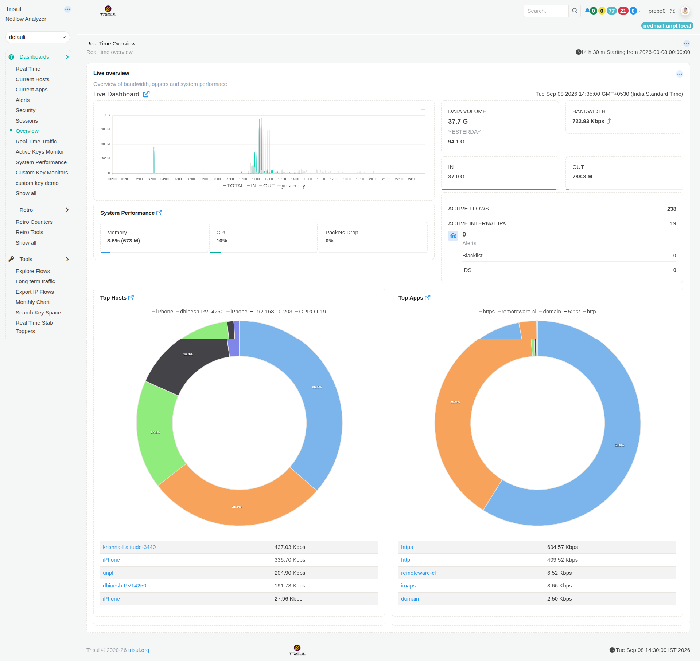

# Overview

The **Overview** dashboard gives you a quick summary of network traffic, Trisul system performance, active network activity, alerts, top hosts, and top applications.

Use this dashboard to quickly find out:

- How much data has been transferred during the selected time period?
- What is the current traffic rate?
- How much traffic is coming into and leaving the network?
- How many network flows are currently active?
- How many internal IP addresses are currently active?
- Are there any blacklist or IDS alerts?
- Which hosts are currently associated with the highest traffic rate?
- Which applications are currently associated with the highest traffic rate?

*Figure: Overview*

> **Note:** The information displayed on the dashboard depends on the selected **Time window** and **Topper count**.

## Understanding the metrics

The Overview dashboard uses several different types of measurements. Understanding the difference between **traffic volume** and **traffic rate** is important when reading the dashboard.

- **Data Volume** is the total amount of data transferred during the selected time period. It is displayed as a data size such as **GB** or **MB**.

- **Bandwidth** is the rate at which data is being transferred. It is displayed as a rate such as **Kbps** or **Mbps**.

- **In** is the amount of data received by the network during the selected time period.

- **Out** is the amount of data sent from the network during the selected time period.

- **Active Flows** is the number of network flows that are currently active.

- **Active Internal IPs** is the number of internal IP addresses that are currently active.

- **Top Hosts** shows the hosts associated with the highest traffic rates.

- **Top Apps** shows the applications associated with the highest traffic rates.

- **Blacklist** is the number of alerts associated with blacklisted activity.

- **IDS** is the number of alerts generated by the Intrusion Detection System.

---

## 1. Live overview

### What question does it answer?

**"How much network traffic is being observed, and how is it changing over time?"**

The **Live overview** provides a summary of network traffic for the selected time period.

It shows:

- **Data Volume**: the total amount of data transferred during the selected period.
- **Yesterday**: the total data volume recorded during the corresponding period on the previous day.
- **Bandwidth**: the current traffic rate.
- **In**: the amount of incoming data.
- **Out**: the amount of outgoing data.
- **Traffic chart**: shows how total, incoming, and outgoing traffic changes throughout the selected time period.

The **Data Volume** and **In/Out** values tell you **how much data was transferred**, while **Bandwidth** tells you **how quickly data is being transferred**.

The traffic chart helps you identify periods when traffic activity increases or decreases.

**To learn how to interact with the chart, see [Chart UI Elements](/docs/ug/ui/charts#chart-ui-elements).**

### When would I use it?

Use this module when you want to **quickly check the amount and rate of network traffic**.

For example, if you notice a sudden increase in the traffic chart, check **Top Hosts** and **Top Apps** to identify which hosts or applications are associated with the higher traffic rate.

---

## 2. System Performance

### What question does it answer?

**"Is the system running Trisul using its resources normally?"**

The **System Performance** module shows the current resource usage of the system running Trisul.

It shows:

- **Memory**: the amount and percentage of system memory currently being used.
- **CPU**: the percentage of processor capacity currently being used.
- **Packets Drop**: the percentage of packets that were dropped instead of being processed.

### When would I use it?

Use this module when you want to **check whether system resource usage or packet drops could affect network monitoring**.

For example, if the packet drop percentage increases, you can check CPU and memory usage to understand the current system load.

---

## 3. Network Activity and Alerts

### What question does it answer?

**"How many network flows and internal IPs are active, and are there any alerts?"**

This section gives you a quick view of current network activity and detected alerts.

It shows:

- **Active Flows**: the number of network flows that are currently active.
- **Active Internal IPs**: the number of internal IP addresses that are currently active.
- **Alerts**: the total number of alerts currently reported.
- **Blacklist**: the number of alerts associated with blacklisted activity.
- **IDS**: the number of alerts generated by the Intrusion Detection System.

### When would I use it?

Use this section when you want to **check the current level of network activity and look for alerts that may require investigation**.

For example, if there are IDS alerts, you can investigate the related network activity to determine which hosts, applications, or connections are involved.

---

## 4. Top Hosts

### What question does it answer?

**"Which hosts currently have the highest traffic rates?"**

The **Top Hosts** module ranks hosts by their traffic rate.

The chart provides a visual comparison of the top hosts, while the list below shows each host and its traffic rate.

For example, a value such as **437.03 Kbps** means that the host is associated with a traffic rate of approximately 437 Kbps.

### When would I use it?

Use this module when you want to **identify which hosts are currently associated with the highest traffic rates**.

For example, if one host has a much higher traffic rate than the others, you can investigate its connections and applications to understand what is generating that activity.

**To learn how to interact with the chart, see [Chart UI Elements](/docs/ug/ui/charts#chart-ui-elements).**

---

## 5. Top Apps

### What question does it answer?

**"Which applications currently have the highest traffic rates?"**

The **Top Apps** module ranks applications by their traffic rate.

The chart provides a visual comparison of the top applications, while the list below shows each application and its traffic rate.

For example, a value such as **604.57 Kbps** means that the application is associated with a traffic rate of approximately 605 Kbps.

### When would I use it?

Use this module when you want to **identify which applications are currently associated with the highest traffic rates**.

For example, if one application accounts for a much higher traffic rate than the others, you can investigate that application to identify the hosts and connections involved.

**To learn how to interact with the chart, see [Chart UI Elements](/docs/ug/ui/charts#chart-ui-elements).**

---

## Overview at a Glance

Use this table to quickly find the part of the dashboard that answers your question.

| If you want to know... | Use this module |
| --- | --- |
| How much data was transferred during the selected period? | **Live overview** |
| What is the current traffic rate? | **Live overview** |
| How much incoming data was transferred? | **Live overview** |
| How much outgoing data was transferred? | **Live overview** |
| How is traffic changing over time? | **Live overview** |
| How much CPU and memory is the Trisul system using? | **System Performance** |
| Are packets being dropped? | **System Performance** |
| How many network flows are currently active? | **Network Activity and Alerts** |
| How many internal IP addresses are currently active? | **Network Activity and Alerts** |
| Are there any alerts? | **Network Activity and Alerts** |
| Are there any blacklist alerts? | **Network Activity and Alerts** |
| Are there any IDS alerts? | **Network Activity and Alerts** |
| Which hosts currently have the highest traffic rates? | **Top Hosts** |
| Which applications currently have the highest traffic rates? | **Top Apps** |

---

## Investigate Further

The **Overview** dashboard is useful for spotting activity that needs a closer look.

For example, you may notice:

- A sudden increase in traffic rate.
- A host with an unusually high traffic rate.
- An application with an unusually high traffic rate.
- A high number of active flows.
- An increase in blacklist or IDS alerts.
- Packet drops on the Trisul system.

Use the relevant observation as the starting point for a deeper investigation in the [Network Investigation Playbook](/playbook/Network%20Investigation%20Playbook/).

The playbook provides step-by-step workflows for investigating network activity and moving from an initial observation to the underlying hosts, applications, flows, and packets involved.