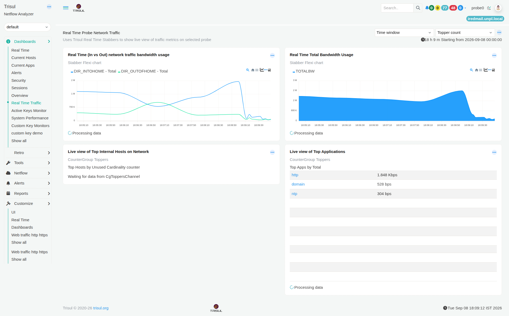

# Real Time Traffic

The **Real Time Traffic** dashboard provides a live view of network activity on the selected Probe.

Unlike dashboards that help you examine traffic over longer time periods, this dashboard is useful when you want to see **what is happening on the network right now**. It shows the current bandwidth rate and the internal hosts and applications contributing to that activity.

*Figure: Real Time Traffic dashboard*

> **Note:** The information displayed in the dashboard depends on the selected **Time window** and **Topper count**.

## In vs Out Network Traffic

The **Real Time (In vs Out) network traffic bandwidth usage** chart shows the current bandwidth rate for traffic entering and leaving your Home Network.

**In** represents traffic coming into your Home Network, while **Out** represents traffic leaving it. The chart lets you see how these two directions are changing from moment to moment.

For example, a sudden increase in **In** bandwidth can indicate that the network is currently receiving much more data than usual.

This view is useful when you want to quickly identify a change in the direction or rate of traffic as it happens.

## Total Bandwidth Usage

The **Real Time Total Bandwidth Usage** chart shows the total bandwidth rate currently being seen by Trisul.

While the previous chart separates traffic into **In** and **Out**, this chart gives you the overall bandwidth rate at a glance.

Use it to spot sudden increases or decreases in total network activity as they happen.

## Top Internal Hosts

The **Live view of Top Internal Hosts on Network** shows the internal hosts that are currently generating the most network activity.

This helps you identify which hosts are contributing most to the traffic at that moment. If a host suddenly appears among the top active hosts, you can use it as a starting point for further investigation.

## Top Applications

The **Live view of Top Applications** shows the applications currently generating the most traffic, along with their bandwidth rates.

This helps you see which applications are responsible for the network activity you are seeing right now.

For example, if `http` appears at the top of the list, you can see how much bandwidth HTTP traffic is currently using.

## Investigate Further

Use the **Real Time Traffic** dashboard when you need to understand what is happening on the network **right now**.

When you notice an unusual bandwidth increase, a particular host becoming highly active, or an application suddenly generating significant traffic, use the relevant host or application information as a starting point for deeper investigation.

For information about investigating network activity in more detail, see the [Network Investigation Playbook](/playbook/Network%20Investigation%20Playbook/).
