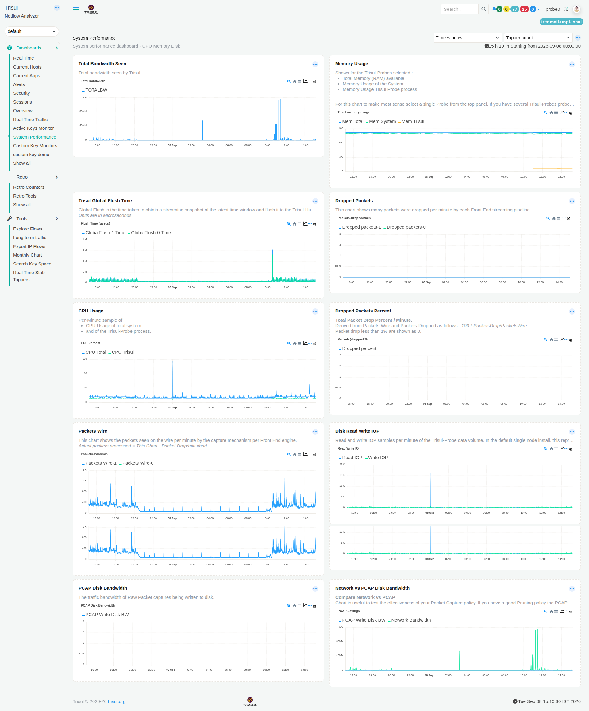

# System Performance

The **System Performance** dashboard helps you monitor the performance of the system running Trisul.

It shows network bandwidth observed by Trisul, CPU and memory usage, packet drops, data flush time, packet capture activity, disk read/write operations, and the disk bandwidth used for storing raw packet captures.

It helps you answer questions such as:

- How much bandwidth is Trisul observing?
- How much CPU and memory is the system using?
- Are packets being dropped?
- How long is Trisul taking to flush its latest data?
- How many packets are being seen by the packet capture mechanism?
- How many disk read and write operations are being performed?
- How much disk bandwidth is being used to write raw packet captures?
- How does network bandwidth compare with PCAP disk write bandwidth?

*Figure: System Performance*

**To learn how to interact with the charts, see [Chart UI Elements](/docs/ug/ui/charts#chart-ui-elements).**

> **Note:** The information displayed in the dashboard depends on the selected **Time window** and **Topper count**.

## Understanding the metrics

The System Performance dashboard uses different measurements for network traffic, system resources, packet processing, and disk activity.

- **Total Bandwidth Seen** shows the total bandwidth observed by Trisul over time.

- **Memory Usage** shows the total system memory available and the memory used by the operating system and Trisul Probe processes.

- **Trisul Global Flush Time** shows how long Trisul takes to obtain a streaming snapshot of the latest time window and flush the data to Trisul-Hub.

- **Dropped Packets** shows the number of packets dropped per minute by each Front End streaming pipeline.

- **CPU Usage** shows CPU usage for the operating system and Trisul Probe processes.

- **Dropped Packets Percent** shows the percentage of packets that were dropped.

- **Packets Wire** shows the number of packets seen per minute by the packet capture mechanism for each Front End engine.

- **Disk Read Write IOP** shows the number of disk read and write operations performed per minute for the Trisul-Probe data volume.

- **PCAP Disk Bandwidth** shows the rate at which raw packet capture data is written to disk.

- **Network vs PCAP Disk Bandwidth** compares the network traffic rate observed by Trisul with the rate at which raw packet capture data is written to disk.

---

## 1. Total Bandwidth Seen

### What question does it answer?

**"How much bandwidth is Trisul observing over time?"**

This module shows the total bandwidth observed by Trisul during the selected time period.

The chart shows how the observed bandwidth changes over time, making it easier to identify periods when the traffic rate increases or decreases.

### When would I use it?

Use this module when you want to **see how the network traffic rate observed by Trisul changes over time**.

For example, a sudden spike in the chart can help you identify a period of unusually high network traffic.

---

## 2. Memory Usage

### What question does it answer?

**"How much memory is the system and Trisul Probe using?"**

This module shows memory usage over the selected time period.

It provides three measurements:

- **Mem Total** shows the total memory available on the system.
- **Mem System** shows memory used by the operating system.
- **Mem Trisul** shows memory used by the Trisul Probe process.

The chart shows how these memory measurements change over time.

> **Note:** For this chart to be meaningful, select a single Trisul Probe from the top of the dashboard.

### When would I use it?

Use this module when you want to **check whether memory usage is increasing, decreasing, or remaining stable**.

For example, if Trisul memory usage continues to increase over time, you can use the chart to identify when the increase started.

---

## 3. Trisul Global Flush Time

### What question does it answer?

**"How long is Trisul taking to flush its latest data?"**

**Trisul Global Flush Time** measures the time Trisul takes to obtain a streaming snapshot of the latest time window and flush that data to Trisul-Hub.

The chart shows the flush time over the selected period.

A higher flush time means Trisul is taking longer to complete this data-flush operation.

### When would I use it?

Use this module when you want to **identify periods when Trisul takes longer than usual to flush data**.

For example, a sudden increase in flush time can help you identify a period when the data-flush operation took significantly longer than usual.

---

## 4. Dropped Packets

### What question does it answer?

**"How many packets are being dropped per minute?"**

This module shows the number of packets dropped **per minute** by each Front End streaming pipeline.

The chart shows when packet drops occur and whether the number of dropped packets increases during particular periods.

### When would I use it?

Use this module when you want to **find out whether packets are being dropped and when the drops occur**.

For example, if the number of dropped packets increases during a period of high network traffic, you can compare this chart with other System Performance measurements to investigate the cause.

---

## 5. CPU Usage

### What question does it answer?

**"How much CPU is the system and Trisul Probe using?"**

This module shows CPU usage for:

- **CPU Total** shows CPU usage for the system.
- **CPU Trisul** shows CPU usage by the Trisul Probe process.

The chart shows how CPU usage changes over the selected time period.

### When would I use it?

Use this module when you want to **check whether CPU usage is increasing, decreasing, or remaining stable**.

For example, if CPU usage suddenly increases, you can compare it with network traffic and other System Performance measurements to investigate what was happening at that time.

---

## 6. Dropped Packets Percent

### What question does it answer?

**"What percentage of packets are being dropped?"**

This module shows the percentage of packets dropped per minute.

The percentage is calculated as:

**100 × Dropped Packets / Packets Wire**

A value of **0%** means that no packets were dropped during that measurement period.

### When would I use it?

Use this module when you want to **measure packet drops as a percentage of the packets seen by the packet capture mechanism**.

For example, you can use this metric to determine whether packet drops represent a small or significant portion of the packets being received.

---

## 7. Packets Wire

### What question does it answer?

**"How many packets is the packet capture mechanism seeing?"**

This module shows the number of packets seen **per minute** on the network interface by the packet capture mechanism for each Front End engine.

It shows the packet volume reaching the packet capture stage before packet processing and provides a basis for comparing packet drops with the number of packets seen.

### When would I use it?

Use this module when you want to **check how many packets the packet capture mechanism is receiving**.

For example, you can compare **Packets Wire** with **Dropped Packets** to understand whether packet drops are occurring while a large number of packets are being received.

---

## 8. Disk Read Write IOP

### What question does it answer?

**"How many disk read and write operations is Trisul performing?"**

This module shows the number of disk read and write operations performed **per minute** for the Trisul-Probe data volume.

It provides separate measurements for:

- **Read IOP** shows the number of disk read operations per minute.
- **Write IOP** shows the number of disk write operations per minute.

### When would I use it?

Use this module when you want to **check the amount of disk input/output activity generated by Trisul Probe**.

For example, a sudden increase in read or write operations can help you identify periods when Trisul is performing significantly more disk operations than usual.

---

## 9. PCAP Disk Bandwidth

### What question does it answer?

**"How much disk bandwidth is being used to write raw packet captures?"**

This module shows the **rate at which raw packet capture data is written to disk**.

The metric represents the disk write bandwidth being used for PCAP storage over the selected time period.

### When would I use it?

Use this module when you want to **check how much disk bandwidth is being used to store raw packet captures**.

For example, you can use it to see whether PCAP storage requires more disk bandwidth during periods of higher network traffic.

---

## 10. Network vs PCAP Disk Bandwidth

### What question does it answer?

**"How does the network traffic rate compare with the PCAP disk write rate?"**

This module compares two different bandwidth measurements:

- **Network Bandwidth** shows the network traffic rate observed by Trisul.
- **PCAP Write Disk BW** shows the rate at which raw packet capture data is written to disk.

The chart lets you compare changes in network traffic rate with changes in PCAP disk write rate over the selected time period.

### When would I use it?

Use this module when you want to **understand how changes in network traffic rate relate to PCAP disk write activity**.

For example, if the network traffic rate increases, you can check whether the PCAP disk write rate increases at the same time.

---

## System Performance at a Glance

Use this table to quickly find the part of the dashboard that answers your question.

| If you want to know... | Use this module |
| --- | --- |
| How much bandwidth is Trisul observing? | **Total Bandwidth Seen** |
| How is the observed bandwidth changing over time? | **Total Bandwidth Seen** |
| How much memory is the system or Trisul Probe using? | **Memory Usage** |
| How long is Trisul taking to flush its latest data? | **Trisul Global Flush Time** |
| How many packets are being dropped per minute? | **Dropped Packets** |
| How much CPU is the system or Trisul Probe using? | **CPU Usage** |
| What percentage of packets are being dropped? | **Dropped Packets Percent** |
| How many packets is the packet capture mechanism seeing per minute? | **Packets Wire** |
| How many disk read and write operations are being performed per minute? | **Disk Read Write IOP** |
| How much disk bandwidth is being used to write raw packet captures? | **PCAP Disk Bandwidth** |
| How does network traffic rate compare with PCAP disk write rate? | **Network vs PCAP Disk Bandwidth** |

---

## Investigate Further

The **System Performance** dashboard helps you identify performance conditions that may need further investigation.

For example, you may notice:

- A sudden increase in CPU usage.
- Increasing memory usage.
- An increase in dropped packets.
- A higher packet drop percentage.
- A sudden increase in Trisul Global Flush Time.
- Increased disk read or write operations.
- Increased PCAP disk write bandwidth.

Use the relevant observation as the starting point for further investigation in the [Network Investigation Playbook](/playbook/Network%20Investigation%20Playbook/).

The playbook provides step-by-step workflows for investigating network activity and moving from an initial observation to the underlying hosts, applications, flows, and packets involved.