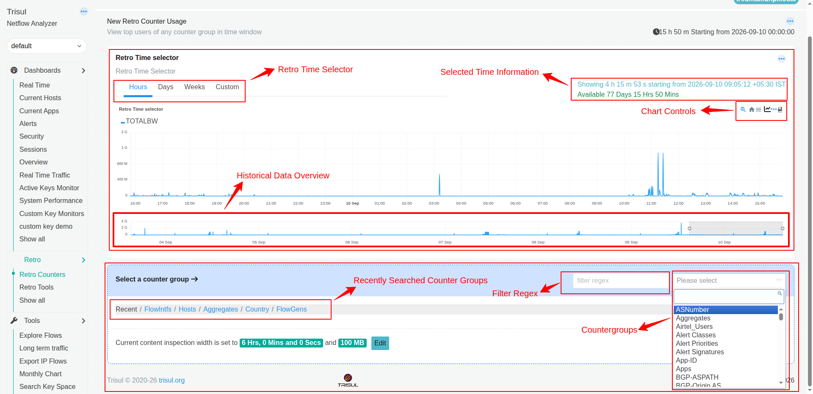

# Retro Counters

The Retro Counter Usage page lets you investigate historical network activity by selecting a Counter Group and viewing its usage over a chosen time period.

Use this page when you want to look back at network activity and examine a particular type of measurement rather than a predefined dashboard view.

:::info navigation
:point_right: Select *Retro &rarr; Retro Counter* to view the Retro Counter Usage page
::: 

*Figure: Retro Counters Page*

> Note: The amount of historical data you can investigate depends on the data available in Trisul. The page displays the available historical period in the Retro Time Selector.

## Retro Time Selector

The Retro Time Selector is the first module shown in the Retro Counters Page. It determines the historical period you want to investigate.

It provides four options:

| Option     | What does it do?          | When would I use it?               |
| ---------- | --------------------------  | ---------------------------------- |
| **Hours**  | Lets you investigate activity over a period measured in hours. | Use this for recent historical activity, such as investigating something that happened earlier today. |
| **Days**   | Lets you investigate activity over a period measured in days. | Use this when you need to examine activity across one or more days. |
| **Weeks**  | Lets you investigate longer historical periods measured in weeks. | Use this when looking for activity or patterns over several weeks. |
| **Custom** | Lets you specify the historical period yourself. | Use this when you need to investigate a particular period that does not fit the predefined options. |

The selector also shows **Selected Time Information**:

- **Showing** — The duration and starting time of the currently selected historical period.
- **Available** — The amount of historical data currently available for investigation.

For example, the page shown in the screenshot below shows that the selected view covers 4 hours 15 minutes 53 seconds and that 77 days 15 hours 50 minutes of historical data are available.

## Historical Data Overview

The smaller chart underneath the main chart represents the larger available historical period.

The selection on this chart determines which portion of the historical data is displayed in the main chart above.

So, in simple terms:

Available history → Historical Data Overview → Selected portion → Main chart

For example:

- Trisul has 77 days of historical data available.
- The overview chart represents that larger historical range.
- You select a smaller portion of that range.
- The main chart then displays only the selected portion, such as 4 hours.

This distinction is important because the main chart is not showing all 77 days at once. It is showing the smaller time range selected from the larger available history.

You can interact with the chart using [**chart controls**](/docs/documentation/ug/ui/charts#2-chart-interaction-controls), including options to inspect and change the chart view. 

The module below the Retro Time Selector is used to select the countergroup and get data enrichment values based on the counter group and time.

## Counter Group categories

- Select a category from the Counter Groups dropdown to narrow down the Counter Groups displayed for selection.This helps investigate its historical usage.

- The filter regex field lets you filter the Counter Group list using a regular-expression pattern. This is useful when there are many Counter Groups and you want to locate a particular one without scrolling through the entire list.

## Current content inspection width

The bottom of the page displays the current content inspection width.

It shows two limits:

- **Time duration** — The amount of time covered by content inspection.
- **Data size** — The maximum amount of data covered by content inspection.

For example, the screenshot shows:

6 Hrs, 0 Mins and 0 Secs and 100 MB

These values represent the current content inspection settings.

Click **Edit** to modify the content inspection width and data-size limit.

## Retro Counter Usage at a glance

| If you want to...                                    | Use...                     |
| ---------------------------------------------------- | -------------------------- |
| Investigate recent historical activity               | **Hours**                  |
| Investigate activity across several days             | **Days**                   |
| Investigate longer-term activity                     | **Weeks**                  |
| Specify an exact historical period                   | **Custom**                 |
| See how activity changed over time                   | **Main activity chart**    |
| Focus on a particular portion of a larger time range | **Time-range overview**    |
| Find recently used Counter Groups                    | **Recent**                 |
| Find host-related Counter Groups                     | **Hosts**                  |
| Find aggregated Counter Groups                       | **Aggregates**             |
| Find country-related Counter Groups                  | **Country**                |
| Find flow-interface Counter Groups                   | **FlowIntfs**              |
| Find flow-generator Counter Groups                   | **FlowGens**               |
| Quickly locate a Counter Group by name or pattern    | **Filter regex**           |
| Select the Counter Group to investigate              | **Counter Group dropdown** |
| Change the content inspection limits                 | **Edit**                   |

## How to use Retro Counter Usage

1. Choose the historical period using Hours, Days, Weeks, or Custom.
2. Check the available history shown in the Retro Time Selector to make sure the period you need is available.
3. Review the activity chart to identify spikes, changes, or periods that need investigation.
4. Select a Counter Group category such as Hosts, Aggregates, or Recent.
5. Select the Counter Group you want to investigate. Use the filter regex field if the list is large.
6. Examine the historical activity for the selected Counter Group using the main chart and time-range overview.
7. Adjust the content inspection settings, if required, using Edit.

### In simple terms

Retro Counter Usage answers two questions:

- When do I want to look? → Use the Retro Time Selector.
- What do I want to look at? → Select a Counter Group.

Together, these let you investigate historical network activity from the Counter Group that is relevant to your investigation.

## Understanding the terms used in this page

:::tip Terminologies used

- [**Retro Analysis**](/docs/documentation/learntrisul/terminology#retro-analysis) — Looking at historical network activity to understand what happened during an earlier period.
- [**Counter Group**](/docs/documentation/learntrisul/terminology#counter-group) — A group of related measurements that Trisul maintains for a particular type of network activity.
- [**Key**](/docs/documentation/learntrisul/terminology#key) — The individual item being measured within a Counter Group.
- [**Time Bucket**](/docs/documentation/learntrisul/terminology#time-bucket) — A period of time used to group network measurements.
- [**Data Volume**](/docs/documentation/learntrisul/terminology#data-volume) — The amount of network data transferred during a period.

:::