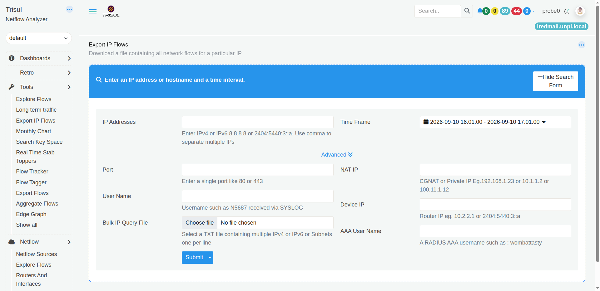

# Export IP Flows

:::info Navigation
:point_right: Go to **Tools &rarr; Export IP Flows**
:::

*Figure: Export IP Flows Page*

The **Export IP Flows** tool lets you retrieve and download network flow records for a specific IP address or other identifying information during a selected time period.

Use this tool when you need to **collect flow records for a particular host, investigate its network activity, or export traffic data for further analysis and reporting**.

The search form allows you to start with an IP address or hostname and time interval. You can also use additional search fields when you need to narrow the results.

## Search for IP flows

The page displays the message:

> **Enter an IP address or hostname and a time interval.**

These are the two basic pieces of information needed to perform an export.

### IP Addresses

Enter an **IPv4 or IPv6 address** to find flows associated with that address.

You can enter multiple IP addresses by separating them with commas.

For example:

`192.168.1.10, 192.168.1.20`

This is useful when you want to retrieve flow records for more than one IP in the same query.

### Time Frame

Select the **time period** for which you want to retrieve the flows.

Only flow records that fall within the selected time frame are considered for the query.

> **Tip:** Choose the time period that covers the activity you are investigating. A shorter time frame can make it easier to focus on a specific event.

## Advanced search options

Click **Advanced** to display additional fields that can be used to narrow the search.

| Field                  | What does it do?                                                                                                          | When would I use it?                                                                                                                |
| ---------------------- | ------------------------------------------------------------------------------------------------------------------------- | ----------------------------------------------------------------------------------------------------------------------------------- |
| **Port**               | Searches for flows involving a specific port. The field accepts a single port, such as `80` or `443`.                     | Use this when you are interested in traffic associated with a particular service or application port.                               |
| **NAT IP**             | Searches using a NAT, CGNAT, or private IP address.                                                                       | Use this when the IP you are investigating is associated with NAT or CGNAT and you need to identify the corresponding flow records. |
| **User Name**          | Searches for a username associated with the network activity. The UI gives a RADIUS/SYSLOG example such as `N5687`.       | Use this when Trisul has user information available and you want to retrieve the flows associated with a particular user.           |
| **Device IP**          | Searches using the IP address of the network device or router.                                                            | Use this when you want to narrow the search to traffic associated with a particular device.                                         |
| **AAA User Name**      | Searches using a RADIUS AAA username.                                                                                     | Use this when network access information identifies users through AAA/RADIUS and you want to retrieve their associated flows.       |
| **Bulk IP Query File** | Allows you to upload a text file containing multiple IPv4 addresses, IPv6 addresses, or subnets, with one entry per line. | Use this when you need to query a large number of IP addresses instead of entering them individually.                               |

### NAT IP

The **NAT IP** field is useful when the IP address you are investigating has been translated through NAT or CGNAT.

The UI accepts examples such as:

`192.168.1.23`

`10.1.1.2`

`100.11.1.12`

Enter the relevant NAT or private IP address to include it in the search criteria.

### Device IP

The **Device IP** field is used to specify the IP address of the network device involved in the traffic.

The UI provides examples such as:

`10.2.2.1`

`2404:5440:3::a`

### Bulk IP Query File

Instead of entering IP addresses one by one, you can select a TXT file containing multiple IPv4 addresses, IPv6 addresses, or subnets.

The file should contain one IP address or subnet per line.

This is particularly useful for bulk investigations where you need to retrieve flows for a large list of addresses.

### Submit the query

After entering the required search information, click **Submit**.

The **Submit** button also provides a dropdown, allowing you to select the available submission option from the button menu.

The query is then processed using the criteria you entered.

| If you want to...                               | Use...                                |
| ----------------------------------------------- | ------------------------------------- |
| Find flows for a particular IP                  | **IP Addresses**                      |
| Find flows for multiple IPs                     | **IP Addresses**, separated by commas |
| Restrict the search to a particular period      | **Time Frame**                        |
| Find flows involving a particular service port  | **Port**                              |
| Search using a NAT or private IP                | **NAT IP**                            |
| Find flows associated with a username           | **User Name**                         |
| Search traffic associated with a network device | **Device IP**                         |
| Search using a RADIUS/AAA username              | **AAA User Name**                     |
| Search a large list of IP addresses or subnets  | **Bulk IP Query File**                |
| Run the search                                  | **Submit**                            |

## Typical uses

You can use Export IP Flows when you need to:

- Retrieve all available flow records associated with a particular IP.
- Investigate what network activity an IP was involved in during a specific period.
- Search traffic involving a particular port.
- Investigate an IP when NAT or CGNAT is involved.
- Retrieve traffic associated with a particular network user.
- Query a large list of IP addresses or subnets at once.
- Export flow information for analysis outside Trisul.

## In simple terms

Export IP Flows answers:

> "Show me the network flows associated with this IP or identifier during this period, so I can retrieve them for further use."

You start with an IP address and time frame, add advanced criteria if needed, and then submit the query.

