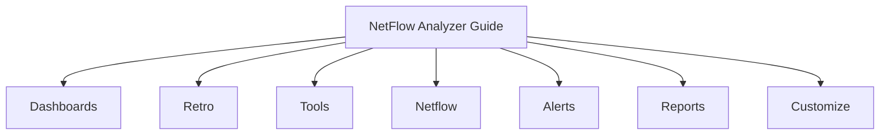

# Trisul NetFlow Analyzer Guide

Welcome to the **Trisul NetFlow Analyzer Guide**!

The **Trisul NetFlow Analyzer** mode is purpose-built for flow-based network traffic monitoring, traffic accounting, capacity planning, and security observability using NetFlow (v5/v9), IPFIX, sFlow, and NetStream.

:::tip NetFlow Product Mode
When Trisul is configured in NetFlow Analyzer mode, the Web UI presents a dedicated navigation menu optimized for flow-based monitoring across routers, switches, and network interfaces.
:::

## Menu Structure

The NetFlow Analyzer interface is organized into seven primary menu categories:

### 1. [Dashboards](./Dashboards/current-hosts)
Real-time streaming, active hosts, current applications, alerts, security telemetry, sessions, and custom key monitors.

### 2. [Retro](./Retro/retro-counters)
Historical counter inspection and retrospective analytical tools across arbitrary past time ranges.

### 3. [Tools](./Tools/explore-flows)
In-depth flow exploration, long-term trends, IP flow exports, monthly usage charts, stab toppers, flow trackers, taggers, and edge connection graphs.

### 4. [Netflow](./Netflow/netflow-sources)
Dedicated NetFlow device telemetry, NetFlow sources and exporters, router and interface traffic mapping, and interface drilldowns.

### 5. [Alerts](./Alerts/threshold-crossing-alerts)
Threshold Crossing Alerts (TCAs), flow tracking alerts, blacklist threat intelligence matching, dynamic threshold bands, and alert dashboards.

### 6. [Reports](./Reports/readymade)
Readymade standard reports, automated recurring report scheduling, and email delivery settings.

### 7. [Customize](./Customize/ui)
Personalize the web user interface, real-time parameters, dashboard layouts, and web traffic HTTP/HTTPS classification rules.
