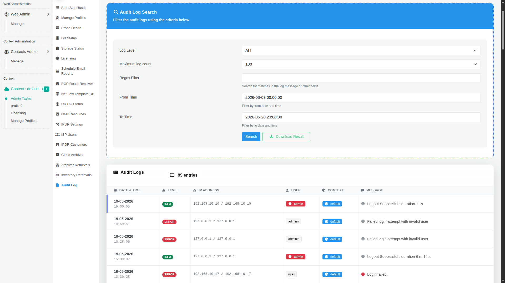

# Audit Log

The **Audit Log** page provides a centralized view of administrative and system-level activities performed within the platform. It helps administrators monitor user actions, troubleshoot operational issues, investigate failed login attempts, and maintain accountability across the deployment.

The Audit Log records events such as:

- User login and logout activity
- Failed authentication attempts
- Administrative actions
- Configuration changes
- Context-related operations
- System and application events

---

## Accessing Audit Logs

:::info navigation
:point_right: Go to Context &rarr; Admin Tasks &rarr; Audit Log
:::

The Audit Log page consists of two main sections:

1. **Audit Log Search**  
   Used to filter and retrieve log entries.

2. **Audit Logs Table**  
   Displays the matching audit records.

---

## Audit Log Search

The search panel allows administrators to filter audit entries based on severity, time range, and custom expressions.

| Field | Description |
|---|---|
| **Log Level** | Filters logs based on severity level such as INFO, ERROR, WARNING, or ALL. |
| **Maximum log count** | Specifies the maximum number of log records to retrieve in the search results. |
| **Regex Filter** | Searches for matching text patterns within log messages or related fields using regular expressions. |
| **From Time** | Displays logs generated after the selected date and time. |
| **To Time** | Displays logs generated before the selected date and time. |
| **Search** | Executes the audit log query using the selected filters. |
| **Download Result** | Downloads the filtered audit logs for offline analysis or archival purposes. |

---

## Audit Logs Table

The lower section displays the audit log entries matching the selected criteria.

Each row represents a single audit event.

| Column | Description |
|---|---|
| **Date & Time** | Timestamp when the event occurred. |
| **Level** | Severity classification of the event such as INFO or ERROR. |
| **IP Address** | Source IP address associated with the event. |
| **User** | Username involved in the activity. |
| **Context** | Context under which the activity occurred. |
| **Message** | Detailed description of the logged event. |

---

## Common Use Cases

### Security Monitoring

Audit logs help administrators identify:

- Unauthorized login attempts
- Repeated authentication failures
- Suspicious administrative activity
- Access from unexpected IP addresses
