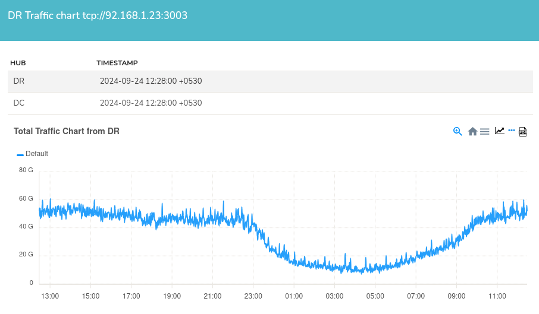

# DR DC Status

Trisul supports Diaster Recovery when the primary site crashes. The primary site is the data centre where traffic is pushed. With the DR setup, Trisul also creates a backup of all the traffic in the DR site and once the primary site is down, the DR site is up.

We can configure the primary site in such a way that we can check if the DR site is running.

In here you can only view the DR DC status. All the configuration of DR Settings, are done in [DR Settings](/docs/ag/webadmin/web_options#dr-settings). This configuration enables you to view the Traffic Chart and DB Status of the DR Site from the primary site.

:::info navigation
:point_right: Go to Context: Default &rarr; Admin Tasks &rarr; DR DC Status
:::

  
*Figure: DR Traffic Chart*

The DR Traffic Chart displays network traffic patterns that run in parallel with the primary site's traffic, ensuring continuous availability. Located below the DR Traffic Chart, DR Database slices serve as backups of the primary database, mirroring the same configuration as the Database Slices in [DB Status](/docs/ag/admintasks/dbstatus#database-slices).

Refer [Disaster Recovery](/docs/ag/ha/dr)