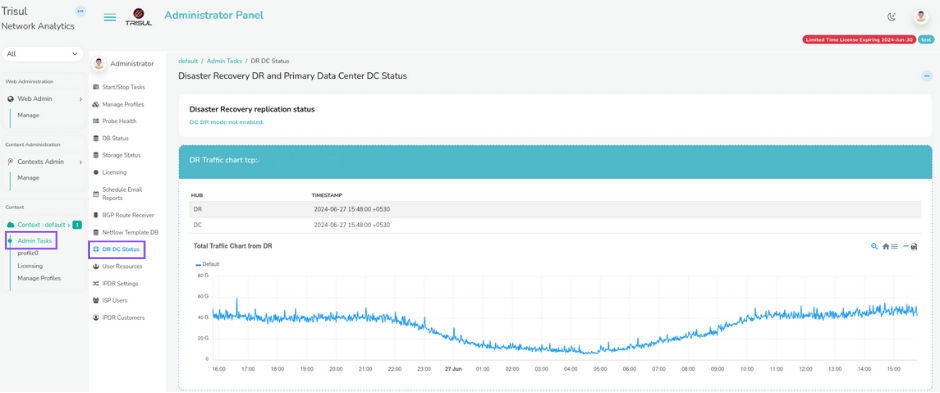

# DR DC Status

Trisul supports Diaster Recovery when the Primary Site crashes.

The Primary Site is the Data Centre where Traffic is pushed. With the DR
Setup, Trisul also creates a backup of all the traffic in the DR site
and once the Primary site is down, the DR site is up.

We can configure the Primary site in such a way that we can check if the
DR site is running.

By [Configuring the DR Settings](/docs/ag/webadmin/web_options#dr-settings),you can view the Traffic Chart and DB
Status of the DR Site from the primary site.

*Figure: DR Traffic Chart*

Refer [Disaster Recovery](/docs/ag/ha/dr)