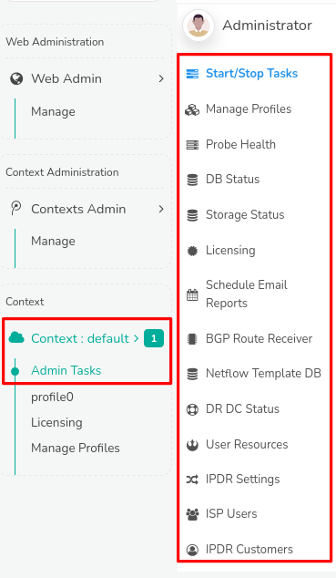

# Admin Tasks

Admin Tasks provides administrators with a single point of access to manage profiles, probe health, storage, licensing, and reporting. Additionally, it offers advanced features for managing user resources, BGP routes, NetFlow templates, disaster recovery, and more, enabling Trisul admin management.

## Manage

:::info navigation
Go to Context: Default &rarr; Admin Tasks &rarr; (*List of all Admin Task Menus*)
:::

  
*Figure: Admin Tasks*

Explore the documentation to access detailed information and controls for admin tasks, organized into the following functional menus.

| Menu                   | Description                                                                                                                                                            |
| ---------------------- | ---------------------------------------------------------------------------------------------------------------------------------------------------------------------- |
| Start/Stop Tasks       | Enables starting and stopping Hub and Probe nodes associated with each context directly through the Web Interface.                                                     |
| Manage Profiles        | Provides a list of available profiles used by multiple probes to manage.                                                                                               |
| Probe Health           | Shows the reachability, current traffic, and latency of Trisul Probes in this particulat context.                                                                      |
| DB Status              | Displays Trisul Data Base Statistics, showing storage volumes and usage across Oper, Reference, and Archive segments, facilitating storage planning and configuration. |
| Storage Status         | Check availability of disk space, storage devices, and file systems.                                                                                                   |
| Licensing              | Displays Trisul's License Policy Details.                                                                                                                              |
| Schedule Email Reports | Schedule Automatic Reports from Trisul like PDF Reports, Alert                                                                                                         |
| based Reports etc.     |                                                                                                                                                                        |
| BGP Route Receiver     | Displays the status of the BGP Route Receiver, providing BGP status updates across all probes.                                                                         |
| NetFlow Template DB    | Provides Netflow/IPFIX template database received by all probes.                                                                                                       |
| DR DC Status           | Check configuration of Diaster Recovery when the Primary Site crashes.                                                                                                 |
| User Resources         | Assign network devices, interfaces, IP addresses, IP subnets or any other network entity to Users.                                                                     |
| IPDR Settings          |                                                                                                                                                                        |
| ISP Users              |                                                                                                                                                                        |
| IPDR Customers         |                                                                                                                                                                        |
