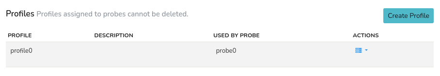
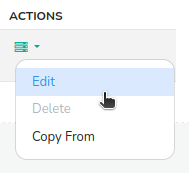
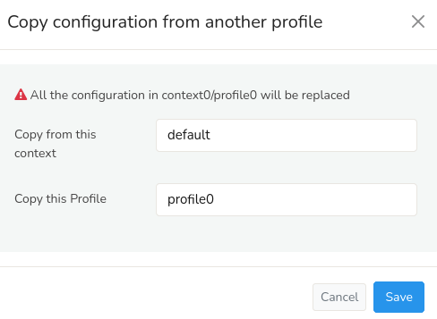

# Manage Profiles

This menu provides a list of available profiles used by multiple probes.
Profile assigned to probes cannot be deleted. If multiple probes are
setup, Multiple profiles will be created automatically and listed here.

:::info navigation
:point_right: Go to Context: Default &rarr; Admin Tasks &rarr; Manage Profiles
:::

You can see the list of configured profiles assigned for the respective probes here. By default *profile0* is already configured for *probe0* and is readily available. 

  
*Figure: Manage Profiles*

## Creating Profiles

To create a new profile, click **Create Profile** button on the upper right hand side and fill in the form with the help of the following details.

| Field Name          | Description                                                           |
| ------------------- | --------------------------------------------------------------------- |
| Profile Name        | Name for the profile. Name should be alpha numeric and length should not exceed 10 characters. |
| Profile Description | Describes the function of the profile created.                         |
| Clone from Context  | You can choose between multiple context to clone profile.              |
| Clone from Profile  | You can also clone an entire profile from a list of profiles.          |

Click *Create* to complete the profile setting.

## Editing Profiles

Click on the action button against the prfile you would like to edit and the following functions are available.

  
*Figure: Action- Profiles*

- **Edit**
 Clicking on the *Edit* button allows you to modify the name and description of the profile. Click *Update* to update the changes.

- **Delete**
You cannot delete the default profile *profile0* hence it is disabled by default. Click *delete* to delete other profiles.

- **Copy From**

Click *Copy from* option to replace the selected profile's configuration with an already existing profile configuration. 

    
*Figure: Copy From Option- Profiles*

The system will prompt you to select a *context* and *profile* from the drop down options. Choose from the available options and Click *Save* to replace the current profile configuration with the new setting.
