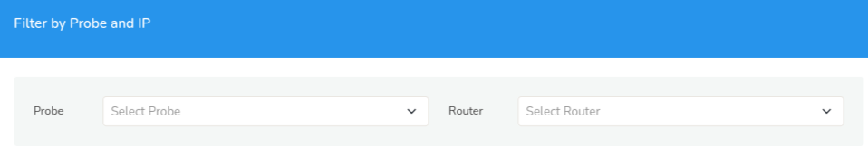
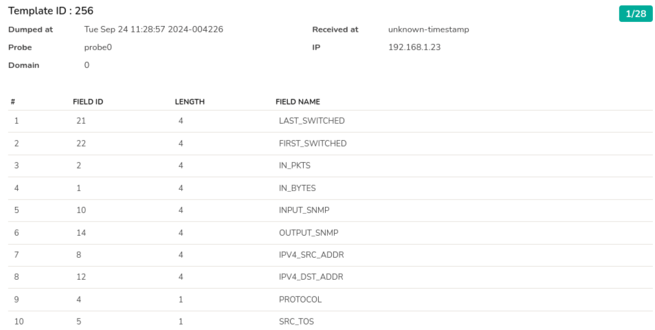

# NetFlow Template DB

NetFlow v9, IPFIX, JFlow, Netstream are technologies that use a concept
of Template records. These are special records sent by the router which
describe the metrics contained in normal data flow records. Viewing
these template records are a great way to troubleshoot NetFlow. 

This Menu provides NetFlow/IPFIX template database received by all
probes.

:::info navigation
:point_right: Context: Default &rarr; Admin Tasks &rarr; NetFlow Template DB
:::

  
*Figure: NetFlow Template DB Form*

Select a probe and a router from the dropdown to view the NetFlow template DB. You can see the template database on each probe. This is updated every 10 minutes or when a new template is received.

  
*Figure: NetFlow Template DB*

The header contains details on the date and time the NetFlow got dumped at and received at, the probe name, domain name, and the router IP. 

On the upper right hand side corner you can see the number of templates received highlighted in green color (in the figure: 28)  The NetFlow Template contains the following details as received from the router.

| Detail | Description |
|--------|-------------|
| # | The count of number of fields received. |
| Field ID | Unique ID for the field. |
| Length | The count of field (on that row) received. |
| Field Name | Name of the field. |