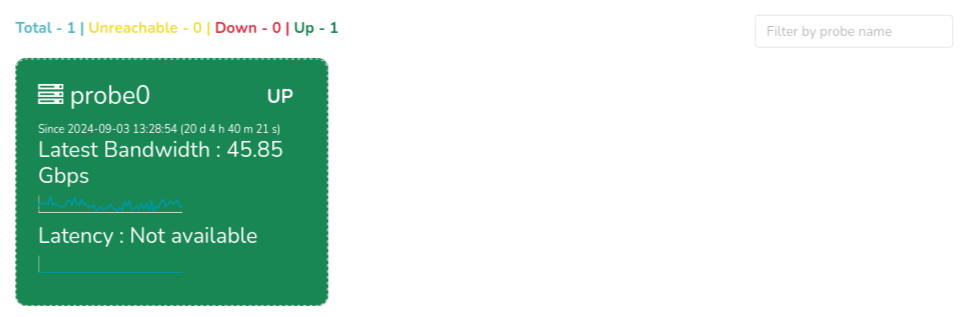

# Probe Health

This menu is nothing but a Probe Health Monitor. It shows the
reachability, current traffic, and latency of Trisul Probes in this
particulat context.

:::info navigation
:point_right: Go to Context: Default &rarr; Admin Tasks &rarr; Probe Health
:::

  
*Figure: Probe Health*

- On the header section you can see the count for Total No.of Probes, No.of Unreachable Probes,
No.of Probes Up/Down. The color of the probe represents the state, say,  
**Green**: The probe is UP and running  
**Yellow**: The probe is UNREACHABLE  
**Red**: The probe is DOWN  

- Also you can see the Latest Bandwidth in Gbps for each probe, The time since the probe is up/down state and its latency if any. Hover over the sparkline to view the tooltip of data displaying bandwidth at different points of time.

- You can also search for a particular probe by entering the probe name on the *filter bar* "Filter by probe name" on the upper right hand side to display only the desired probe health data.