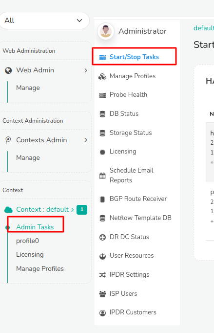

# Start and Stop Trisul

Once packet capture or NetFlow inputs are configured, Trisul needs its core components running to process the data.

This page is where you bring the **Trisul Hub and Probe** online to begin processing that data, or stop them safely when required.

Each context runs its own Hub and Probe pair. Starting or stopping them here affects only the selected context, allowing you to control processing without altering your input configuration.

From here, you’ll typically:

- Start the Hub and Probe for the first time after configuring inputs
- Restart components during maintenance or configuration changes
- Stop components cleanly before shutdowns or upgrades


### Start/Stop Tasks

Trisul consists of multiple components that run as separate processes. This page allows you to start and stop these components for the selected context.

- **Trisul Hub**:  
Processes the Database

- **Trisul Probe**:  
Processes the analytics

- **WebTrisul**:  
Provides the web interface

Each context has its own **Hub and Probe** pair, which is why start and stop actions are handled at the context level.


## Start and Stop Trisul


:::info Start Stop from Web UI

Login as admin to the Trisul UI 

:point_right:  Select Context → Admin Tasks → Start/Stop Tasks 
:::

  
*Figure:  Selecting the Start Stop Menu*


Then press Start button on Hub and Probe to bring up the Trisul System.


*Figure: Pressing Start Stop button*

:::warning Start the Hub First 

Both the hub and probe need to be started, Importantly the HUB needs to be started for the probe to connect and start. 
Hence Start the HUB First, then the PROBE. During STOP follow the reverse, stop the probe first, then the hub. 
:::

### Hub Options

Click on the three lines button adjacent to the Start/Stop button to access Hub options menu.

  
*Figure: Hub Options Menu*

| Options | Description |
|---------|-------------|
| View Flusher Log | Displays the log file for the Flusher process, which is responsible for periodically removing outdated data from the Trisul database to maintain data retention policies. |
| View TRP Log | Displays Trisul Remote Protocol logs queried from hub to Web Trisul. |
| View Data Retention | Allows administrators to view the current data retention policies configured in Trisul |
| View System Info | Provides detailed information about the Trisul Hub system, including Name, Kernel, IP Addresses, Version etc |
| Change Customer Logo | Enables customization of the Trisul interface by uploading a custom logo, allowing organizations to brand the platform according to their requirements. |
| Start IPDR Service | Activates the IPDR (Internet Protocol Detail Record) service, which collects and processes IPDR data from network devices for querying.


### Probe Options

Click on the three lines button adjacent to the Start/Stop button to access Hub options menu.

  
*Figure: Probe Options Menu*

| Options | Description |
|---------|-------------|
| View RunStats Log | Displays the log file containing runtime statistics for the Trisul Probe, providing insights of uptime and downtime. |
| View Probe Log | Shows the main log file for the Trisul Probe, capturing events, errors, and informational messages related to its operation. |
| Get Interfaces List | Retrieves and displays a list of network interfaces configured on that probe. |
| Clear All Stabbers | Resets or clears all "stabbers" in the Trisul probe. |
| How to Start Snort? | Provides instructions on configuring and starting Snort with Trisul. |
| How to Start Suricata? | Offers guidelines on integrating and starting Suricata with Trisul. |
| How to Start Ping Server? | Provides instructions on starting the Ping monitor. |
| Start Ping Server | Activates the Ping Monitor, enabling the Trisul Probe to respond to ICMP echo requests and provide network connectivity verification.
| Stop Ping Server | Terminates the Ping Server process, disabling ICMP echo response functionality. |


## Start and Stop Via Command Line

The CLI tools [trisulctl_hub](/docs/ref/trisul_hub) allows you to start and stop easily from the root command line. 

```bash
$ trisulctl_hub
> restart context default
```

## Start and Stop Web Server - WebTrisul

Web Trisul provides the Web UI and is configured to start automatically.

### Start and Stop Webtrisul

Use the normal Linux tools to start and stop Webtrisul. The service name is `webtrisuld`

```bash
systemctl stop webtrisuld
systemctl start webtrisuld
```
