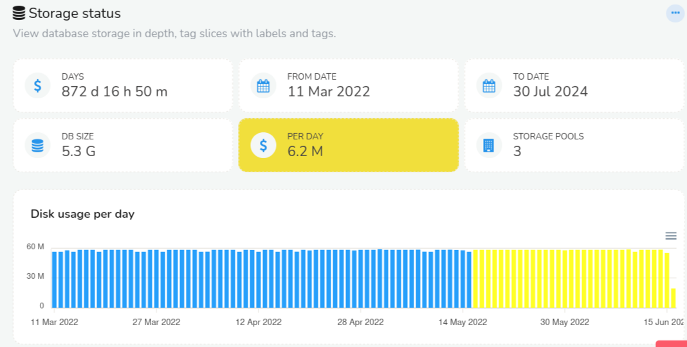

# Storage Status

*Storage status* is a dashboard for your Trisul storage, providing insights to help you optimize and maintain your storage infrastructure. You can check Trisul's health and availability of the storage subsystem, which includes disk space, storage devices, and file systems. It indicates whether the storage is:

- Online/Available

- Offline/Unavailable

- Storage Pool Status

You can View database storage in depth, tag slices with labels and tags. To view the storage status,

:::info Navigation

:point_right: Login as Admin &rarr; Context:default &rarr; Admin Tasks &rarr; Storage Status

:::

  
*Figure: Storage status dashboard showing disk space size information*

The Storage status consists of the following information and their status details.

| Information   | Description                                                         |
| ------------- | ------------------------------------------------------------------- |
| Days          | Represents the number of days since the data started getting stored |
| From Date     | Data available from this date                                       |
| To Date       | Data available until this date                                      |
| DB Size       | Total amount of disk space used by Trisul database files            |
| Per Day       | The amount of disk space used by Trisul on daily basis              |
| Storage Pools | The number of storage pools configured in Trisul                    |

> In the Disk Usage Per Day Module, each bar represents each day. And yellow color represents the data that belongs to the selected storage pool say oper/ref/archive which gets reflected as you select.

### Disk Usage Per Day

Disk Usage Per day is a graphical representation of the disk usage per day in bar chart. You can hover over any bar to view the storage data including date, size, duration and status of that particuar date.

*Figure: Disk Usage per day in bar chart*

| Storage Data | Description                                                   |
| ------------ | ------------------------------------------------------------- |
| Date         | The date of the storage data you have hovered on              |
| Size         | The size of storage space in that particular date             |
| Duration     | The duration for which the data has been stored for that date |
| Status       | The storage pool where the data is stored on that day         |

## Storage Pools

In *Storage Pools* you can view each of the storage pool's status information including the number of days since the data has started getting stored in the storage pool, the disk space used by the storage pool, and pool disk usage percentage. The Gauge meter on the lower right represents the pool disk usage percentage.

*Figure: Storage status dashboard showing storage pools information*

| Information         | Description                                                                         |
| ------------------- | ----------------------------------------------------------------------------------- |
| Pool Name           | Pool name like oper/ref/archive                                                     |
| Device              | Name of your storage disk where the data gets stored                                |
| Mounted on          | The location name where the disk is mounted                                         |
| Disk Size           | The capacity of the storage device                                                  |
| Disk Free           | Amount of available(free) storage space on the device                               |
| DB Size             | Total size of the Trisul Database files                                             |
| Slices              | The number of slices Trisul Database is divided into                                |
| Offline AWS S3/Tape | Indicates whether Trisul is configured to use Amazon Web Services (AWS) S3 or Tape storage for archiving or backup purposes                                                                            |
| From Date           | The time range from which the data started getting stored                           |
| To Date             | The time range until which the data is stored                                       |
| Days                | The total number of days the data has been stored in Trisul.                        |

## Storage Status Tabular Data

Also the following table contains two tabs,

- Day wise slice details

- Detailed slice information
  
  In the example the slices has been stored for 32 days, clicking on which the table data shows,

*Figure: Day wise Slice details in storage status*

| Information | Description                                             |
| ----------- | ------------------------------------------------------- |
| Num Slices  | The number of slices per day                            |
| Day         | The day of the week                                     |
| From IST    | Time from when the slices got stored                    |
| To IST      | Time until the slices got stored for the particular day |
| Size        | Size of slices stored                                   |
| Slice Tags  | Slice tags if any                                       |

The second tab in the example shows 64 data slices, which is 2 slices per day for 32 days.

*Figure: Slice wise details in storage status*

Clicking on this tab shows you the table details,

| Information | Description                                                         |
| ----------- | ------------------------------------------------------------------- |
| NAME        | Name of the slice                                                   |
| DAY         | Day of the week the slice got stored                                |
| FROM IST    | Time range from when the slice started getting stored               |
| TO IST      | Time range until when the slice got stored for that particular date |
| DUR         | Duration of the storage of slices                                   |
| POOL        | The storage pool in which the slice is stored                       |
| AVAIL       | Indicates if the slice is available in the mentioned storage pool   |
| SIZE        | Size of the slices stored for the day                               |
| TAGS        | Slice tags if any                                                   |
| OPTS        | Click on the option tool against each slice to view or download     |

## Tape

Tape serves as an offline storage solution for backing up data from the archive storage pool. The Meta Slice maintains a comprehensive repository of information for each storage pool, including oper, ref, archive, storage pool retention periods, and slice information for each storage pool.

  
*Figure: Showing Tape Storage*

**Tape Disabled**: When data is deleted from the archive storage pool, there will be no corresponding entry in the Meta Slice.

**Tape Enabled**: If Tape storage is enabled, the Meta Slice marks the entry as "Tape" indicating Tape is enabled.

This process ensures a secure and organized backup strategy for archive data.