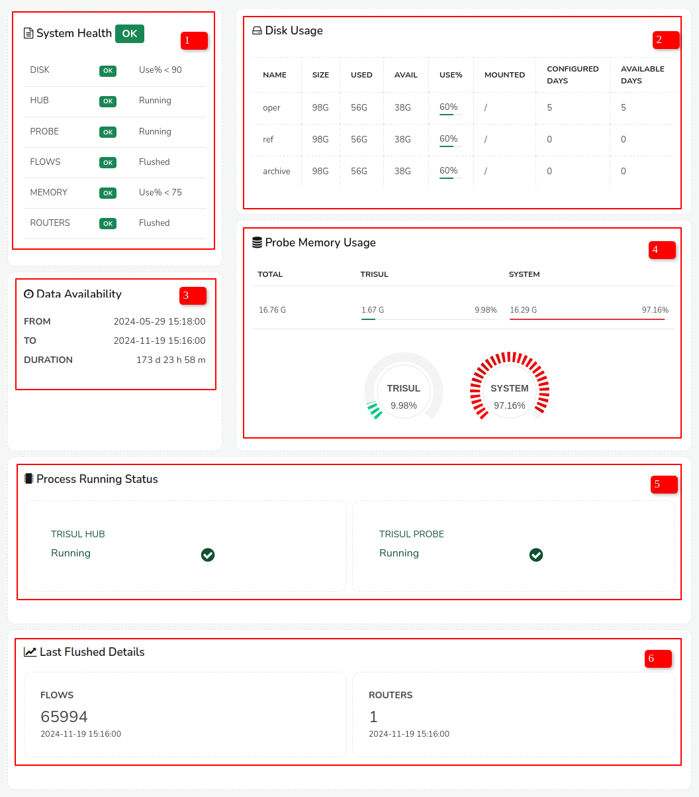

# System Health

The System Health Dashboard provides a comprehensive overview of the system's health and performance. It consists of several modules that monitor and display the status and usage of various system components.

  
*Figure: System Health Dashboard*  

1) System Health Check

This module performs a comprehensive check on the system's core components, ensuring they are functioning correctly. It verifies the status of:
Disk: Checks the disk's health, ensuring it's operational and not faulty.
Hub: Confirms the Trisul Hub is running and connected.
Probe: Verifies the Trisul Probe is running and connected.
Flows: Checks the flow of data, ensuring it's being processed and flushed correctly.
Memory: Monitors memory usage, ensuring the system has sufficient resources.
Routers: Verifies the routers are operational and flushing data correctly.

The module displays a simple "OK" status indicator for each component, providing a quick overview of the system's health.

> To configure the disk usage alert percentage:

:::note navigation

:point_right: Login as admin, Go to Web Admin &rarr; Manage &rarr; App Settings &rarr; UI

:::

In the App settings form scroll down to the field "Disk Usage Alert Percentage" and enter a value. Click Save.

2)Disk Usage

This module provides an in-depth view of the system's disk usage, helping identify potential storage issues. It monitors three storage pools: Oper, Ref, and Archive

For each pool the module displays the following details,

| Detail | Description |
|--------|-------------|
| Total Size | The total capacity of the storage pool |
| Used Space | The amount of space currently occupied |
| Available Space | The remaining free space |
| Usage Percentage | The percentage of used space compared to total size |
| Mounted | The location where the pool is mounted |
| Configured days | The number of days the storage pool has been configured |
| Available days | The number of days the storage pool has been available |

3) Data Availability

This module displays the availability of data within a specified timeframe, ensuring data is accessible and complete. It shows:

From date and time: The starting point of the data availability period.
To date and time: The ending point of the data availability period.
Duration of data availability: The total length of time data was available within the specified period.

4) Probe Memory Usage

This module monitors memory usage for the Trisul Probe, ensuring it has sufficient resources to operate effectively. It displays:

Total probe storage: The total memory allocated to the Trisul Probe.
Trisul storage: The amount of memory used by Trisul.
System storage: The amount of memory used by the system.

The module presents memory usage in both numerical values and a gauge display, providing a clear visual representation.

5) Process Running Status
This module verifies the status of critical system processes, ensuring they are running correctly. It monitors:

Trisul Hub: Confirms the Trisul Hub is running and connected.
Trisul Probe: Verifies the Trisul Probe is running and connected.

6)Last Flushed Details
This module displays information about the last data flush, ensuring data is being processed and cleared correctly. It shows:

Number of flows: The total number of data flows processed.
Date/time: The timestamp of the last data flush.
Number of routers: The total number of routers involved in the data flush.
Date/time: The timestamp of the last router update.