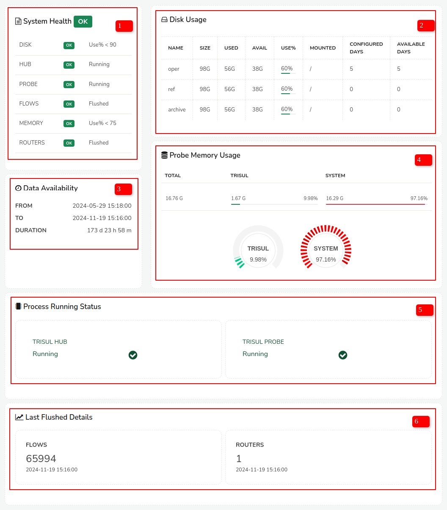

# System Health

## Overview

The System Health page helps you verify that Trisul’s core components are running reliably and that data is being processed as expected.

You can come here when you want to confirm system stability, investigate missing or delayed data, or perform a routine health check after changes such as upgrades or restarts.

If traffic analytics look unusual or incomplete, this page helps determine whether the issue is with the system itself rather than the network.

  
*Figure: System Health Dashboard*  

## 1) System Health Check

This section provides a quick, high-level check of Trisul’s essential components. Each item reports a simple **OK** status so you can immediately see whether something fundamental is not functioning correctly.

It verifies the status of:

- **Disk**  
Confirms that disk storage is accessible and functioning normally.

- **Hub**  
Verifies that the Trisul Hub is running and connected.

- **Probe**  
Confirms that the Trisul Probe is active and connected.

- **Flows**  
Ensures that network flows are being processed and flushed correctly.

- **Memory**  
Checks whether sufficient memory is available for stable operation.

- **Routers**  
Verifies that routers are operational and updating data correctly.

If any of these checks fail, analytics and alerts may appear incomplete or unreliable.

### Disk usage alert threshold

You can configure when disk usage should trigger alerts so storage pressure is detected early. To do that.

:::info navigation

:point_right: Login as `admin`, Go to Web Admin &rarr; Manage &rarr; App Settings &rarr; UI

:::

In the App Settings form, set **Disk Usage Alert Percentage** and click **Save**.

## 2) Disk Usage

This module provides an in-depth view of the system's disk usage, helping identify potential storage issues. It monitors three storage pools: Oper, Ref, and Archive

For each pool the module displays the following details,

| Detail | Description |
|--------|-------------|
| Total Size | The total capacity of the storage pool |
| Used Space | The amount of space currently occupied |
| Available Space | The remaining free space |
| Usage Percentage | The percentage of used space compared to total size |
| Mounted | The location where the pool is mounted |
| Configured days | The number of days the storage pool has been configured |
| Available days | The number of days the storage pool has been available |

### 3) Data Availability

This module displays the availability of data within a specified timeframe, ensuring data is accessible and complete. It shows:

**From** : The starting time point of the data availability period.  
**To** : The ending time point of the data availability period.  
**Duration of data availability**: The total length of time data was available within the specified period.  

### 4) Probe Memory Usage

This module monitors memory usage for the Trisul Probe, ensuring it has sufficient resources to operate effectively. It displays:

**Total probe storage**: The total memory allocated to the Trisul Probe.  
**Trisul storage**: The amount of memory used by Trisul.  
**System storage**: The amount of memory used by the system.  

The module presents memory usage in both numerical values and a gauge display, providing a clear visual representation.

### 5) Process Running Status
This module verifies the status of critical system processes, ensuring they are running correctly. It monitors:

**Trisul Hub**: Confirms the Trisul Hub is running and connected.   
**Trisul Probe**: Verifies the Trisul Probe is running and connected.  

### 6)Last Flushed Details
This module displays information about the last data flush, ensuring data is being processed and cleared correctly. It shows:

**Number of flows**: The total number of data flows processed.  
**Date/time**: The timestamp of the last data flush.  
**Number of routers**: The total number of routers involved in the data flush.  
**Date/time**: The timestamp of the last router update.  