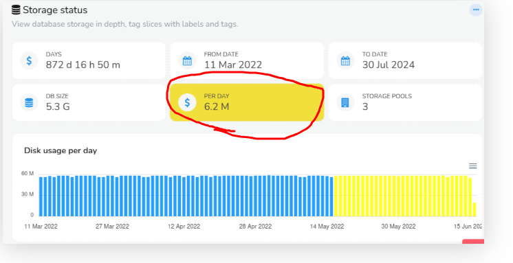

# Configure Retention Policy

Data retention policy refers to the number of days you want to keep historical data. 

1. How much raw packet data in **GB** (probe nodes)  **default 10GB**
2. How much metrics, flows, alerts in **Days** (hub nodes) **default 96 days**


## Check current Per-Day Disk Usage 

One of the first things you need to do is to calculate how much disk you are going to need to meet your data retention requirements.


:::info Navigation

:point_right: Login as Admin &rarr; Context:default &rarr; Admin Tasks &rarr; Storage Status



:::

Here we can see  we are using **6.2 MegaBytes** of disk per day using the [Storage Status](/docs/ag/webadmin/storage_status) tool

  

## Retention Period Hub 

 
The default retention policy is **96 days**. 

:::tip Hub Config File
The retention period in number of days is specified in the [:memo: Trisul Hub Configuration](/docs/ref/trisulhubconfig) file. 
:::


The Oper/Ref/Archive areas store 32 days each for a total of 96 days. 

```xml {7,13,19}
 <SlicePolicy>
            <SliceWindow>
                    DAILY
            </SliceWindow>
            <Operational>
                    <SliceCount>
                            32
                    </SliceCount>
                    <UsageRedMark/>
            </Operational>
            <Reference>
                    <SliceCount>
                            32
                    </SliceCount>
                    <UsageRedMark/>
            </Reference>
            <Archive>
                    <SliceCount>
                            32
                    </SliceCount>
                    <UsageRedMark/>
            </Archive>
```


### Increasing the Retention Period

Simply change the Archive Slice Count from 32 to the desired number.  

Say if you wanted to store 1 year of data, set the Archive Count to 301 

```xml {3}
            <Archive>
                    <SliceCount>
                            301
                    </SliceCount>
                    <UsageRedMark/>
            </Archive>
```

You can also adjust the Oper and Ref , refer to the [Storage Architecture](/docs/ag/domain/storage_arch) document for details.

## Packet Capture Size Probe 

On the Probe node you can configure the total disk allocated to packet capture.  Trisul will then use a sliding mechanism to ensure the latest data is stored.


The default maximum Packet Capture PCAP storage is **10GB**


:::tip Max PCAP Storage 
The packet capture storage limit is specifiied in the [:memo: Trisul Probe Configuration](/docs/ref/trisulconfig) file in two parameters

- `FileSizeMB` - size of each PCAP file 
- `SliceCount` - How many such files 
:::


In the example below we have a `FileSizeMB` set to  `1000MB` or 1GB and number of such files in each pool `8 + 8 + 0 = 16GB` total. 

```xml {3,12,20,28}
              </FilePrefix>
                <FileSizeMB>
                        1000
                </FileSizeMB>
                <EnableDDosNetflowTapTrail/>
 <SlicePolicy>
                       <Rule mode="IGNORE"/>
                </RuleChain>
                <SlicePolicy>
                        <Operational>
                                <SliceCount>
                                        8
                                </SliceCount>
                                <UsageRedMark>
                                        90
                                </UsageRedMark>
                        </Operational>
                        <Reference>
                                <SliceCount>
                                        8
                                </SliceCount>
                                <UsageRedMark>
                                        90
                                </UsageRedMark>
                        </Reference>
                        <Archive>
                                <SliceCount>
                                        0
                                </SliceCount>
                                <UsageRedMark>
                                        90
                                </UsageRedMark>
                        </Archive>
                </SlicePolicy>
        </Ring>


```


### Move packets to a different volume

Follow the instructions for[`trisulctl_probe relocate context`](/docs/ag/basictasks/reloc)command to relocate the probe capture files to a different directory.

### Increase the PCAP Storage

On the Probe nodes, PCAPs can rapidly fill a disk volume. By default Trisul Probe is configured to store 10GB of packet data, you can increase that to match your disk size.


Simply change the Archive Slice Count from 0 to the desired number and/or increase the FileSizeMB parameter.


To store 500GB of data in 100x5GB files do this 

```xml {3,10}
              </FilePrefix>
                <FileSizeMB>
                        5000
                </FileSizeMB>
                ..
                ..
                <SlicePolicy>
                        <Archive>
                                <SliceCount>
                                        100
                                </SliceCount>
                ..

```

