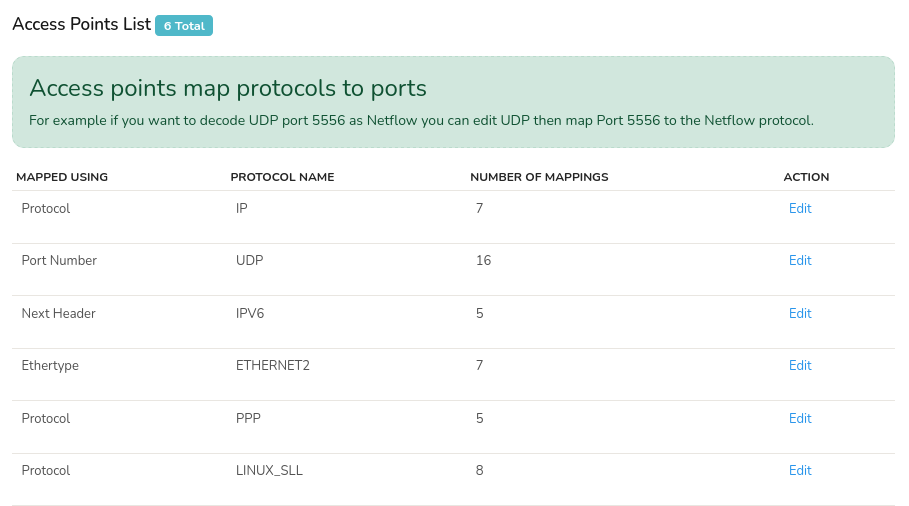
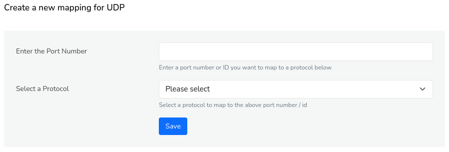

# Access Points

Access points help connect protocols to ports. The common use case is to specify NetFlow ports for each protocol.

They Control how protocols are mapped to ports and other entities. Access points map protocols to ports. For example if you want to decode UDP port 5556 as Netflow you can edit UDP then map Port 5556 to the Netflow protocol.

## Access Point List

Login as `admin` user to view the access points list.

:::info navigation
:point_right: Go to Context: Default &rarr; profile0 &rarr; Access Points
:::

  
*Figure: Access Point List*

The access point list shows the following table of details.

| Detail | Description |
|--------|-------------|
| Mapped Using | Shows on what basis the network traffic mapping is based on like protocol, port number, ethertype etc. |
| Protocol Name | Name of the protocol. |
| Number of Mappings | Shows the number of mappings in that port. |
| Action | Click Edit to modify the port number and protocol. |

## Add a New Access Point

Click the **Edit** button against any protocol in the protocol list and on the following screen, click the **Add** button to add new access point.

  
*Figure: Create a New Mapping for the UDP*

 Enter the port number and select the protocol from the dropdown. Click Save.

