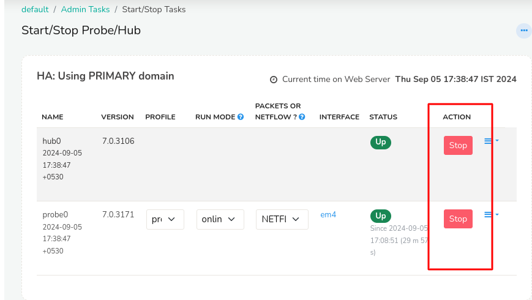

# Start and Stop Trisul

Describes how you can start and stop Trisul components. 


The components 

- Trisul Processes 
  - **Trisul Hub** processes - the database
  - **Trisul Probe** processes - the analytics 
- WebTrisul - the webserver 


## Start and Stop Trisul


:::info Start Stop from Web UI

Login as admin to the Trisul UI 

:point_right:  Select Context → Admin Tasks → Start/Stop Tasks 
:::

  
*Figure:  Selecting the Start Stop Menu*


Then press Start button on Hub and Probe to bring up the Trisul System.


*Figure: Pressing Start Stop button*

:::warning Start the Hub First 

Both the hub and probe need to be started, Importantly the HUB needs to be started for the probe to connect and start. 
Hence Start the HUB First, then the PROBE. During STOP follow the reverse, stop the probe first, then the hub. 
:::


### Start and Stop Via Command Line

The CLI tools [trisulctl_hub](/docs/ref/trisul_hub) allows you to start and stop easily from the root command line. 

```bash
$ trisulctl_hub
> restart context default
```

## Start and Stop Web Server - WebTrisul

Web Trisul provides the Web UI and is configured to start automatically.

### Start and Stop Webtrisul

Use the normal Linux tools to start and stop Webtrisul. The service name is `webtrisuld`

```bash
systemctl stop webtrisuld
systemctl start webtrisuld
```
