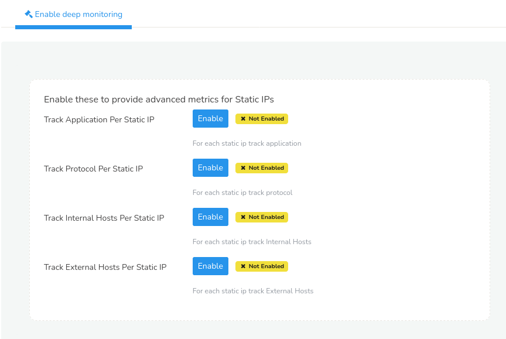

# Advanced

*Advanced* menu allows you to enable certain tracking functions to provide advanced metrics for Static IPs.

:::info Navigation
:point_right: Go to Context: Default &rarr; Profile0 &rarr; Advanced
:::

  
*Figure: Advanced Options*

| Options | Description |
|---------|-------------|
| Track Application per Static IP | Click on the Enable button to start tracking application per static IP. |
| Track Protocol per Static IP | Click on the Enable button to start tracking protocol per static IP. |
| Track Internal Hosts per Static IP | Click on the Enable button to start tracking internal hosts per static IP. |
| Track External Hosts per Static IP | Click on the Enable button to start tracking external hosts per static IP. |