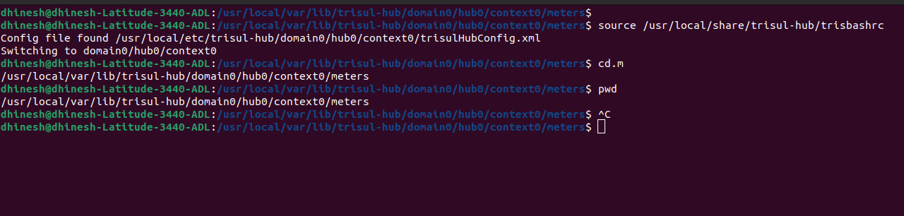

# Backups

There are two categories of data you might want back up :

**Configuration**  
This includes all the config files, analytics configuration, users, web
config, context configuration, and such.

**Data**  
This includes the metrics, flows, alerts, packets

For a large data platform like Trisul , configuration backup is of main
importance. The databases tend to be of very large Terabyte sizes. The
recommended solution for full scale data backup is to setup a DR node.

## Directories

:::note **Small deployment easy backup** 

For small deployments simply backup the `/usr/local` directory. Ensure to first check the directory size using `du -sh /usr/local`

:::

The following directories need to be backed up. If your Trisul installation
is small you can simply backup these directories using normal Linux
backup tools.

| Directories      | Description                                          |
| ---------------- | ---------------------------------------------------- |
| /usr/local/share | data                                                 |
| /usr/local/lib   | libraries                                            |
| /usr/local/var   | data and log files. this directory can be very large |
| /usr/local/etc   | config                                               |
| /usr/local/bin   | executables                                          |

## How to take Trisul Data Backup Manually

To ensure business continuity, it is essential to regularly back up Trisul data and configuration. Here's a step-by-step guide:

### Trisul Data Backup

Step 1: Load Trisul Environment Variables
```Bash
source /usr/local/share/trisul-hub/trisbashrc
```
This command loads the Trisul environment variables.

Step 2: Navigate to the Trisul Data Directory
```Bash
cd.m
```
This command changes the directory to the Trisul data path.

Step 3: Verify the Current Working Directory
```Bash
pwd
```
This command prints the current working directory to verify that you are in the correct location.

Step 4: Backup Trisul Data and Configuration
For example: 

```Bash
cp -r /usr/local/var/lib/trisul-hub/domain0/context0/meters <backup folder>
```

    
*Figure: Showing Example of Trisul Data Backup*

## How to take Trisul Configuration Backup

### Trisul Configuration Backup

To ensure the preservation of your Trisul configuration, it is essential to backup the following files:

| Config | Path | Description |
|--------|------|-------------|
| Trisul Hub Config | The output of ls /usr/local/etc/trisul-hub/ | Contains the hub config files |
|        | The output of ls /usr/local/share/trisul-hub/ | Contains the hub data |

| Config | Path | Description |
|--------|------|-------------|
| Trisul Probe Config | The output of ls /usr/local/etc/trisul-probe/ | Contains the probe config files |
|        | The output of ls /usr/local/share/trisul-probe/  | Contains the probe data |

| Config | Path | Description |
|--------|------|-------------|
| WebTrisul Config | The output of ls /usr/local/var/lib/trisul-config   | Contains the Libraries in the UI |

Please backup the outputs of these commands to ensure that your Trisul configuration is safely preserved.

### Running install_setup_backup.sh

> **For Secured Backups Using ssh/scp**: You need to setup automatic login
> use `ssh-copy-id`

The steps are :

1. Go to /usr/local/share/trisul-hub
2. Type ./install_setup_backup.sh
3. You will be asked to enter the SFTP login details , or FTP login
   details
4. You will be asked to enter a remote directory

Once completed, a crontab entry will be automatically created to backup at
4:00AM daily. You may adjust this later.

### Backup Trisul Configuration

`0 4 * * * /usr/local/share/trisul-hub/setup_backup.sh /usr/local/share/trisul-hub/setup_backup.conf`

The backups are placed in the remote directory in a single tar.gz file
with the HOSTNAME and TIMESTAMP of the backup

### Backup Trisul Data

Using the `install_setup_backup.sh` tool.

The trisul-hub package includes the install_setup_backup.sh (backup the
Trisul setup) script which sets up a CRON which automates these backups.

The supported backup methods are :

1. Using sftp / scp (the default)
2. Using FTP
3. By copying to another directory, such as an external drive

### Distributed Probe

If you have a distributed setup, copy the `install_setup_backup.sh`
`install_setup_backup.conf` and `setup_backup.sh` files to each node
into the /usr/local/share/trisul-probe or trisul-hub directories and
repeat the above steps.

## Restore

To restore the backup. Locate the backup with the correct timestamp you
wish to use and untar the backup file.


### Restoring Trisul Data 

Step 1: Load Trisul Environment Variables
```Bash
source /usr/local/share/trisul-hub/trisbashrc
```
This command loads the Trisul environment variables.

Step 2: Navigate to the Trisul Data Directory
```Bash
cd.m
```
This command changes the directory to the Trisul data path.

Step 3: Verify the Current Working Directory
```Bash
pwd
```
This command prints the current working directory to verify that you are in the correct location.

Step 4: Backup Trisul Data and Configuration
For example: 

```Bash
cp -r <backup folder> /usr/local/var/lib/trisul-hub/domain0/context0/meters 
```