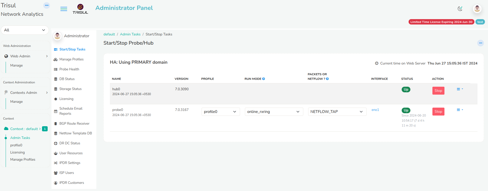

# Admin Tasks

A Trisul context is a separate instance of Trisul with its own isolated
database, configuration, and processes. To know more about contexts,
Refer to [Working with Contexts](/docs/ag/domain/contexts)

All the administrative functions are being done here right from
starting/stopping Hub and Probe nodes to monitoring Netflow and BGP in
Trisul.

*Figure: Start/Stop Tasks in Admin Panel*

### Start/Stop Tasks

This Menu is generally used to start/stop Hub and Probe nodes associated
with each context. Each context will have separate Hub and Probe nodes.
You can directly start and stop the nodes from Web Interface through
this menu.

### Manage Profiles

This menu provides a list of available profiles used by multiple probes.
Profile assigned to probes cannot be deleted. If multiple probes are
setup, Multiple profiles will be created automatically and listed here.

> To create a new profile, select **Create Profile** option.

You are shown the form with following fields

| Field Name          | Description                                                           |
| ------------------- | --------------------------------------------------------------------- |
| Profile Name        | Name for the profile. Name should be alpha numeric and length should not exceed 10 characters |
| Profile Description | Describes the function of the profile created                                                 |
| Clone from Context  | You can choose between multiple context to clone profile                                      |
| Clone from Profile  | You can also clone an entire profile from a list of profiles                                  |

### Probe Health

This menu is nothing but a Probe Health Monitor. It shows the
reachability, current traffic, and latency of Trisul Probes in this
particulat context.

It shows the count for Total No.of Probes, No.of Unreachable Probes,
No.of Probes Up/Down. Also provides the Latest Bandwidth in Gbps for
each probe.

### DB Status

This menu shows up the Trisul Data Store Statistics. It provides
detailed information on Session Flows, Resources, Alerts,
FTS (Full Text Search) objects.

Trisul Database is generally divided into three segments based on the
how many days Trisul has to store data.

- Oper is where the Latest data gets stored.
- Reference is the next level where data is pushed based on the days
  specified for storage.
- Archive is responsible for storing very old data.

You can view how much volume of data is being stored per day in each
slice and you can calculate accordingly as to how much days data can be
stored depending on the size of the disk.

> To configure the DB storage retention policy refer to [Configuring disk
> storage](/docs/ag/basictasks/configure_storage.md)

You can also view the disk occupied by each counter-group in a SLICE
every-day. This is helpful in tuning the system.

### Licensing

This menu gets you through the license policy of Trisul.

Trisul Network Analytics licenses are :

1. Perpetual
2. Need one license per physical node
3. Tied to a machine ID

License types are :

1. Free 3-Day License : this is the default license that does not
   expire but only gives you a 3-day window of history
2. Production License : depends on the number of active internal
   endpoints in your Home Network space
   1. Small Business : 500 simultaneously active Internal IPs
   2. Medium : 3000 simultaneously active Internal IPs
   3. Unlimited : As many as your hardware can support

To Install a new License, Refer to the [Installing Trisul
License](/docs/ag/license/install) for instructions

### Schedule Email Reports

You can Schedule Automatic Reports from Trisul like PDF Reports, Alert
based Reports etc.

You may dispatch by email any of the supported report types at these
intervals.

1. Hourly
2. Daily
3. Weekly
4. Monthly

To know more about how to schedule Reports, Refer to [Schedule
Reports](/docs/ug/reports/schedreports)

### BGP Route Reciever

This menu is all about the status of BGP Route Reciever. It shows the
BGP Status on all probes.

> To start the BGP Receiver you need root privileges on the probe, then
> type **systemctl start trisul-bgp**

To know more on Trisul-BGP concept, See [Trisul-BGP](/docs/isp/bgp)

### Netflow Template DB

Netflow v9, IPFIX, JFlow, Netstream are technologies that use a concept
of Template records. These are special records sent by the router which
describe the metrics contained in normal data flow records. Viewing
these template records are a great way to troubleshoot Netflow.

This Menu provides Netflow/IPFIX template database received by all
probes.

You can see the template database on each probe. This is updated every
10 minutes or when a new template is received.

### DR DC Status

Trisul supports Diaster Recovery when the Primary Site crashes.

The Primary Site is the Data Centre where Traffic is pushed. With the DR
Setup, Trisul also creates a backup of all the traffic in the DR site
and once the Primary site is down, the DR site is up.

We can configure the Primary site in such a way that we can check if the
DR site is running.

:::info navigation

:point_right: Login as User. Select Manage &rarr; App Settings &rarr; DR Settings.

:::

Enter the IP and TCP Port number of the DR Site.

*Figure: DR Settings*

By Configuring the DR Settings,you can view the Traffic Chart and DB
Status of the DR Site from the primary site.

*Figure: DR Traffic Chart*

Refer [Disaster Recovery](/docs/ag/ha/dr)