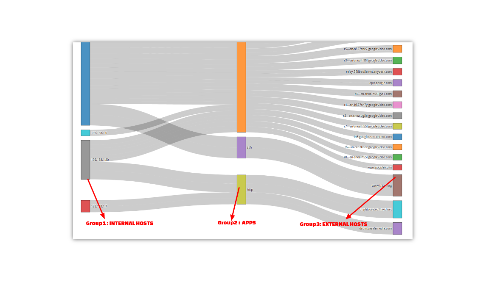

# Cross Key Counter Groups

This lets you monitor a cross product of two or three counter groups.
This takes advantage of the fact that Trisul is capable of monitoring
millions of unique keys for any counter group. By crossing the
*Applications X Hosts* counter group you setup a new counter group with
*Unique(hosts) x Unique(apps)* keys.

### Example 1 : Two Groups Host Flows

Say you want to see Internal Hosts to External Host traffic flows - you
can get this by querying the *Flows database* using the *Explore Flows*
tool, but this is impractical for large deployments which can have
billions of flows. To solve this we setup a Cross Key Counter group of
*Internal Host x External Hosts*

*Figure: CrossKey Counter Group Showing Two Groups Host Flows*

> We use the Sankey Crosskey Trisul APP to visualize the flows. 

To install Sankey Crossdrill,

:::info navigation

:point_right: Go to Admin &rarr; Web Admin &rarr; Manage &rarr; Apps 

:::

Using the normal Retro Counters tool you can see the composite keys

*Figure: Composite Keys in Retro Counter*

### Example 2 : Three Groups Hosts App Flows

You can cross 3 groups as well. Here we setup a new Cross Keys counter
group with *Internal Hosts X Applications X External Hosts*

*Figure: CrossKey Counter Group Showing Three Groups Hosts App Flows*

> We use the Sankey Crosskey Trisul APP to visualize the flows. 

:::info navigation

:point_right: Go to Admin &rarr; Web Admin &rarr; Manage &rarr; Apps

:::

### Creating a Cross Key Counter Group

:::info navigation

:point_right: Login as Admin &rarr; Select Context:default&rarr; profile0 &rarr; Custom Counters
&rarr; Crosskeys

:::

1. Click the option **New Crosskey Counter Group**

This leads you to a form with these five fields.

| Field Name         | Description                                                                 |
| ------------------ | --------------------------------------------------------------------------- |
| Counter Group Name | Name of the counter group                                                   |
| Description        | Description of the group                                                    |
| Parent Group       | The parent counter group *G1*                                               |
| Crosskey Group     | The first cross product counter group group with the parent group *G1 x G2* |
| Crosskey Group 2   | The optional second cross product *G1 x G2 x G3*                            |

After creation , the user is redirected to a page which lists the newly
created group.

#### Enable and Disable Crosskeys

The parent counter group and the crosskey group 1 and crosskey group 2
(if used) must be enabled. If any of them are disabled the crosskey
counter group will not be created by Trisul.

### Viewing

Once created , the new Cross Key counter group is just like any other
group.

:::info navigation

:point_right: Select Retro &rarr; Retro Tools &rarr; Select counter group

:::

The cross key counter group is intended for visualizing relationships as
Flows. You can use the *Sankey Crosskey* Trisul APP to visualize the
cross key counter group.

> We use the Sankey Crosskey Trisul APP to visualize the flows. 

:::info navigation 

:point_right: Go to Admin &rarr; Web Admin &rarr; Manage &rarr; Apps 

:::

*Figure: Sankey Crossdrill Apps from Trisul Apps*
