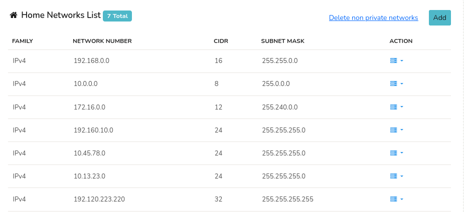

# Home Networks

Several features of Trisul depend on being able to tell which IPs belong
to your home network and which are to be treated as external. The rough
idea is that hosts in your home network are thought to be under your
administrative domain. For these features to work accurately you need to
tell Trisul which IPs constitute your “Home Network”

:::note **Default private IP ranges**  
Trisul by default considers the RFC1918 private IP ranges *10.0.0.0/8,
192.168.0.0/16, 172.16.0.0/12* to be home networks. For most users who
deployed NAT this should be sufficient. There is nothing more to do
here.

:::

See [Home Network Concepts](/docs/ag/webadmin/homenetwork_concepts)

## Add a New Home Network

It pays to be accurate about your home network as it can impact several
reports and views. If you want to add a new subnet to your home network
or edit an existing entry, follow these steps.

:::info navigation

:point_right: (login as admin) Select *Context : default &rarr; profile0 -&rarr; Home
Networks*

:::

You are shown the following screen

*Figure: Showing a list of configured Home Network subnets*

- Click on **Add a network**  

- Enter an IP and a subnetmask (eg, 59.92.0.0 and 255.255.0.0) that
  represents your home network  

- Click **Create** button to add a new home network

## Adding Home Networks in Bulk

When you click on “Add” in the Home Networks screen you can see the Add
form below

*Figure: The add subnetworks screen*

Here you can

1. **Add one by one** : a single network number in "Network Number" and subnet mask in "Network Mask"
2. **Add in bulk** : Simply copy paste a series of **comma separated** or
   **one-per-line** networks in CIDR format in "Network Number". When using the CIDR format you can leave the "Network Mask" field blank.

## Deleting

1. Delete any single home network by pressing the “Delete” link next to
   it.
2. You can press the “Delete non private networks” to delete all the
   elements in bulk except the three built-in private ranges. Use this
   option if you want to add the home networks in bulk later.

## Viewing Traffic Direction

The Home Network is a crucial part of Trisul reports. Apart from the
“Internal Hosts”, “External Hosts” classification - you can see the
following data.

### Metrics in the Aggregates Counter Group.

:::info navigation

:point_right: Select *Tools &rarr; Long Term Traffic*

:::

1. Counter group = Aggregates
2. Meter = Total
3. Keys to the Item = DIR_INTOHOME,DIR_OUTOFHOME,DIR_TRANSIT,DIR_WITHINHOME

The following chart gives you the traffic details in each direction.

*Figure: Directional chart determined by the Home Network settings*

### Flows

Trisul has the ability to use Flow Taggers to tag each flow with a direction hint based on the endpoint Home Addresses.

1. Enable the [TagFlowsWithDirection](pathname:///docs/ref/netflow-config#TagFlowsWithDirection) setting in the NetFlow configuration file
2. You can then go to Tools &rarr; Explore Flows to search for flows with
   the appropriate tag.
3. For example to see all *Transit* flows , enter `tag=[dir]transit` in
   the tool's search query.

*Figure: search for directional flows using a custom flow tagger*

Also see user guide sections: [Flow Taggers](/docs/ug/flow/tagger), [Explore Flows](/docs/ug/tools/explore_flows)
