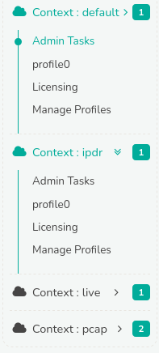

# Configuring Trisul

**Context menu** serves as the central hub for configuring all network configuration settings including home network setup, capturing adapters, controlling hub/probe operations etc. 

A Trisul context is a separate instance of Trisul with its own isolated
database, configuration, and processes. To know more about contexts,
Refer to [Working with Contexts](/docs/ag/domain/contexts)

Trisul, by default provides a context named **'Context: Default'** as seen in the figure. Additionally, any newly created contexts will also be listed in the admin menu below the default context. 

  
*Figure: Context: Menus*

Each context has its own dedicated menu as in the following.

1) [Admin Tasks](/docs/ag/context/context_menus)
2) [Profile0](/docs/ag/context/profilemenu)
3) [Licensing](/docs/ag/license/intro)
4) [Manage Profiles](/docs/ag/context/manage_profiles)

