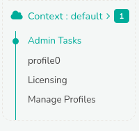

# Context Menu

A Trisul context is a separate instance of Trisul with its own isolated
database, configuration, and processes. To know more about contexts,
Refer to [Working with Contexts](/docs/ag/domain/contexts)

Trisul provides a context named 'Context: Default' by default. Additionally, any newly created contexts will also be listed in the admin menu. Each context has its own dedicated menu, which includes the following.

  
*Figure: Context Menus*