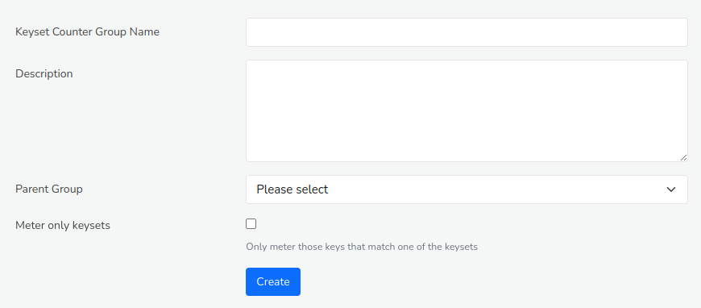
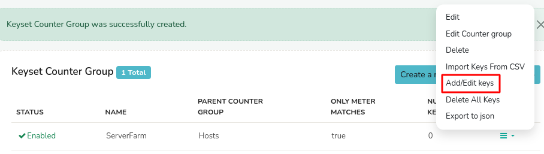
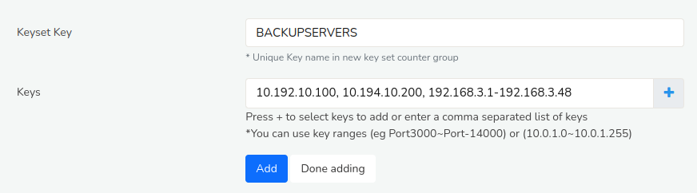

# Keyset Counter Groups

A new counter group that aggregates sets of keys from a host counter
group. This can be used to group IP addresses , port numbers, network
interfaces and then count the aggregate. Some examples are shown below

| New Keyset Counter Group | Host/Parent Group | Key sets                                                     |
| ------------------------ | ----------------- | ------------------------------------------------------------ |
| MyApps                   | Apps              | Ports 80,445,8080 = WEB Ports 3000-4000 = VoIP Ports 18001,18002,19001 = TRADING                                                                                   |
| ServerFarm               | Hosts             | IPs 10.1.17.1,10.1.18.1 = GATEWAYS IPs 10.1.17.40 to 50 = MANAGEMENT IPs 10.1.19.1 to 255 = HR ..build other business groupings                                 |

### Creating a Keyset Counter Group

:::info navigation

:point_right: Login as Admin &rarr; Select Context:default&rarr; profile0 &rarr; Custom Counters
&rarr; Keysets

:::

*Figure: Creating a new Keyset Counter Group*

Fill out these fields

| Field Name                | Description                                                                         |
| ------------------------- | ----------------------------------------------------------------------------------- |
| Keyset Counter Group Name | The name of the new counter group. Keep this short.                                 |
| Description               | A description of the new counter group                                              |
| Parent Group              | The parent counter group from which you will be selecting keys. Select from dropdown|
| Meter only keysets        | The default behavior is when keys seen in traffic do not match any groups they will be counted as-is in the new group. If this box is checked, then only those keys that match a group will be metered, others will be discarded.                                                                                         |

Now you have created the counter group. Next you need to group keys
together.

### Group Keys Together

Directions to Create new keyset counter groups

:::info navigation

:point_right: Login as Admin &rarr; Select Context :default &rarr; profile0 &rarr;  Custom Counters
&rarr; Keysets

:::

1. The list of keyset counter groups will appear
2. Click the option “Add/Edit keys” against the group name.

*Figure: How to group keys together*

1. Click the *Add/Edit Keys* to edit keysets
2. You will be redirected to a page with following fields

*Figure: Adding two IPs and an IP range to a group called BACKUPHOSTS*

| Field Name | Description                                                                                   |
| ---------- |---------------------------------------------------------------------------------------------- |
| Keyset Key | Key name in new key set counter group                                                         |
| Keys       | Keys from parent counter group separated by a comma. To add Key Ranges use a ~ tilde character. For example :                                                                                                    |
| \+ button  | Press the + button to select keys from a list based on top keys in that group                                                                                                        |

1. Enter new Keys and group items then press *Add*. It will appear in
   the bottom.
2. Repeat the process one by one until you have added all the groups.
   Then press *Done Adding*

Your keyset group is ready.

> **Restart**  
> Restart the Probe for changes to take effect.

You can then view the new counter group in *Retro > Retro Counters*