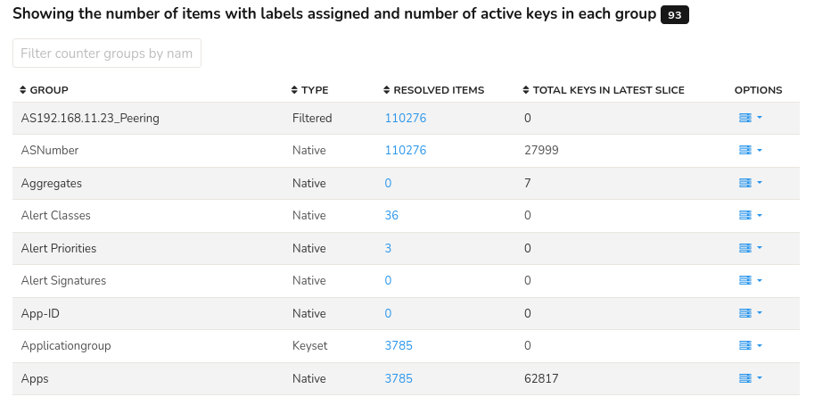
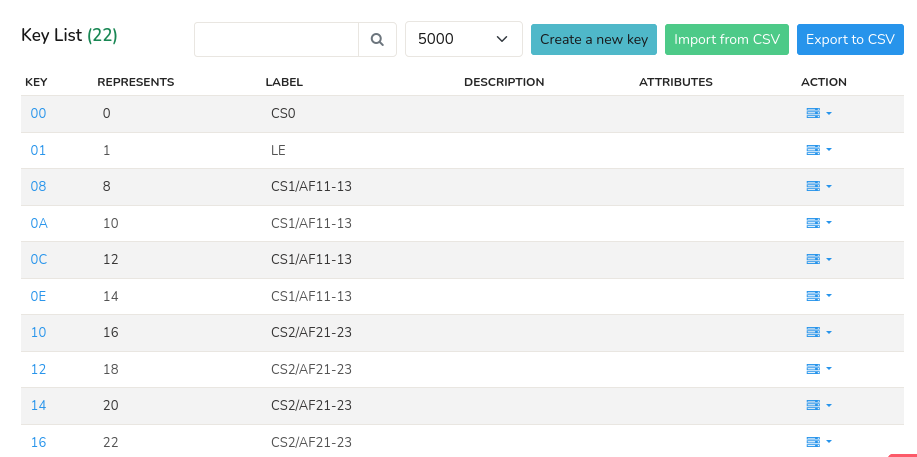

# Manage Keys

*Manage Keys* allows you to view and manage the [keys](/docs/ug/cg/intro#a-key) on Trisul platform.

## View Keys

:::info navigation
:point_right: Go to Context: Default &rarr; Profile0 &rarr; Manage Keys
:::

In here you can see the list of keys on the platform and manage them. 

  
*Figure: List of Keys*

The header of the table shows the total number of keys on the platform highlighted in black (in figure: 93 keys). The table of list of keys contains the following details and options.

| Column | Description |
|--------|-------------|
| Group | The name of the Countergroup that the keys belong to. |
| Type | Indicates the type of countergroup that the keys belongs to. |
| Resolved Items | Number of items that have been resolved in that countergroup. |
| Total Keys in Last Slice | The total number of keys in the last slice. |
| Options | Options that can be performed on the keys. |

> Note that each column in the table is [sortable](/docs/ug/ui/elements#column-sorter) for flexible data analyses.

### Options 

Click on the Option button against each key to perform various actions on the key. The actions include the following.

| Options | Description |
|---------|-------------|
| Show recently active | Shows the most active keys on that countergroup. |
| Import from CSV | Upload a CSV file to add a key to that countergroup. |
| Export to CSV | Download the keys on that countergroup in the CSV format. |
| Clear all attributes | Resets all the attributes of the keys. |

## View Resolved Items

Click on the number on the resolved items column to see the specified number of list of resolved keys. 

    
*Figure: List of Resolved Items*

| Column | Description |
|--------|-------------|
| Key | Unique identifier for resolved key. |
| Represents | Indicates which item is the label representing. |
| Label | Human readable name for the key. |
| Description | A short description of the resolved key. |
| Attributes | Attributes associated with the resolved key. |
| Action | click on the action button to edit the properties of the resolved key. |

- Use the **Filter bar** located on the header of the table to filter a particular key or label.
- Select a value from the **Page dropdown** box located on the header to specify the number of items to display per page.
- Click on **Import from CSV** button on the upper right hand side to upload a CSV file and add a key to the list.
- Click on **Export to CSV** button on the upper right hand side to download the list of keys in CSV format.

## Create a New Key

Click on the **Create a New Key** button to add a new key to the list and fill the form with the help of following details.

| Field | Description |
|-------|-------------|
| Key | Unique identifier for the key. Counter groups generate statistics against this key.
| Name | A user friendly name for this key. |
| Description | More information about this entity. |
| Valid From | Select a time from the calendar where statistics before this time are not shown. |
| Attributes | Enter one attribute per line for the key. |

And click *Create*. 