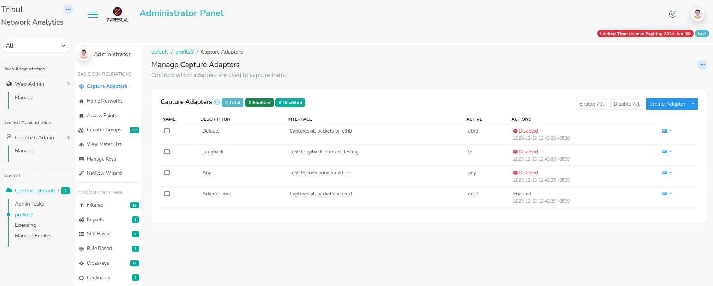

# Profile0

## Profile Menu

The Profile0 Menu has all the basic configuration related traffic
monitoring, flows, custom counters, Alerts, Resources and Advanced Tools
that can be modified as and when it is needed. The default profile is
called **profile0** you can click on that item to access the profile0
menu.

  
*Figure: Profile0 in Context: default*

Lets get familiar with the profile configuration menus as listed in the following.

### Basic Configurations

| Menu               | Description       |
|--------------------|-------------------|
| Capture Adapters | Describes how you can add or edit packet capture parameters for any profile. See [Capture Adapters](/docs/ag/context/profiles) |
| Home Networks | Configuration of home networks to monitor a range of internal IPs within your organisation. See [Home Networks](/docs/ag/context/home_networks) |
| Access Points | Controls how protocols are mapped to ports and other entities. See [Access points](/docs/ag/context/access_points) |
| Counter Groups | See [Counter Group Settings](/docs/ug/cg/settings) |
| View Meter List | See [Trisul Traffic Meters](/docs/ref/meters) |
| Manage Keys | 
| NetFlow Wizard | See [NetFlow Configuration Wizard](/docs/ug/netflow/netflow_wizard) |

### Custom Counters

| Menu               | Description |
|--------------------|-------------------|
| Filtered | See [Filtered Countergroups](/docs/ug/cg/custom#filtered-counter-groups) |
| Keysets | See [Keyset Countergroups](/docs/ug/cg/custom#keyset-counter-groups) |
| Stat Based | See [Keyset Countergroups](/docs/ug/cg/custom#stat-based-counter-groups) |
| Rule Based | See [Rule Based Countergroups](/docs/ug/cg/custom#rule-based-counter-groups) |
| Crosskeys | See [Cross Key Countergroups](/docs/ug/cg/custom#cross-key-counter-groups) |
| Cardinality | See [Cardinality Counter](/docs/ug/cg/custom#cardinality-counting)

### Flows

| Menu | Description |
|--------------------|-------------------|
| Session Groups | 
| Flow Trackers | See [Flow Trackers](/docs/ug/flow/tracker) |
| Flow Taggers | See [Flow Taggers](/docs/ug/flow/tagger) |

### Alerts

| Menu | Description |
|--------------------|-------------------|
| All Alert Groups | See [Manage Alert Groups](/docs/ug/alerts/manage) |
| Flow Tracker | See [Flow Tracker Alerts](/docs/ug/alerts/ft) |
| Threshold Crossing | See [Threshold Crossing Alerts](/docs/ug/alerts/tca) |
| Threshold Band | See [Threshold Band Anomaly Alerts](/docs/ug/alerts/tband) |
| Setup Email | See [Email Alert Delivery](/docs/ug/alerts/email_settings) |

### Resources

| Menu | Description |
|--------------------|-------------------|
| All Resources | See [Resources](/docs/ug/resources/) |
| All FTS Groups |See [Full Text Search](/docs/ug/resources/fts) |

### Others

| Menu | Description |
|--------------------|-------------------|
| Protocols | 
| Plugins | See [Plugin Configuration](/docs/ref/plugin_configuration) |
| Bulk PING Groups | See [Ping Monitor](/docs/isp/pingmonitor) |
| SNMP Agents | See [SNMP Agent](/docs/ag/context/snmp_agent) |
| Static IPs | 
| Advanced |

