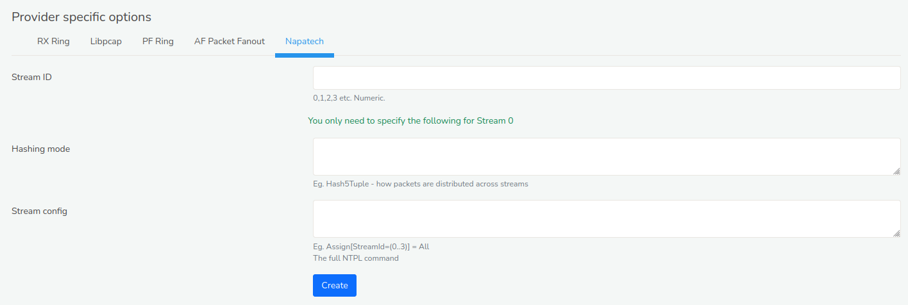

# Capture Adapters

A single instance of Trisul can listen on one or more network
interfaces. This page describes how you can add or edit packet capture
parameters for any profile.

## View List of Capture Profiles

:::info navigation

:point_right: Login as admin and Select Context : default &rarr; profile0 &rarr; Capture
Adapters

:::

By default, only **eth0** is enabled. There are some other disabled
entries for debugging purposes. If you want to listen on, say eth1 you
can create a new profile and enable that one.

## Create a New Capture Profile

Say you want to create a new network adapter for profile0 in context0.

:::info navigation

:point_right: Select Context : default &rarr; profile0 &rarr; Capture Adapters 
Click **Create Adapter**

:::

A form with the following fields are displayed

| Field              | Description                                                                  |
| ------------------ | ---------------------------------------------------------------------------- |
| Name               | A unique name for this profile                                               |
| Network Interface  | The linux network interface name - such as *eth0*, *eth1*, *wlan0*           |
| BPF Filter         | A BPF (libpcap/tcpdump) filter expression (see [notes below](/docs/ag/context/profiles#specifying-a-bpf-filter-for-afpacket-and-rxring) on how to generate this for rxring mode - the default) |
| ERSPAN Interface   | Decapsulate all ERSPAN packets on this interface. If this option is disabled, ERSPAN is counted as a single IP+GRE tunnel.                                                                  |
| Add Ethernet FCS   | Add 4 byte FCS to packet length. Use this option to reconcile with SNMP based counters.|
| Force Netflow Mode | Force this adapter into Netflow Mode - use this option if you want to use a mix of Netflow and Packet capture on a per-adapter basis.                                                          |
| Description        | A short description of the profile                                           |

### Provider Specific Options

Trisul can capture packets in two “five modes”, *Linux RX Ring* ,
*Libpcap* , *PF Ring* , *AF Packet*, *Napatech* . You dont control the run
mode here, but at the command line or by changing the application
settings. The capture profiles work for all run modes, with one
exception.

#### RX Ring

  
*Figure: Configure RX Ring Mode*

***Number of blocks (2^N)*** 
Number of slots in the ring. Increase only if you need to

#### Libpcap

  
*Figure: Configure Libpcap Mode*

***Promiscuous Mode***  
Usually set to true

***Snap length***  
How many bytes of each packet to capture

#### PF Ring

  
*Figure: Configure PF Ring Mode*

***PF Ring Cluster ID***  
Cluster ID to which this PF_RING socket is attached. (Numeric)

#### AF Packet

  
*Figure: Configure AF Packet Mode*

***AF Packet FANOUT Group ID***  
AF Packet Fanout Group ID for flow based load balancing (Numeric \<
1000)

#### Napatech

  
*Figure: Configure Napatech Mode*

***Stream ID***  
Numeric number

***Hashing mode***  
how packets are distributed across streams

***Stream config***  
Full NTPL command.

## Specifying a BPF Filter for AFPACKET and RXRING

:::info navigation

:point_right: Select the active Interface and Click Create Adapter

:::

  
*Figure: Configure New Capture Adapter*

In the "BPF Filter" enter the expression such as `host 192.168.2.11 or host 10.29.1.1` or bytecode output of `tcpdump -ddd`

## Express Adapter Creation Wizard

Click on “Create Adapter” on the top right to quickly create capture
profiles for flow based load balancing.

  
*Figure: Showing Create Adapter Option in Adapter Creation Wizard*

### Quick Create Single Adapter

Select *Quick create single Adapter* to create a single adapter using an
interface name

| Field Name   | Description                              |
| ------------ | ---------------------------------------- |
| Adapter name | Enter the network adapter name (eg eth0) |

### Quick Create PF Ring

Select *Quick create RF Ring* to create a PF Ring capture profile with
multiple streams for flow based load balancing

| Field Name        | Description                                                   |
| ----------------- | ------------------------------------------------------------- |
| Adapter name      | Enter the network adapter name (eg eth0)                      |
| Number of streams | Number of flow balanced streams (eg 2, 4, etc)                |
| Cluster ID        | PF Ring Cluster ID you wish to assign to the streams (eg 999) |

### Quick Create AF Packet

Select *Quick create AF Packet* to create AF Packet FANOUT based streams
for flow based load balancing.

| Field Name        | Description                                                             |
| ----------------- | ----------------------------------------------------------------------- |
| Adapter name      | Enter the network adapter name (eg eth0)                                |
| Number of streams | Number of AF FANOUT streams for flow based load balancing (eg, 2,4,etc) |
| Fanout Group ID   | AF Packet Fanout Group ID for flow based load balancing (Example 999)   |

## Enable or Disable the Profile

  
*Figure: Enable/Disable all*

- Click **Enable All** or **Disable All** on the top right hand side to enable or disable all adapters.

### Edit the Profile

Click the action button against any interface and a dropdown menu shows up **Enable**, **Edit**, and **Delete** options in the Profile list.    

- **Enable**: Click enable to enable the selected interface.  
- **Edit**: Click edit to modify the adapter configuration.  
- **Delete**: Click delete to delete the selected interface.  

### Bulk Edits

Click on the checkboxes of the interfaces you want to edit in bulk and the following options appears as in the figure.  

    
*Figure: Showing bulk edit options*    

| Options | Descriptions |
|---------|--------------|
| Enable | Activates the chosen interfaces, allowing them to function and interact with users or systems as intended. |
| Disable | Deactivates the selected interfaces, temporarily halting their functionality and interaction with users or systems. |
| Edit | Opens a bulk editing interface "Edit Capture Adapter" on the left side as shown in the figure to modify settings of the selected interfaces simultaneously. (Options in "Edit Capture Adapater" is the same fields as in the "Create Adapater") and click Update. |
| Select All | Automatically checks all available interfaces, enabling you to apply bulk actions (enable, disable, edit) to every interface at once. | 
| Unselect All | clears all previously selected checkboxes, resetting your selection and allowing you to start fresh. |
| Invert | Toggles the selection status of all interfaces. Checked boxes will become unchecked, and unchecked boxes will become checked, providing a convenient way to quickly reverse your selections. |