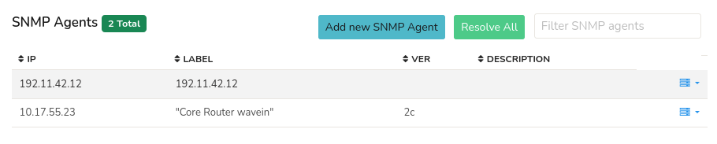

# SNMP Agent

SNMP Agent menu helps to resolve several Router IPs with their respective SNMP
Read community. You can add multiple number of Router IPs.

:::info navigation
:point_right: Go to Context: Default &rarr; Profile0 &rarr; SNMP Agents
:::

Shows the list of IPs, their respective labels, version, and descriptions in a table where columns are sortable.

  
*Figure: SNMP Agents List*

## Add New SNMP Agent

> To add a new SNMP agent, Select **Add New SNMP Agent** option

| Field Name          | Description                                                        |
| ------------------- | ------------------------------------------------------------------ |
| IP Address          | IP address of snmp device. You can add multiple devices at once. Specify multiple IPs separated by comma                                                                         |
| SNMP Version        | SNMP version v1 or v2c or v3. Select V3 to show SNMPv3 parameters  |
| SNMP Read Community | SNMP read community string                                         |

## Resolve All

The "Resolve All" button retrieves and updates the SNMP information for all the added Router IPs with their respective SNMP Read Community strings. Clicking on "Resolve All" syncs the system's data with the current SNMP configurations of the listed routers. 

