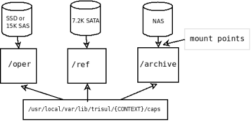

# Storage Architecture 

Optimizing disk storage is a key part of Trisul. This section describes.

- The concept of *Sliding Slices* 
- How data is stored on the *Trisul Hub*
- How data is stored on the *Trisul Probe*
- Optimizing Packet PCAP storage on the Trisul Probe 

## Sliding Slices

Trisul uses an innovative sliding mechanism to store raw packets.

Raw packets are stored in three directories.

| Directory | Name               | Description                                               |
| --------- | ------------------ | --------------------------------------------------------- |
| *oper*    | Operational slices | recent data that is most likely to be called up           |
| *ref*     | Reference slices   | not so recent data so okay to be on slower disks          |
| *archive* | Archive slices     | unlikely but may be called upon, could be on slower disks |

As each directory gets filled up, the oldest slice from that directory 
moves to the next area. Slices from the archive silently move to `/dev/null`(they are deleted). The figure below illustrates the concept. Note that trisul only writes to the *oper* slices.

You have to edit the following parameters to suit your environment.

1. Size of each slice (file storing raw packets)
2. Number of slices (files) in *oper*, *ref*, and *archive* areas

See the [trisulConfig.xml](https://trisul.org/docs/ref/trisulconfig.html) documentation for more details.

## Mapping disks to Slices

The slice architecture allows you to configure hardware resources for peak performance. The concept behind the optimization is :

- Older data less likely to be called up than recent data
- If older data is called upon a reduced performance is acceptable
- Writes only ever happen to operational *oper* slices

With these in mind, you can save money while getting peak performance
 by mapping faster disks to the operational area. An example is shown 
below :

## Flexible Policies for Volume Reduction

Storing raw packets can be tricky due to the volume of storage 
required. Not every organization has the resources to store absolutely 
everything. In our experience, there is always some **trusted and predictable** activity that allows scope for optimization. For example :

1. a daily full company offsite backup
2. Antivirus pushes from a trusted server to desktops
3. lots of very long flows – such as MSDN / Linux ISO image downloads

The primary method Trisul uses to cut traffic is rule based flow 
capping. You specify a chain of rules and the disposition when each rule
 in the chain matches.

A sample rule chain is shown below. We want to :

1. Cap av-pushes to first 10M
2. Cap lotusnote traffic to first 1M
3. Do not store traffic to offsite-backup
4. Store full content for everything else

Rule chain :

| Rule                             | Disposition |
| -------------------------------- | ----------- |
|                                  | FULL        |
| host av-server.mydomain.com      | FLOWCAP10M  |
| app lotus-note                   | FLOWCAP1M   |
|                                  | FLOWCAP100K |
|                                  | FLOWCAP10K  |
|                                  | HEADERS     |
| host offsite-backup.mydomain.com | NONE        |
| default                          | FULL        |

> if nothing matches

For detailed syntax for specifying the rule chain, see the Ring section in [trisulConfig.xml](https://trisul.org/docs/ref/trisulconfig.html#ring)

## Encrypted Content

Raw packets represent all of your network communications over an extended time period.

Storing them in the clear :

- makes Trisul an attractive target for attackers
- makes disposal and reuse of disks risky
- makes enterprise network admins nervous about such systems

Trisul encrypts all content by default using AES-128 in CTR mode. The disk subsystem never sees clear text packets.

To change the passphrase, see the *PassphraseFile* parameter in [trisulConfig.xml](https://trisul.org/docs/ref/trisulconfig.html#ring)

The raw packets are stored for each context in the following default directories. The*App > DBRoot*parameter in[trisulProbeConfig.xml](/docs/ref/trisulconfig)points to the base directory

- /usr/local/var/lib/trisul-probe/domain0/probe0/context0/caps/
  - /oper – the operational directory where Trisul*writes*packets
  - /ref – the reference directory for recent data likely to be looked up
  - /archive – older data  
    As data ages they ‘cool down’ and slide from oper to ref to archive. Therefore the ‘hottest’ data slices are under /oper.

The reason we have three directories is that they can be mounted on three separate volumes if required for heavy workloads.