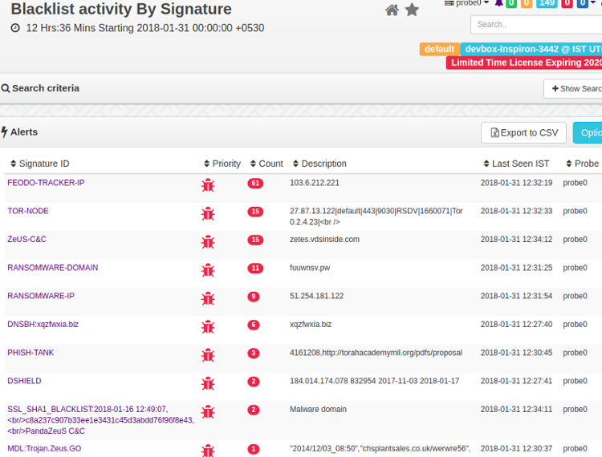

# BadFellas plugin

The Badfellas plugin checks your network traffic against millions of indicators to detect malicious activity.



Blacklist Alerts

The following objects in your network traffic are scrutinized.

**IP address**

Matches IPs against blacklisted IPs

**Domain**

Matches blacklisted domain names, even if no response was received, or hidden inDNSrecords

**HTTPHost**

Checks if aHTTPhost is blacklisted. Priceless when flagging shared hosts like badun.blogspot.com

**SSLHost**

The Server Name Indicator (SNI) is inspected  
-URL:=  
ChecksHTTPGETs/POSTs of your network against well known evil ones

**SSLCertificate**

Checks SHA1 fingerprint

## Feeds

Feeds are sources of threat intelligence from which Trisul downloads updated threat indicators. Upon installion of badfellas plugin a “Feed” is automatically added to the Trisul-Hub node. The hub node then downloads updates as per rules and pushes them to the probes.

The feed directory is located on the Trisul-Hub node at  

 BASHCopy`cd /usr/local/var/lib/trisul-config/domain0/allcontexts/feeds`

Inside this directory you can see`feed_xx`sub-directories representing plugins requesting feed updates. For example : GeoIP updates. The Badfellas feed is located in the subdirectory  

```bash
cd feed-2F3CCCA3-38D4-4773-97AB-3ED732F82533
```


Inside the feed directory , there is a file called`rules.xml`This contains the feed configuration.

### Removing a feed

Locate the`rules.xml`file as described above. Then remove the feeds you want to disable. For example if you wish to disable theALIENVAULTfeed.

Remove the following lines

```xml
<Source>
    <URL>http://reputation.alienvault.com/reputation.generic.gz</URL>
    <Target>reputation.generic.gz</Target>
</Source>
```

The feed will skipped at the next download. See`Frequency`parameter in the rules.xml file.

## Included Blacklist Feeds

The Badfellas package installs stub copies of the following blacklists. These feeds are updated to the latest versions at the next scheduled update time. Within 24 hrs.

| Name                     | Type   | Source |
| ------------------------ | -------------- | ------ |
| DNSblackhole list       | [malwaredomains.lehigh.edu](http://sbc.io/hosts/hosts)List keeps track of domains known to propagate malware and spyware                             |        |
| Malicious/scanner IPs    | [Dshield.org](https://www.dshield.org/)The well knownDSHIELDlist                                                                                   |        |
| IP Blocklist             | [feodotracker.abuse.ch](https://feodotracker.abuse.ch/blocklist/)contains IP addresses (IPv4) used as C&C communication channel by the Feodo Trojan. |        |
| Malware domain + urls    | [Malware Domain List](http://www.malwaredomainlist.com/)<br/>Domains hosting latest malware                                                           |        |
| Anti phishing            | [Phish Tank](https://www.phishtank.com/)User submitted known phishing domains                                                                        |        |
| Domains                  | Contains top domains list                                                                                                                             |        |
| Domains                  | [Ransomware Domain Blocklist](https://ransomwaretracker.abuse.ch/blocklist/)show list of ransomware domain                                           |        |
| IPs                      | [Ransomware Domain IPs](https://ransomwaretracker.abuse.ch/blocklist/)show list of ransomware IPs                                                    |        |
| URLs                     | [Ransomware Domain URLs](https://ransomwaretracker.abuse.ch/blocklist/)show list of ransomware urls                                                  |        |
| SSLBlacklist            | [SSLBlacklist](https://sslbl.abuse.ch/)contains list of badSSLcertificates                                                                        |        |
| Domains                  | Contains top 1 million domains list                                                                                                                   |        |
| TORnodes                | [TORnodes](https://www.dan.me.uk/torlist/?full)Checks if any of your network hosts are involved inTORproxy activitiy                              |        |
| AlienVault IP Reputation | Flags IPs with poor reputation. This list includes scanners and other mischief                                                                        |        |
| SSLBlacklist            | Hashes of maliciousSSLcertificates sourced from sslbl.abuse.ch    |        |

## Feed updates

The plugin will automatically download a fresh database at a set schedule. You can control when and how frequently this database is updated by modifying the`Frequency`parameter in the rules.xml file. The default setting is 1 update every day. All feeds are updated at the same frequency.

```bash
<Run>
    <RunAt>0200</RunAt>
    <Frequency>86400</Frequency>
</Run>
```

### Viewing status of feed updates

To view the status of feed updates, whether the downloads were successful or not.

:::note

Login as admin, then select*Webadmin > Manage > Plugin Data Updates*

:::

This shows the feed status.

## Installation

This plugin is distributed as aRPM/DEBpackage.

```bash
# on centos
rpm -Uvh trisul_badfellas-1.0.153-0.el5.x86_64.rpm
# on ubuntu
dpkg -i trisul_badfellas-1.0.153.amd64.deb
```

##### Upgrading

Simply uninstall the old package and reinstall the new package.

#### A sample install

When you install you should get an output like the following.

```bash
[root@localhost share]# rpm -Uvh trisul_badfellas-1.0.153-0.el5.x86_64.rpm
Preparing...                ########################################### [100%]
   1:trisul_badfellas       ########################################### [100%]
Creating temp staging area..
Creating consolidated Bad Fellas Tokyo Cab ..
Processing File /tmp/temp_trisul_badfellas_staging/usr/local/share/BadFellas/dns-blackhole.txt..25270 entries
Processing File /tmp/temp_trisul_badfellas_staging/usr/local/share/BadFellas/malware-domain-list.txt.......134498 entries
[root@localhost share]#
```

### Uninstallation

Stop Trisul and uninstall theRPMorDEB

```bash
# centos
rpm -e trisul_badfellas
# ubuntu
dpkg -r  trisul_badfellas
```

### Starting

Once installed, the plugin will be effective the next time you restart Trisul.

## Adding custom indicators

#### Step 1 : Create Tab Separated Indicator file

Using external mechanism place your custom feed in a Tab Separated file with the following format`<FEEDNAME><TAB><IP/DOMAIN/URL><TAB><DESCRIPTION>`

#### Step 2 : Add your file as a source feed for Badfellas automatic updates

Locate the feed`rules.xml`file[as described in feeds](#feeds)

Find the local feed section

```xml
<!-- ***************************************************************** -->
<!--    Local feed                                                     -->
<!--     Any file named badfellas-local-*.tsv  will be processed       -->
<!--     The file is a TAB separated file with the following fields    -->
<!--     INTELSOURCE<TAB>KEY<TAB><DESCRIPTION>                         -->
<!--     KEY = IP Address, Domain Name, URL                            -->
<!-- ***************************************************************** -->
<Source>
    <URL>file:///usr/local/share/trisul/plugins/badfellas-local.tsv</URL>
    <Target>badfellas-local-0.tsv</Target>
</Source>
```

In the above snippet – theURL`file://.... badfellas-local.tsv`represents the source feed. Change it to your file orURLif you are hosting it on a website. The feed will be automatically refresh like the other sources.

#### Restart Trisul or wait for about 30 minutes for the feed to be picked up

## Configuration parameters

The rules.xml allows you to customize

**ReloadListSeconds**

How frequently Trisul server reloads the threat intel information. This is separate from the per-feed download Frequency

**CheckICMP**

ScanICMPtraffic like PINGs for connection attempts

**CheckDNS**

ParseDNSrecords

**CheckHTTPHost**

CheckHTTPHost header in addition toDNS

**CheckTCPFlows**

Check each flow

**CheckURL**

Check all URLs seen

**FatTailRank**

In theURLTop-1million lists URLs below this as considered as Fat Tail

Locate the[rules.xml file](/docs/ug/install/badfellas#feeds)

```xml
<TrisulPluginConfiguration>
        <description>Controls how the Trisul Badfellas plugin works </description>
        <ReloadListSeconds>900</ReloadListSeconds>
        <CheckICMP>TRUE</CheckICMP>
        <CheckDNS>TRUE</CheckDNS>
        <CheckHTTPHost>TRUE</CheckHTTPHost>
        <CheckTCPFlows>TRUE</CheckTCPFlows>
        <CheckURLs>TRUE</CheckURLs>
```

## Also read

See the[Badfellas Malware alerts section](/docs/ug/alerts/mw)in the User Guide
