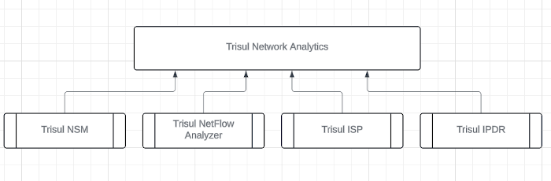
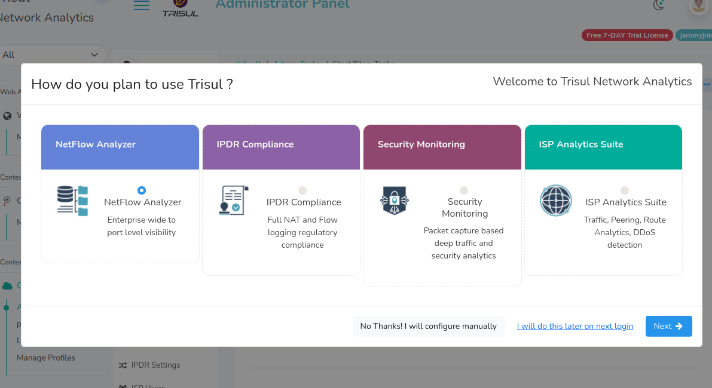
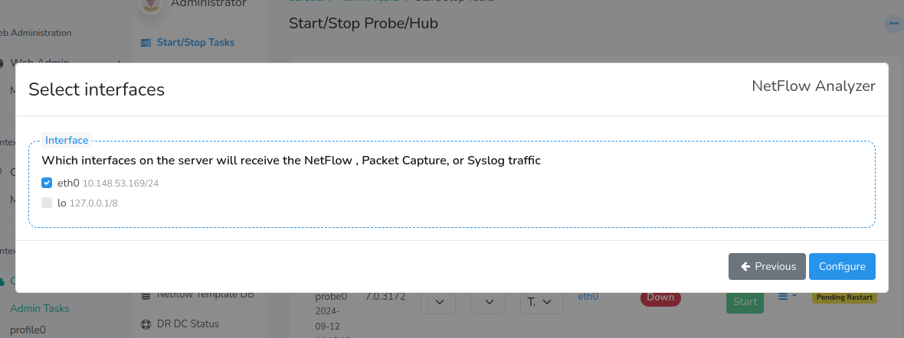
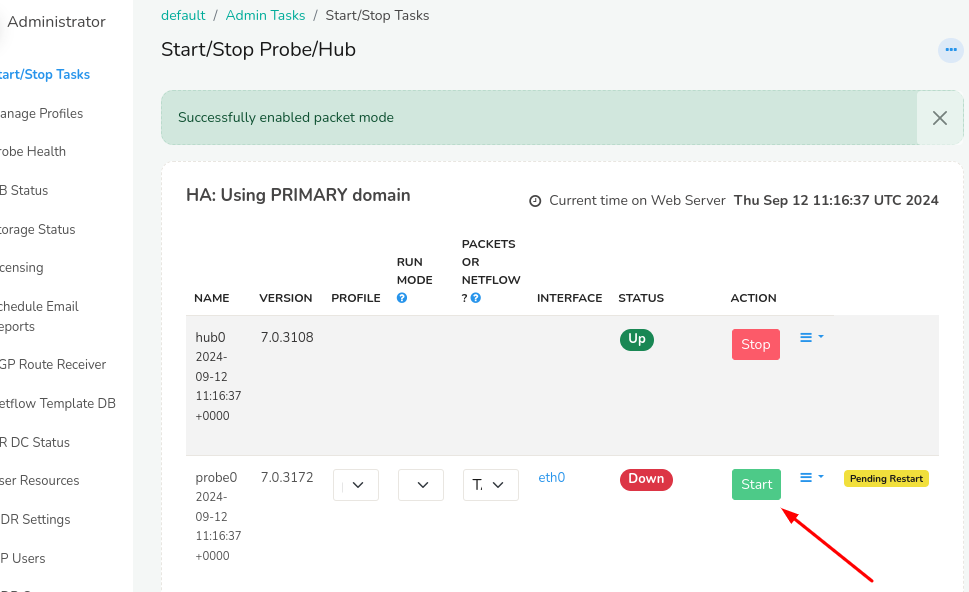

:::note after install
After installing on the server you need to select the product mode as the first step.
:::
Trisul Network Analytics is a general platform which can be reconfigured to very specific use cases.  

This *product*-izing process consists of customizing counters, flows, menus, dashboards and so on. For ease of use you can simply select the configuration set up front after installation.

:::tip Productize it
The default mode of Trisul is Packet Capture based Network Security Monitoring. We recommend you switch to the appropriate mode such as NetFlow Analyzer or IPDR or ISP using this step even though you can accomplish the same by manual configuration.
:::

## Four product modes

|Packet Mode|NetFlow|Compliance|ISP|
|---|---|---|---|
||| ||
|**Packet**  Packet Capture based Network Security Monitoring (the default)|**NetFlow Analyzer** Turn into a NetFlow Monitor|**IPDR Compliance** A ISP/Telco flow and NAT logging solution for regulatory compliance|**ISP Analytics**  For ISPs looking for peering analytics, BGP Route Analytics, Prefixes and so on|

## First Login

After following the steps in [installation](doinstall). You should be able to login to the UI by opening 

:::note navigation

:point_right:  Open your browser and go to `http://ipaddress:3000`  default username = `admin` and pwd = `admin` 
:::

## Screen 1: Configure Product Mode

The first screen you encounter will present the following options

Select the Mode.

Then you have three options  

* **No Thanks! I will configure manually** &rarr; Advanced users can manually configure Trisul for their use case.
* **I will do this later on next login** &rarr;  Show this screen later the next time I login. I am just looking around now. 
* **Next** &rarr; I have selected the product mode , lets move to the next step.

## Screen 2: Select Interface

Upon selecting "Next" in screen 1 

The dialog shows a list of interfaces found on the Trisul Probe node along with their IP Addresses. Select one or more of the interfaces on which you will be receiving Packets (via SPAN port) or NetFlow 

Press the **Configure** button to finish.

## Screen 3: Start Probe

Now the system is configured to the desired mode. You need to start the Probe which starts processing packets.

