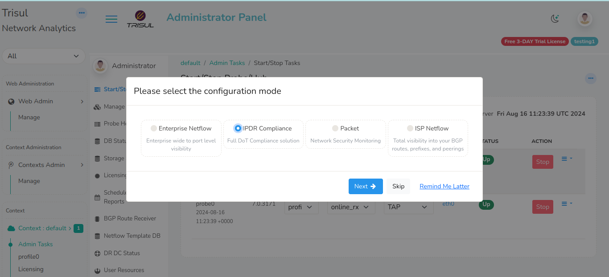

# Selecting the  mode

Trisul Network Analytics is a general platform which can be reconfigured to very specific use cases.  

This *product*-izing process consists of customizing counters, flows, menus, dashboards and so on. For ease of use you can simply select the configuration set up front after installation.

:::tip Productize it
The default mode of Trisul is Packet Capture based Network Security Monitoring. We recommend you switch to the appropriate mode such as NetFlow Analyzer or IPDR or ISP using this step even though you can accomplish the same manually.
:::

## First login

After following the steps in [installation](doinstall). You should be able to login to the UI by opening 

> Login by opening http:// ipaddress:3000 with default username = `admin` and pwd = `admin` 

## Screen 1: Configure Product Mode

The first screen you encounter will present the following options

Select the Mode.

* **Enterprise NetFlow**  &rarr;  Turn into Trisul NetFlow Analyzer
* **IPDR Compliance** &rarr; Turn into IPDR Flow Compliance Solution
* **Packet** &rarr;  Packet Capture based Network Security Monitoring (the default)
* **ISP Netflow** &rarr;  ISP Solution with NetFlow and BGP 

Then you have three options  

* **Next** &rarr;  Accept the config mode and move to screen 2
* **Skip** &rarr;  I don't want to configure anything , I will do it manually
* **Remind Me Later** &rarr;  SHow this screen later the next time I login. I am just looking around now. 

## Screen 2: Select Interface

Upon selecting "Next" in screen 1 you need to select the network interface on which NetFlow or Packet Capture traffic is arriving. 

Press the **Configure** button to configure Trisul to the selected mode. 

