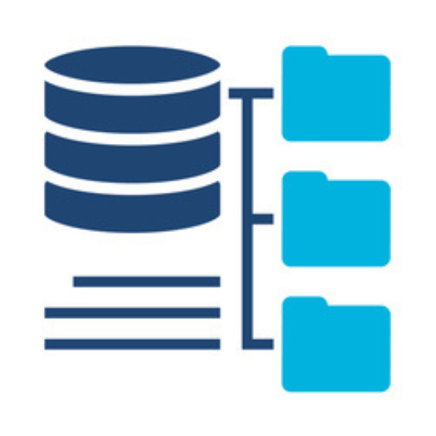
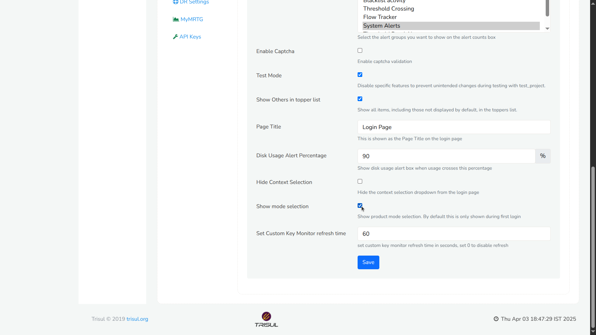

# Selecting the Product Mode

:::note after install
After installing on the server you need to select the product mode as the first step.
:::
Trisul Network Analytics is a general platform which can be reconfigured to very specific use cases.  

This *product*-izing process consists of customizing counters, flows, menus, dashboards and so on. For ease of use you can simply select the configuration set up front after installation.

:::tip Productize it
The default mode of Trisul is Packet Capture based Network Security Monitoring. We recommend you switch to the appropriate mode such as NetFlow Analyzer or IPDR or ISP using this step even though you can accomplish the same by manual configuration.
:::

## Four Product Modes

|Trisul Network Security Monitoring | Trisul NetFlow Analyzer|Trisul DoT Compliance Solution |Trisul ISP Analytics|
|:---|:---|:---|:---|
||| ||
|[**Packet Based Mode**](/docs/ag/install/requirements#processing-modes)   Packet Capture based Network Security Monitoring (the default)|[**Flow Based Mode**](/docs/ag/install/requirements#processing-modes)   Turn into a NetFlow Monitor|[**Flow Based Mode**](/docs/ag/install/requirements#processing-modes)   A ISP/Telco flow and NAT logging solution for regulatory compliance|[**Flow Based Mode**](/docs/ag/install/requirements#processing-modes)    Netflow + BGP-based peering, AS, prefix, route, geo traffic analytics| 
|**Best for:**   Deep troubleshooting, security visibility, investigation, and forensics. | **Best for:**   Routers, firewalls, or devices that export NetFlow/IPFIX. | **Best for:**   ISPs that need DoT-compliant IPDR generation and long-term storage. | **Best for:**     ISPs needing peering visibility, AS/prefix analytics, traffic engineering, route & geo traffic oversight | 
|**What it does:**   Captures packets from a SPAN/port mirror, stores raw PCAPs, and generates rich metadata (flows, apps, hosts, files, alerts).| **What it does:**   Processes flow records to provide lightweight, scalable traffic analytics across large networks.| **What it does:**   Extracts subscriber activity records (IPDR) from live traffic in the required format for lawful retention. | **What it does:**   Combines NetFlow with optional BGP to provide AS and prefix-level traffic analytics, route/BGP visibility, Content provider & OTT analytics and geo-mapped traffic insights. | 
|**Choose this if:**   You need raw packets, deep analysis, or security-focused visibility.| **Choose this if:**   You want high-level traffic visibility without deploying packet capture. |**Choose this if:**   Your requirement is IPDR logging, compliance reporting, or telecom-grade data retention. | **Choose this if:**   You run an ISP or large network and need BGP/peering + flow-level visibility, traffic-engineering insight, prefix/AS/geo level reporting, and peering optimization |

## First Login

After following the steps in [installation](doinstall). You should be able to login to the UI by opening 

:::info navigation

:point_right:  Open your browser and go to `http://ipaddress:3000`  
default username = `admin` and  
pwd = `admin` 
:::

## Screen 1: Configure Product Mode

The first screen you encounter will present the 4 product modes as shown below. 

Using the guidance above, choose the product mode that best fits your intended use.

Once selected, choose how you’d like to proceed:

* **No Thanks! I will configure manually** &rarr; Best suited for Advanced users who already know the way around Trisul.
* **I will do this later on next login** &rarr;  Not ready to commit yet? You can explore the system now and come back to this setup the next time you log in.
* **Next** &rarr; Continue with the guided setup using the product mode you selected.

You can always revisit or adjust your choices later. Nothing here locks you in.

## Screen 2: Select Interface

Upon selecting "Next" in screen 1 

The dialog shows a list of interfaces found on the Trisul Probe node along with their IP Addresses. Select one or more of the interfaces on which you will be receiving Packets (via SPAN port) or NetFlow 

Press the **Configure** button to finish.

## Screen 3: View Status

The hub and probe nodes are restarted with the selected mode.

:::success Complete
Now you can start sending traffic, either NetFlow or packets to Trisul.
Logout and login as user to start viewing reports
:::

:memo: Refer to Trisul User Guide [Introduction](/docs/ug/ui/) for user login. 

## Re-Enabling Product Mode Selector

If you skipped product selection during the initial setup (Screen 1: Configure Product Mode) or selected a mode and later decide to switch to another mode, you’ll need to re-enable the Product Mode selector.

This restores the same Product Mode selection screen you saw during first-time onboarding.

:::info navigation
:point_right: Go to Web Admin &rarr; Manage &rarr; App Settings &rarr; UI
:::

  
*Figure: Showing Re-enabling Product Mode Selector*

- Check the "Show mode selection" checkbox and
- Click the "Save" button

Once you have completed these steps, you can select the desired mode from the Product Selection Mode.