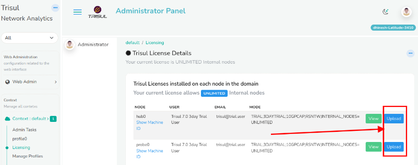

# Installing a License file

This section describes how you can install a new License File.


## The License.xyz.txt file

A new license file issued by us is typically named `License.{emailid/username}.txt` it looks something like this


```
----------------------------------------------------------------
User:  Tim HoprXXXX
Email: test@xx
Mode:  PRODUCTON;UNLIMITED-DAYWINDOW;UNLIMITED-PCAP;RSNTW;INTERNAL_NODES=UNLIMITED
Muuid: 4C4C4544-0052-5610-8035-C8C04F375633
Due:   0 (Upgrade at will)
Maint: 1725273471 (Sep 2 2024)
Ver:   7
Key:   Below
----------------------------------------------------------------
BG5fK4vUHyAf5QN2P4noQXtPTZOIPvnPXEqoEkfMLf2LBOjUbd4l6ENL0SWyglS+
LKVr80cDlii6U7v1w0U3lGOcwe3nj1N/T1A06f+7nIQ=
----------------------------------------------------------------
GirSyXktWOM7qct2MwrIrsAs+DtVbY66pKL3pQO+ZxELOZTvjWkwD8owZ7Z/Qdhw
KQIDAQAB
----------------------------------------------------------------
```

:::danger one license file per machine
A new license file is required for every machine because it is locked to a MachineID. For most customers on a single machine you only need a single license file
:::


## Install using Web Interface

This is the recommended method suitable for most deployments. You just have to upload the new license to the Hub and Probe nodes using the *License page*

:::note navigation

Login as Admin → Select Context :default → Licensing

:::

On the Licensing page you can click on the Upload Button shown in the image below to select the new License file and upload it.

*Showing the Upload button used to install new license files*  



## Install new licenses using the Command Line

The following alternate method places the new License files directly in the correct directories. You can use this method if the User Interface is not suitable for you. For example : when you want automatic deployment of license files.

### Install license on Trisul Probe node

1. Put the new license file in `/usr/local/etc/trisul-probe` 
1. Change the name  of the new file to `LicenseKey.txt`  *OR*
2. Edit the `LicenseFile` parameter in [trisulProbeConfig.xml](/docs/ref/trisulconfig#app ) to point to the new file. 


repeat the same for the Hub (even if on the same machine)

### Install license on Trisul Hub node

1. Put the new license file in`/usr/local/etc/trisul-hub`
1. Change the name** of the new file to `LicenseKey.txt` *OR*
2. Edit the `LicenseFile` parameter in [trisulHubConfig.xml](/docs/ref/trisulconfig#app ) to point to the new file. 

### Restart Trisul Hub and Probe node

:::info
Please restart both hub and probe node to take effect
:::


## View the License file in effect

:::note

Login as Admin → Select Context → Licensing

:::

The current license file is displayed as shown in the screenshot above.

## Moving an existing License to new hardware

If you move any Trisul node (Probe or Hub) to a new machine or VM, send us the new machineid and we will reissue the License.

