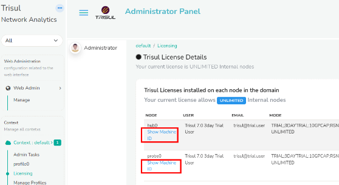

# Introduction 

Trisul Network Analytics licenses are :

1. Perpetual
2. Need one license per physical node
3. Tied to a machine ID

License types are :

1. Free 3-Day License : The free license gives you tremendous value as it gets you all of the real time analytics and the most recent 3 days for historical analysis
2. Production License : depends on the number of active internal endpoints in your Home Network space
   1. Small Business : 500 simultaneously active Internal IPs
   2. Medium : 3000 simultaneously active Internal IPs
   3. Unlimited : As many as your hardware can support

For more information see the[LicensingFAQ](https://trisul.org/pricing)

## Machine ID

Once you have decided which license type suits you, you need to get the Trisul Machine ID that uniquely identifies the server or VM on which you are running Trisul.

### Getting the Machine ID

:::note navigation

Login as Admin → Select Context :default → Licensing

:::

*Getting the machine-id from the Admin UI*  


Click on the machine ID link against each node to get the machineID as shown below

*Showing the Upload button used to install new license files*  


### Alternate method: get Machine ID using command line

Using this alternate method to get the machine ID. Type the following command as send us its output.

 ```BASH
sudo trisul --machineid

4087ACCD-4B0B-DE11-833A-00248CB93BDE
```

That number 4087ACCD-4B0B-DE11-833A-00248CB93BDE is called the MachineID.


## Finding out how many internal IPs I have

The license size depends on the number of maximum number of simultnaneously active Internal IPs. To get this number

:::note navigation

Login as Admin → Select Context → Licensing

:::


The chart shows the active internal hosts in the past 24 hours. Click on “Long Term Trends” to see a longer time window