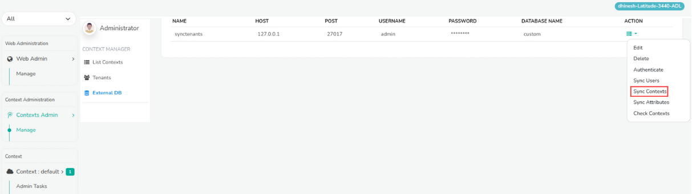

# External DB

External db is the place where all the contexts details are stored and managed. Trisul pulls contexts details from the customer database using external DB. Any changes including addition or removal of subnets of the tenant from customers are reflected by syncing their tenant details.

To sync tenants, login as admin
:::info navigation
:point_right: Go to Context admin &rarr; Manage &rarr; ExternalDB
:::

The external DB displays the list of all customers, their host, post id, username and password and the database name. 

  
*Figure: Sync Contacts of Tenants*

Click on the action button against the customer name and select Sync Contexts from the dropdown. This will check all the database of the tenants for changes of subnets. If new addition of removal is found it will replace the current database with the new one and syncs.